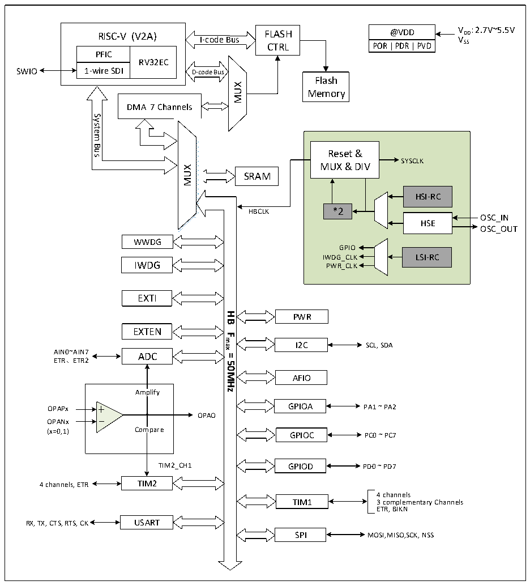

<!-- source-page: 2 -->

[← p.1](0001.md) · [index](../README.md) · [PDF p.2](https://ch32-riscv-ug.github.io/CH32V003/datasheet_en/CH32V003RM.PDF#page=2) · [p.3 →](0003.md)

<!-- header: CH32V003 Reference Manual https://wch-ic.com -->

# Chapter 1 Memory and Bus Architecture

## 1.1 Bus Architecture

The CH32V003 series is designed based on the RISC-V instruction set, and its architecture interacts the core,  
arbitration unit, DMA module, SRAM storage and other parts through multiple buses. The design integrates a  
general-purpose DMA controller to reduce the CPU load and improve access efficiency, as well as data  
protection mechanisms, automatic clock switching protection mechanisms and other measures to increase  
system stability. The system block diagram is shown in Figure 1-1.  

Figure 1-1 CH32V003 system block diagram  
 <!-- rendered from the PDF; verify at https://ch32-riscv-ug.github.io/CH32V003/datasheet_en/CH32V003RM.PDF#page=2 -->

🖼 Text parsed from the figure above

RISC-V (V2A)  PFIC  RV32EC  1-wire SDI  
@VDD V DD : 2.7V~5.5V  
RISC-V (V2A) FLASH  
VSS  
I-code Bus  
CTRL  
SWIO  
Flash  
MUX  
Memory  
DMA 7 Channels  
System  
<!-- image: p2-draw-image-00002 inside the figure -->
<!-- image: p2-draw-image-00003 inside the figure -->
Bus  
Reset &amp;  
SYSCLK  
MUX &amp; DIV  
MUX  
SRAM  
HSI-RC  
*2  
HBCLK  
OSC_IN  
HSE  
OSC_OUT  
WWDG  
GPIO  
IWDG_CLK LSI-RC  
IWDG PWR_CLK  
EXTI  
<strong>HB</strong>  
PWR  
EXTEN  
<strong>Fmax</strong>  
I2C  
SCL, SDA  
AIN0~AIN7 ADC  
<strong>=</strong>  
ETR、ETR2  
<strong>50MHz</strong>  
AFIO  
Amplify  
OPAPx GPIOA PA1 ~ PA2  
OPAO  
OPANx  
(x=0,1) Compare GPIOC PC0 ~ PC7  
TIM2_CH1 GPIOD PD0 ~ PD7  
4 channels, ETR TIM2  
4 channels  
TIM1 3 complementary Channels  
ETR, BIKN  
RX, TX, CTS, RTS, CK USART  
SPI MOSI,MISO,SCK, NSS  

The system is equipped with: General-purpose DMA controller to reduce the CPU burden and improve  
efficiency; clock tree hierarchy management to reduce the total power consumption of peripherals, as well as  
data protection mechanisms, clock security system protection mechanisms and other measures to increase  
system stability.  
● The instruction bus (I-Code) connects the core to the FLASH instruction interface and prefetching is done  
<!-- image: p2-draw-image-00001 bbox=[507.6, 794.64, 527.04, 805.2] -->
<!-- footer: V1.9 1 -->
