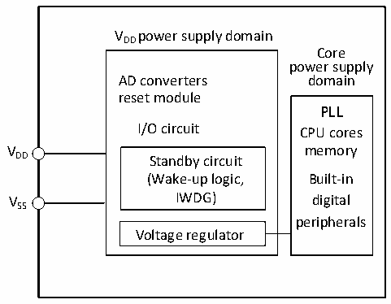
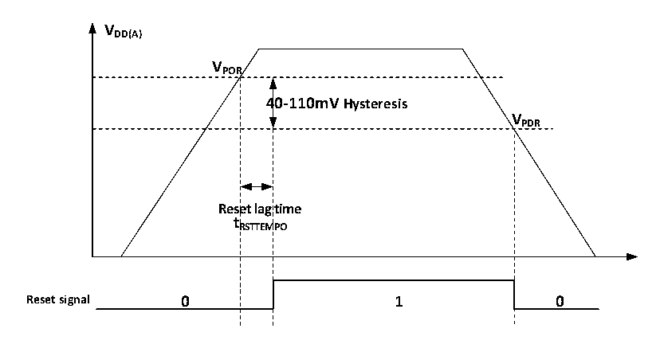

<!-- source-page: 6 -->

[← p.5](0005.md) · [index](../README.md) · [PDF p.6](https://ch32-riscv-ug.github.io/CH32V003/datasheet_en/CH32V003RM.PDF#page=6) · [p.7 →](0007.md)

<!-- header: CH32V003 Reference Manual https://wch-ic.com -->

# Chapter 2 Power Control (PWR)

## 2.1 Overview

The system operating voltage VDD ranges from 2.7 to 5.5V, and the built-in voltage regulator provides the  
working power supply required by the core.  

Figure 2-1 Block diagram of power supply structure  
 <!-- rendered from the PDF; verify at https://ch32-riscv-ug.github.io/CH32V003/datasheet_en/CH32V003RM.PDF#page=6 -->

🖼 Text parsed from the figure above

VDD power supply domain  
Core  
power supply  
AD converters domain  
reset module  
PLL  
I/O circuit CPU cores  
V memory  
DD Standby circuit  
(Wake-up logic, Built-in  
VSS IWDG) digital  
peripherals  
Voltage regulator  

## 2.2 Power Management

### 2.2.1 Power-on Reset and Power-down Reset

The system has an internal power-on reset POR and a power-down reset PDR circuit. When the chip supply  
voltage VDD falls below the corresponding threshold voltage, the system is reset by the relevant circuit, and no  
additional external reset circuit is required. Please refer to the corresponding datasheet for the parameters of  
the power-on threshold voltage VPOR and the power-down threshold voltage VPDR.  

Figure 2-2 Schematic diagram of the operation of POR and PDR  
 <!-- rendered from the PDF; verify at https://ch32-riscv-ug.github.io/CH32V003/datasheet_en/CH32V003RM.PDF#page=6 -->

🖼 Text parsed from the figure above

<strong>VDD(A)</strong>  
<strong>VPOR</strong>  
4  40-110mV Hysteresis  Rese t R  et lag RSTTEM  time MPO  V  
<strong>VPDR</strong>  
<strong>tRSTTEMPO</strong>  

### 2.2.2 Programmable Voltage Detector

The programmable voltage monitor, PVD, is mainly used to monitor the change of the main power supply of  
the system and compare it with the threshold voltage set by PLS[2:0] of the power control register PWR_CTLR,  
and with the external interrupt register (EXTI) setting, it can generate relevant interrupts to notify the system  
<!-- image: p6-draw-image-00001 bbox=[507.6, 794.64, 527.04, 805.2] -->
<!-- footer: V1.9 5 -->
