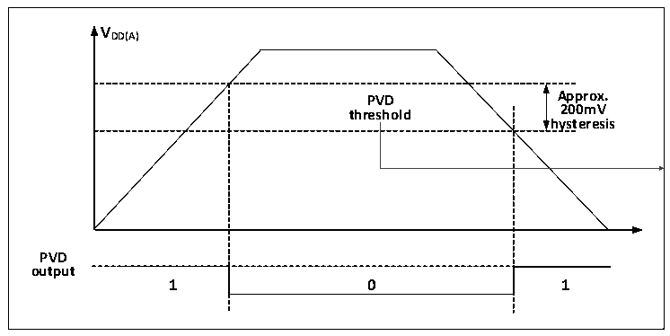

<!-- source-page: 7 -->

[← p.6](0006.md) · [index](../README.md) · [PDF p.7](https://ch32-riscv-ug.github.io/CH32V003/datasheet_en/CH32V003RM.PDF#page=7) · [p.8 →](0008.md)

<!-- header: CH32V003 Reference Manual https://wch-ic.com -->
in time for pre-power down operations such as data saving.  
The specific configuration is as follows.  
1) Set the PLS[2:0] field of the PWR_CTLR register to select the voltage threshold to be monitored.  
2) Optional interrupt handling. the PVD function internally connects to the rising/falling edge trigger setting  
of line 8 of the EXTI module, turns on this interrupt (configures EXTI), and generates a PVD interrupt  
when VDD drops below the PVD threshold or rises above the PVD threshold.  
3) Set the PVDE bit of PWR_CTLR register to enable the PVD function.  
4) Read the PVD0 bit of PWR_CSR status register to obtain the current system main power and PLS[2:0]  
setting threshold relationship, and perform the corresponding soft processing. When the VDD voltage is  
higher than the threshold set by PLS[2:0], PVD0 position 0; when the VDD voltage is lower than the  
threshold set by PLS[2:0], PVD0 position 1.  

Figure 2-3 Schematic diagram of PVD operation  
 <!-- rendered from the PDF; verify at https://ch32-riscv-ug.github.io/CH32V003/datasheet_en/CH32V003RM.PDF#page=7 -->

🖼 Text parsed from the figure above

<strong>VDD(A)</strong>  
PVD threshold  0  
<strong>hysteresis</strong>  
<strong>PVD</strong>  
<strong>output</strong>  

## 2.3 Low-power Modes

After a system reset, the microcontroller is in a normal operating state (run mode), where system power can  
be saved by reducing the system main frequency or turning off the unused peripheral clock or reducing the  
operating peripheral clock. If the system does not need to work, you can set the system to enter low-power  
mode and let the system jump out of this state by specific events.  
Microcontrollers currently offer 2 low-power modes, divided in terms of operating differences between  
processors, peripherals, voltage regulators, etc.  
● Sleep mode: The core stops running and all peripherals (including core private peripherals) are still  
running.  
● Standby mode: Stop all clocks, wake up and switch the clock to HSI.  

<!-- p7-table-002 (table-2-1@1) -->
<table><caption>Table 2-1 Low-power mode list</caption><tr><th>Mode</th><th>Entry</th><th>Wake-up source</th><th>Effect on clock</th><th style="text-align:left">Voltage regulator</th></tr><tr><td rowspan="2">Sleep</td><td>WFI</td><td>Any interrupt</td><td rowspan="2" style="text-align:left">Core clock OFF, no effect on other clocks</td><td rowspan="2">ON</td></tr><tr><td>WFE</td><td>Wake-up event</td></tr><tr><td>Standby</td><td style="text-align:left">Set SLEEPDEEP to 1 Set PDDS to 1 WFI or WFE</td><td style="text-align:left"><em>Any external interrupt or event, AWU event, NRST pin reset, or IWDG reset. Note: Any event can also wake up the system, but the system does not reset after waking up.</em></td><td style="text-align:left">HSE, HSI, PLL and peripheral clock OFF</td><td>Low-power mode</td></tr></table>

<em>Note: The SLEEPDEEP bit belongs to the core private peripheral control bit, CH32V003 product reference</em>  
<em>PFIC_SCTLR register.</em>  
<!-- image: p7-draw-image-00001 bbox=[507.6, 794.64, 527.04, 805.2] -->
<!-- footer: V1.9 6 -->
