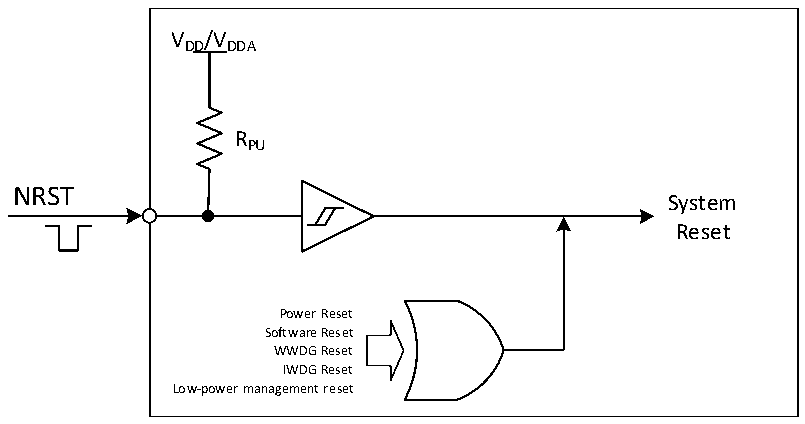

<!-- source-page: 13 -->

[← p.12](0012.md) · [index](../README.md) · [PDF p.13](https://ch32-riscv-ug.github.io/CH32V003/datasheet_en/CH32V003RM.PDF#page=13) · [p.14 →](0014.md)

<!-- header: CH32V003 Reference Manual https://wch-ic.com -->

Figure 3-1 System reset structure  
 <!-- rendered from the PDF; verify at https://ch32-riscv-ug.github.io/CH32V003/datasheet_en/CH32V003RM.PDF#page=13 -->

🖼 Text parsed from the figure above

VDD/VDDA  
RPU  
NRST  
System  
Reset  
Power Reset  
Software Reset  
WWDG Reset  
IWDG Reset  
Low-power management reset  

<!-- image: p13-draw-image-00001 bbox=[507.6, 794.64, 527.04, 805.2] -->
<!-- footer: V1.9 12 -->
