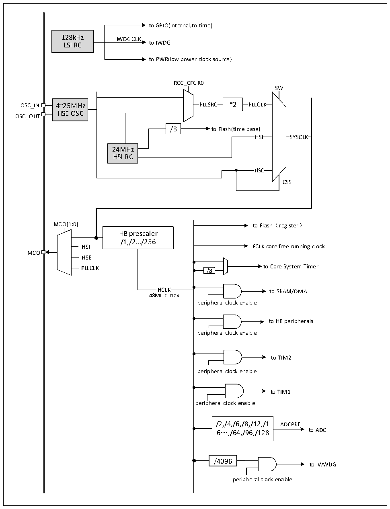

<!-- source-page: 14 -->

[← p.13](0013.md) · [index](../README.md) · [PDF p.14](https://ch32-riscv-ug.github.io/CH32V003/datasheet_en/CH32V003RM.PDF#page=14) · [p.15 →](0015.md)

<!-- header: CH32V003 Reference Manual https://wch-ic.com -->

## 3.3 Clock

### 3.3.1 System Clock Structure

Figure 3-2 CH32V003 clock tree block diagram  
 <!-- rendered from the PDF; verify at https://ch32-riscv-ug.github.io/CH32V003/datasheet_en/CH32V003RM.PDF#page=14 -->

🖼 Text parsed from the figure above

to GPIO(internal,to time)  
128kHz IWDGCLK  
LSI RC to IWDG  
to PWR(low power clock source)  
RCC_CFGR0  
SW  
OSC_IN 4~25MHz PLLSRC *2 PLLCLK  
HSE OSC  
OSC_OUT  
/3 to Flash(time base)  
HS  HS  
SYSCLK  SYSCLK  
HSI SYSCLK  
24MHz  
HSI RC  
HS  HS  
CSS  
MCO[1:0] to Flash（register）  
HB prescaler  
/1,/2.../256  
HSI FCLK core free running clock  
MCO  
HSE  
PLLCLK /8 to Core System Timer  
HCLK to SRAM/DMA  
48MHz max  
peripheral clock enable  
to HB peripherals  
peripheral clock enable  
to TIM2  
peripheral clock enable  
to TIM1  
peripheral clock enable  
/2,/4,/6,/8,/12,/1 ADCPRE  
6…,/64,/96,/128 to ADC  
/4096  
to WWDG  
peripheral clock enable  

<!-- image: p14-draw-image-00001 bbox=[507.6, 794.64, 527.04, 805.2] -->
<!-- footer: V1.9 13 -->
