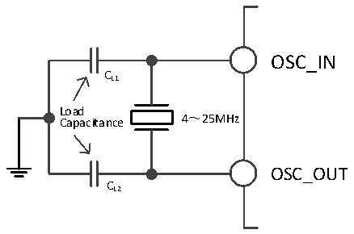
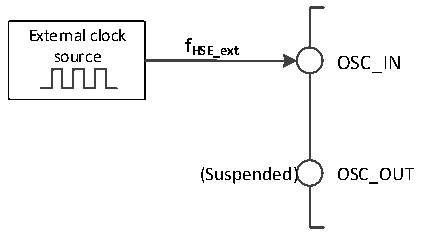

<!-- source-page: 15 -->

[← p.14](0014.md) · [index](../README.md) · [PDF p.15](https://ch32-riscv-ug.github.io/CH32V003/datasheet_en/CH32V003RM.PDF#page=15) · [p.16 →](0016.md)

<!-- header: CH32V003 Reference Manual https://wch-ic.com -->

### 3.3.2 High-speed Clock (HSI/HSE)

HSI is a high-speed clock signal generated by the system&#x27;s internal 24MHz RC oscillator. HSI RC oscillator  
can provide system clock without any external devices. It has a short start-up time. HSI is enabled and disabled  
by setting the HSION bit in the RCC_CTLR register, and the HSIRDY bit indicates whether the HSI RC  
oscillator is stable or not. The system defaults HSION and HSIRDY to 1 (it is recommended not to turn them  
off). If the HSIRDYIE bit in the RCC_INTR register is set, the corresponding interrupt will be generated.  
● Factory calibration: The difference of manufacturing process will cause different RC oscillation  
frequency for each chip, so HSI calibration is performed for each chip before it is shipped. After system  
reset, the factory calibration value is loaded into HSICAL[7:0] of the RCC_CTLR register.  
● User tuning: Based on different voltages or ambient temperatures, the application can adjust the HSI  
frequency by using the HSITRIM[4:0] bits in the RCC_CTLR register.  
<em>Note: If the HSE crystal oscillator fails, the HSI clock is used as a backup clock source (clock safety system).</em>  
HSE is an external high speed clock signal, including external crystal/ceramic resonator generation or external  
high speed clock feed.  
● External Crystal/Ceramic Resonator (HSE Crystal): An external 4-25MHz oscillator provides a more  
accurate clock source for the system. Further information can be found in the Electrical Characteristics  
section of the datasheet. The HSE crystal can be turned on and off by setting the HSEON bit in the  
RCC_CTLR register. The HSERDY bit indicates whether the HSE crystal oscillation is stable or not, and  
the hardware feeds the clock into the system only after HSERDY position 1. If the HSERDYIE bit of the  
RCC_INTR register is set, the corresponding interrupt will be generated.  

Figure 3-3 High-speed external crystal circuit  
 <!-- rendered from the PDF; verify at https://ch32-riscv-ug.github.io/CH32V003/datasheet_en/CH32V003RM.PDF#page=15 -->

🖼 Text parsed from the figure above

OSC_IN  
CL1  
Load  
4～25MHz  
Capacitance  
OSC_OUT  
CL2  

<em>Note: The load capacitor needs to be as close to the oscillator pin as possible and the capacitance value should</em>  
<em>be selected according to the crystal manufacturer&#x27;s parameters.</em>  
● External High-speed Clock Source (HSE Bypass): This mode feeds the clock source directly from the  
external to the OSC_IN pin, with the OSC_OUT pin dangling. The maximum frequency supported is  
25MHz. The application needs to set the HSEBYP bit to turn on the HSE bypass function with the  
HSEON bit at 0, and then set the HSEON bit again.  

Figure 3-4 High-speed clock source circuit  
 <!-- rendered from the PDF; verify at https://ch32-riscv-ug.github.io/CH32V003/datasheet_en/CH32V003RM.PDF#page=15 -->

🖼 Text parsed from the figure above

External clock  
<strong>f</strong>  
source HSE_ext OSC_IN  
(Suspended) OSC_OUT  

<!-- image: p15-draw-image-00001 bbox=[507.6, 794.64, 527.04, 805.2] -->
<!-- footer: V1.9 14 -->
