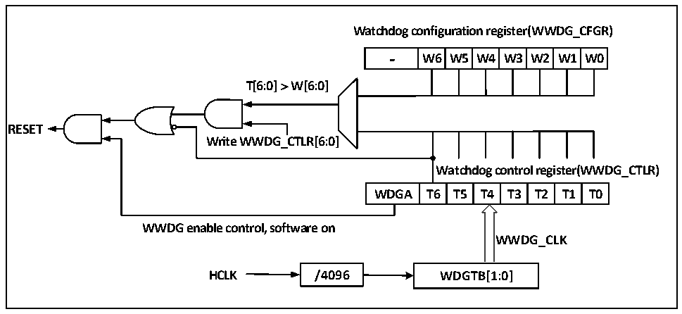

<!-- source-page: 29 -->

[← p.28](0028.md) · [index](../README.md) · [PDF p.29](https://ch32-riscv-ug.github.io/CH32V003/datasheet_en/CH32V003RM.PDF#page=29) · [p.30 →](0030.md)

<!-- header: CH32V003 Reference Manual https://wch-ic.com -->

# Chapter 5 Window Watchdog (WWDG)

A Window Watchdog is generally used to monitor system operation for software faults such as external  
disturbances, unforeseen logic errors, and other conditions. It requires a counter refresh (dog feeding) within  
a specific window time (with upper and lower limits), otherwise earlier or later than this window time the  
watchdog circuit will generate a system Reset.  

## 5.1 Main Features

● Programmable 7-bit downcounter  
● Biconditional reset: the downcounter value is less than 0x40, or the counter value is reloaded outside the  
window time  
● Wake Up Early Notification (EWI) function for timely dog feeding action to prevent system Reset  

## 5.2 Function Description

### 5.2.1 Principle and Application

The window watchdog operation is based on a 7-bit downcounter, which is mounted under the HB bus and  
counts the dividing frequency of the time base WWDG_CLK source (HCLK/4096) clock with the dividing  
factor set in the WDGTB[1:0] field in the configuration register WWDG_CFGR. The downcounter is in the  
free-running state, and the counter keeps cycling downcount regardless of whether the watchdog function is  
on or not. As shown in Figure 5-1, the block diagram of the internal structure of the window watchdog.  

Figure 5-1 Block diagram of Window Watchdog structure  
 <!-- rendered from the PDF; verify at https://ch32-riscv-ug.github.io/CH32V003/datasheet_en/CH32V003RM.PDF#page=29 -->

🖼 Text parsed from the figure above

<strong>Watchdog configuration register(WWDG_CFGR)</strong>  
-  W6  W5  W4  W3  W2  W1  W0  
<strong>T[6:0] ＞ W[6:0]</strong>  
<strong>RESET</strong>  
<strong>Write WWDG_CTLR[6:0]</strong>  
<strong>Watchdog control register(WWDG_CTLR)</strong>  
WDGA  T6  T5  T4  T3  T2  T1  T0  
<strong>WWDG enable control, software on</strong>  
<strong>WWDG_CLK</strong>  
<strong>HCLK / 4 096 WDGTB[1:0]</strong>  

● Enable Window Watchdog  
After a system Reset, the watchdog is off. Setting the WDGA bit of the WWDG_CTLR register enables the  
watchdog, and then it cannot be turned off again unless a reset occurs.  
Note: The watchdog function can be stopped indirectly by setting the RCC_APB1PCENR register to turn off  
the clock source of WWDG and suspend the WWDG_CLK count, or by setting the RCC_APB1PRSTR  
register to reset the WWDG module, which is equivalent to the role of reset.  
● Watchdog Configuration  
The watchdog is internally a 7-bit counter that runs in a continuous decreasing cycle and supports read and  
write access. To use the watchdog reset function, the following actions need to be performed.  
<!-- image: p29-draw-image-00001 bbox=[507.6, 794.64, 527.04, 805.2] -->
<!-- footer: V1.9 28 -->
