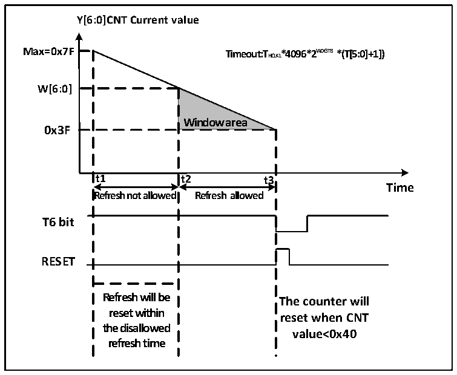

<!-- source-page: 30 -->

[← p.29](0029.md) · [index](../README.md) · [PDF p.30](https://ch32-riscv-ug.github.io/CH32V003/datasheet_en/CH32V003RM.PDF#page=30) · [p.31 →](0031.md)

<!-- header: CH32V003 Reference Manual https://wch-ic.com -->
1) Counting time base: via the WDGTB[1:0] bit field of the WWDG_CFGR register, note that the WWDG  
module clock of the RCC unit should be turned on.  
2) Window counter: Set the W[6:0] bit field of WWDG_CFGR register, this counter is used by hardware as  
a comparison with the current counter, the value is configured by user software and will not change. It is  
used as the upper limit value of the window time.  
3) Watchdog enable: WDG_CTLR register WDGA bit software set to 1, to turn on the watchdog function,  
you can system reset.  
4) Feed the dog: i.e., refresh the current counter value and configure the T[6:0] bit field of the  
WWDG_CTLR register. This action needs to be executed within the periodic window time after the  
watchdog function is turned on, otherwise a watchdog reset action will occur.  
● Dog feeding window time  
As shown in Figure 5-2, the gray area is the monitoring window area of the window watchdog, whose upper  
time t2 corresponds to the point in time when the current counter value reaches the window value W[6:0]; its  
lower time t3 corresponds to the point in time when the current counter value reaches 0x3F. This area time  
t2&lt;t&lt;t3 can be fed with a dog operation (write T[6:0]) to refresh the current counter value.  

Figure 5-2 Counting mode of Window Watchdog  
 <!-- rendered from the PDF; verify at https://ch32-riscv-ug.github.io/CH32V003/datasheet_en/CH32V003RM.PDF#page=30 -->

🖼 Text parsed from the figure above

<strong>Y[6:0]CNT Current value</strong>  
<strong>Max=0x7F Timeout:THCLK1*4096*2W D G T B *(T[5:0]+1])</strong>  
<strong>W[6:0]</strong>  
<strong>Window area</strong>  
<strong>0x3F</strong>  
<strong>t1 t2 t3</strong>  
<strong>Time</strong>  
<strong>Refresh not allowed Refresh allowed</strong>  
<strong>T6 bit</strong>  
<strong>RESET</strong>  
<strong>Refresh will be</strong>  
<strong>The counter will</strong>  
<strong>reset within</strong>  
<strong>reset when CNT</strong>  
<strong>the disallowed</strong>  
<strong>value&lt;0x40</strong>  
<strong>refresh time</strong>  

● Watchdog reset  
1) When the value of T[6:0] counter changes from 0x40 to 0x3F due to no timely dog feeding operation, a  
&quot;window watchdog reset&quot; will occur and a system reset will be generated. That is, the T6-bit is detected  
as 0 by the hardware and a system reset will occur.  
<em>Note: The application can write T6-bit to 0 by software to achieve system Reset, which is equivalent to</em>  
<em>software reset function.</em>  
2) When the counter refresh action is executed within the disallowed dog feeding time, i.e., the write T[6:0]  
bit field is operated within t1≤t≤t2 time, a &quot;window watchdog reset&quot; will occur and a system Reset will  
be generated.  
● Wake up in advance  
<!-- image: p30-draw-image-00001 bbox=[507.6, 794.64, 527.04, 805.2] -->
<!-- footer: V1.9 29 -->
