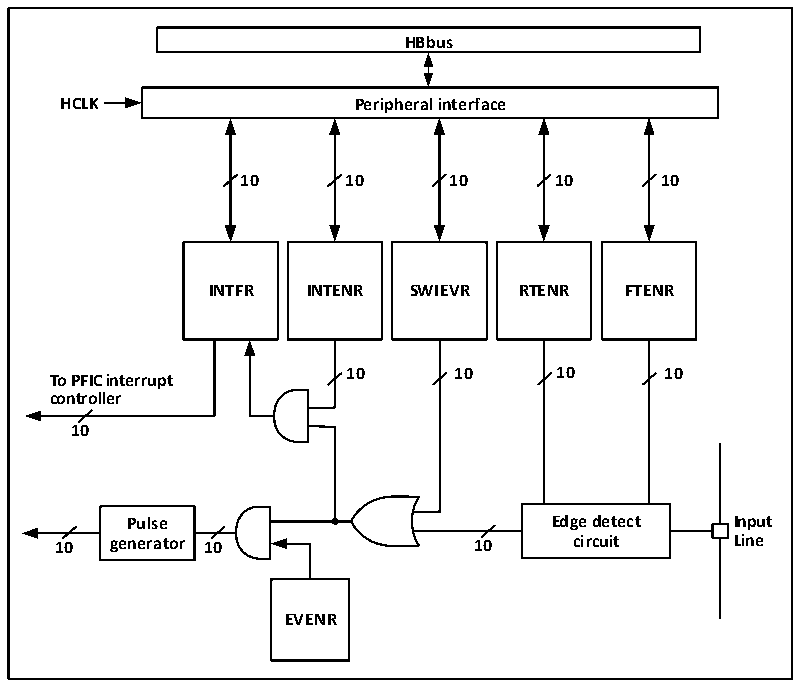

<!-- source-page: 34 -->

[← p.33](0033.md) · [index](../README.md) · [PDF p.34](https://ch32-riscv-ug.github.io/CH32V003/datasheet_en/CH32V003RM.PDF#page=34) · [p.35 →](0035.md)

<!-- header: CH32V003 Reference Manual https://wch-ic.com -->

> ⬆ **Table continued** — rendered in full at [page 33](0033.md). <!-- p34-table-001 -->

## 6.4 External Interrupt and Event Controller (EXTI)

### 6.4.1 Overview

Figure 6-1 External interrupt (EXTI) interface block diagram  
 <!-- rendered from the PDF; verify at https://ch32-riscv-ug.github.io/CH32V003/datasheet_en/CH32V003RM.PDF#page=34 -->

🖼 Text parsed from the figure above

<strong>HBbus</strong>  
<strong>HCLK Peripheral interface</strong>  
<strong>10 10 10 10 10</strong>  
<strong>INTFR INTENR SWIEVR RTENR FTENR</strong>  
<strong>10 10 10 10</strong>  
<strong>To PFIC interrupt</strong>  
<strong>controller</strong>  
<strong>10</strong>  
<strong>Pulse Edge detect Input</strong>  
<strong>10 generator 10 10 circuit Line</strong>  
<strong>EVENR</strong>  

As can be seen from Figure 6-1, the trigger source of the external interrupt can be either a software interrupt  
(SWIEVR) or an actual external interrupt channel. The signal of the external interrupt channel will be screened  
by the edge detect circuit first. Whenever one of the software interrupt or external interrupt signals is generated,  
it will be output to two with-gate circuits, event enable and interrupt enable, through the or-gate circuit in the  
figure, as long as an interrupt is enabled or an event is enabled, an interrupt or an event will be generated. six  
registers of EXTI are accessed by the processor through the HB interface.  

### 6.4.2 Wake-up Event

The system can wake up the Sleep mode caused by the WFE command through a wake-up event. The wake-  
up event is generated by either of the following two configurations.  
● Enabling an interrupt in a peripheral register, but not enabling this interrupt in the PFIC of the core, and  
enabling the SEVONPEND bit in the core at the same time. Embodied in EXTI, it is to enable an EXTI  
interrupt, but not to enable the EXTI interrupt in PFIC, and to enable the SEVONPEND bit at the same  
<!-- image: p34-draw-image-00001 bbox=[507.6, 794.64, 527.04, 805.2] -->
<!-- footer: V1.9 33 -->
