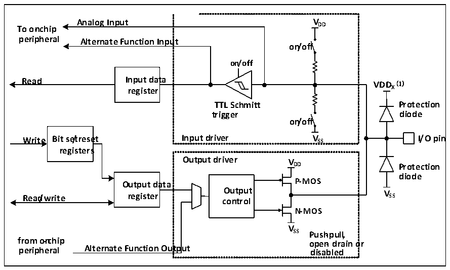

<!-- source-page: 50 -->

[← p.49](0049.md) · [index](../README.md) · [PDF p.50](https://ch32-riscv-ug.github.io/CH32V003/datasheet_en/CH32V003RM.PDF#page=50) · [p.51 →](0051.md)

<!-- header: CH32V003 Reference Manual https://wch-ic.com -->

# Chapter 7 GPIO and Alternate Function (GPIO/AFIO)

The GPIO port can be configured for multiple input or output modes, with built-in pull-up or pull-down  
resistors that can be turned off, and can be configured for push-pull or open-drain functions. the GPIO port  
can also be multiplexed for other functions.  

## 7.1 Main Features

Each pin of the port can be configured to one of the following multiple modes.  
● Floating input ● Open drain output  
● Pull-up input ● Push-pull output  
● Dropdown input ● Multiplexing the inputs and outputs of  
● Analog input functions  
Many pins have multiplexing capabilities, and many other peripherals map their output and input channels to  
these pins. The specific usage of these multiplexed pins needs to be referred to the individual peripherals, and  
the content of whether these pins are multiplexed and remapped is explained in this chapter.  

## 7.2 Function Description

### 7.2.1 Overview

Figure 7-1 GPIO module basic structure block diagram  
 <!-- rendered from the PDF; verify at https://ch32-riscv-ug.github.io/CH32V003/datasheet_en/CH32V003RM.PDF#page=50 -->

🖼 Text parsed from the figure above

<strong>Analog Input VDD</strong>  
<strong>To on-chip</strong>  
ut on/off  
<strong>peripheral Alternate Function Input</strong>  
<strong>on/off</strong>  
<strong>register X</strong>  
<strong>TTL Schmitt Protection</strong>  
<strong>trigger diode</strong>  
<strong>on/off</strong>  
<strong>Write Bit se/treset Input driver V SS I/O pin</strong>  
<strong>registers</strong>  
<strong>Output driver V</strong>  
<strong>DD Protection</strong>  
<strong>diode</strong>  
<strong>Output data P-MOS</strong>  
<strong>Read/write register c O o u n t t p r u ol t V SS</strong>  
<strong>N-MOS</strong>  
<strong>V</strong>  
<strong>SS Push-pull,</strong>  
<strong>from o-nchip open- drain or</strong>  
<strong>peripheral Alternate Function Output disabled</strong>  

<em>Note: (1) VDDx is VDD when GPIO is normal IO, and VDDx is VDD_FT when GPIO is FTIO.</em>  
As shown in Figure 7-1 IO port structure, each pin has two protection diodes inside the chip, and the IO port  
can be divided into input and output driver modules internally. Among them, the input driver has a weak pull-  
up and pull-down resistor optional, which can be connected to AD and other analog input peripherals; if the  
input is to a digital peripheral, it needs to go through a TTL Schmitt trigger and then connect to GPIO input  
registers or other multiplexed peripherals. The output driver has a pair of MOS tubes, and the IO port can be  
configured as open-drain or push-pull output by configuring whether the upper and lower MOS tubes are  
enabled or not; the output driver can also be configured internally to control the output by GPIO or by other  
multiplexed peripherals.  
<!-- image: p50-draw-image-00001 bbox=[507.6, 794.64, 527.04, 805.2] -->
<!-- footer: V1.9 49 -->
