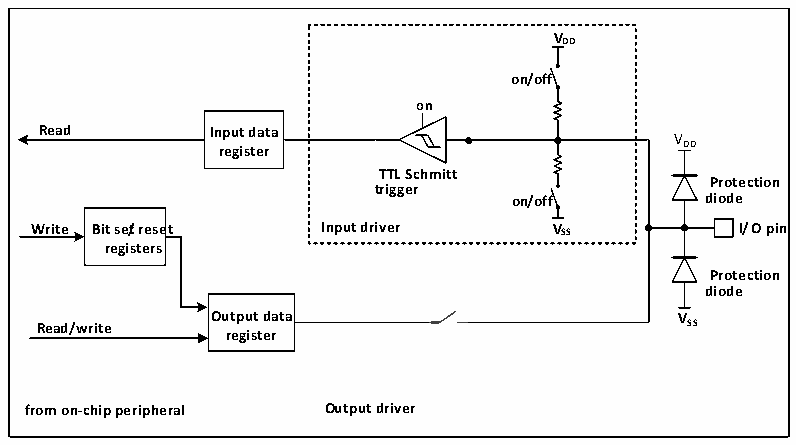

<!-- source-page: 51 -->

[← p.50](0050.md) · [index](../README.md) · [PDF p.51](https://ch32-riscv-ug.github.io/CH32V003/datasheet_en/CH32V003RM.PDF#page=51) · [p.52 →](0052.md)

<!-- header: CH32V003 Reference Manual https://wch-ic.com -->

### 7.2.2 GPIO Initialization Function

Just after reset, the GPIO ports run in the initial state, when most IO ports are running in the floating input  
state, but there are also peripheral related pins such as HSE that are running on the peripheral multiplexing  
function. Please refer to the chapter related to pin description for the specific initialization function.  

### 7.2.3 External Interrupts

All GPIO ports can be configured with external interrupt input channels, but an external interrupt input channel  
can only be mapped to at most one GPIO pin, and the serial number of the external interrupt channel must be  
the same as the bit number of the GPIO port, for example, PA1 (or PC1, PD1, etc.) can only be mapped to  
EXTI1, and EXTI1 can only accept one of PA1, PC1 or PD1, etc. The mapping of both parties is one-to-one.  

### 7.2.4 Multiplexing Functions

It is important to note that using the multiplexing function.  
● To use the multiplexing function in the input direction, the port must be configured in multiplexed input  
mode, and the pull-down settings can be set according to actual needs.  
● Using the multiplexing function in the output direction, the port must be configured in multiplexed output  
mode, push-pull or open-drain can be set according to the actual situation.  
● For bidirectional multiplexing, the port must be configured in multiplexed output mode, when the driver  
is configured in floating input mode  
The same IO port may have multiple peripherals multiplexed to this pin, so in order to maximize the space for  
each peripheral, the multiplexed pins of peripherals can be remapped to other pins in addition to the default  
multiplexed pins, avoiding the occupied pins.  

### 7.2.5 Locking Mechanism

The locking mechanism locks the configuration of the IO port. After a specific write sequence, the selected IO  
pin configuration will be locked and cannot be changed until the next reset.  

### 7.2.6 Input Configuration

Figure 7-2 GPIO module input configuration structure block diagram  
 <!-- rendered from the PDF; verify at https://ch32-riscv-ug.github.io/CH32V003/datasheet_en/CH32V003RM.PDF#page=51 -->

🖼 Text parsed from the figure above

<strong>VDD</strong>  
<strong>on/off</strong>  
<strong>on</strong>  
<strong>Read Input data</strong>  
VDD  
<strong>register</strong>  
<strong>TTL Schmitt</strong>  
<strong>Protection</strong>  
<strong>trigger</strong>  
<strong>on/off diode</strong>  
<strong>Write Bit se/treset Input driver VSS I/O pin</strong>  
<strong>registers</strong>  
<strong>Protection</strong>  
<strong>diode</strong>  
<strong>Output data VSS</strong>  
<strong>Read/write</strong>  
<strong>register</strong>  
<strong>from on-chip peripheral Output driver</strong>  

When the IO port is configured in input mode, the output driver is disconnected, the input pull-up and pull-  
down are selectable, and no multiplexed functions or analog inputs are connected. The data on each IO port is  
sampled into the input data register at each HB clock, and the level status of the corresponding pin is obtained  
by reading the corresponding bit of the input data register.  
<!-- image: p51-draw-image-00001 bbox=[507.6, 794.64, 527.04, 805.2] -->
<!-- footer: V1.9 52 -->
