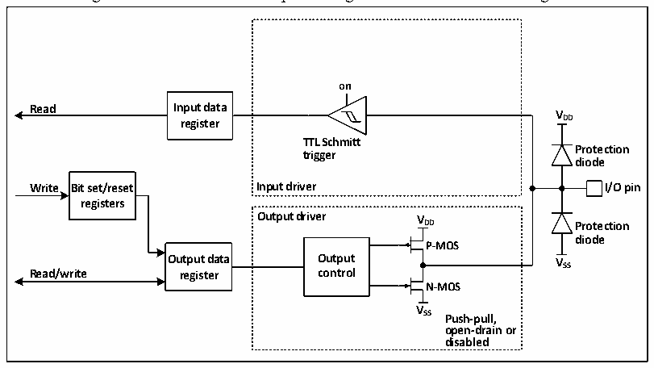
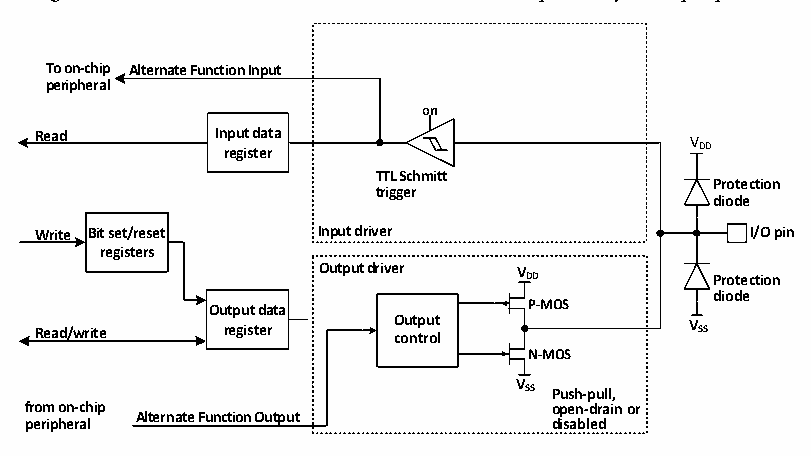

<!-- source-page: 52 -->

[← p.51](0051.md) · [index](../README.md) · [PDF p.52](https://ch32-riscv-ug.github.io/CH32V003/datasheet_en/CH32V003RM.PDF#page=52) · [p.53 →](0053.md)

<!-- header: CH32V003 Reference Manual https://wch-ic.com -->

### 7.2.7 Output Configuration

Figure 7-3 GPIO module output configuration structure block diagram  
 <!-- rendered from the PDF; verify at https://ch32-riscv-ug.github.io/CH32V003/datasheet_en/CH32V003RM.PDF#page=52 -->

🖼 Text parsed from the figure above

<strong>on</strong>  
<strong>Read Input data</strong>  
<strong>V</strong>  
<strong>register DD</strong>  
<strong>TTL Schmitt</strong>  
<strong>Protection</strong>  
<strong>trigger</strong>  
<strong>diode</strong>  
<strong>Write Bit set/reset Input driver I/O pin</strong>  
<strong>registers</strong>  
<strong>Output driver V</strong>  
<strong>DD Protection</strong>  
<strong>diode</strong>  
<strong>P-MOS</strong>  
<strong>Output data Output VSS</strong>  
<strong>Read/write register control</strong>  
<strong>N-MOS</strong>  
<strong>V</strong>  
<strong>SS Push-pull,</strong>  
<strong>open-drain or</strong>  
<strong>disabled</strong>  

When the IO port is configured to output mode, the pair of MOS in the output driver can be configured to  
push-pull or open-drain mode as needed, without using the multiplexing function. The pull-up and pull-down  
resistors of the input driver are disabled, the TTL Schmitt trigger is activated, and the levels appearing on the  
IO pins will be sampled into the input data registers at each HB clock, so reading the input data registers will  
give the IO status, and in push-pull output mode, access to the output data registers will give the last written  
value.  

### 7.2.8 Multiplexing Function Configuration

Figure 7-4 The structure of GPIO module when it is multiplexed by other peripherals  
 <!-- rendered from the PDF; verify at https://ch32-riscv-ug.github.io/CH32V003/datasheet_en/CH32V003RM.PDF#page=52 -->

🖼 Text parsed from the figure above

<strong>To on-chip Alternate Function Input</strong>  
<strong>peripheral</strong>  
<strong>on</strong>  
<strong>Read Input data V</strong>  
<strong>register DD</strong>  
<strong>TTL Schmitt</strong>  
<strong>Protection</strong>  
<strong>trigger</strong>  
<strong>diode</strong>  
<strong>Write Bit set/reset Input driver I/O pin</strong>  
<strong>registers</strong>  
<strong>Output driver V</strong>  
<strong>DD Protection</strong>  
<strong>diode</strong>  
<strong>Output data P-MOS</strong>  
<strong>Read/write register O co u n t t p r u o t l V SS</strong>  
<strong>N-MOS</strong>  
<strong>V</strong>  
<strong>SS Push-pull,</strong>  
<strong>from on-chip open-drain or</strong>  
<strong>Alternate Function Output</strong>  
<strong>peripheral disabled</strong>  

When multiplexing is enabled, the output driver is enabled and can be configured to open-drain or push-pull  
mode as desired, the Schmitt trigger is turned on, the input and output lines of the multiplexing function are  
connected, but the output data registers are disconnected, and the levels appearing on the IO pins will be  
sampled into the input data registers at each HB clock. In open-drain mode, reading the input data register will  
give the current status of the IO port; in push-pull mode, reading the output data register will give the last  
written value.  
<!-- image: p52-draw-image-00001 bbox=[507.6, 794.64, 527.04, 805.2] -->
<!-- footer: V1.9 53 -->
