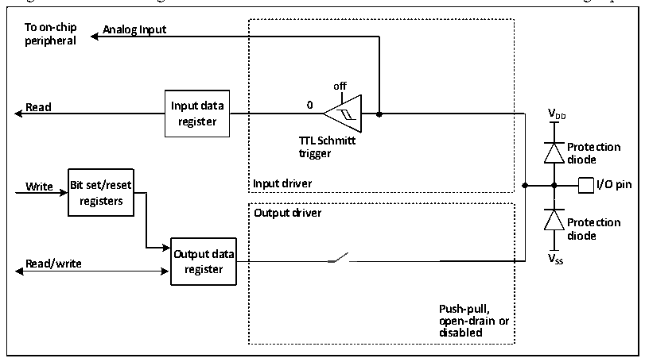

<!-- source-page: 53 -->

[← p.52](0052.md) · [index](../README.md) · [PDF p.53](https://ch32-riscv-ug.github.io/CH32V003/datasheet_en/CH32V003RM.PDF#page=53) · [p.54 →](0054.md)

<!-- header: CH32V003 Reference Manual https://wch-ic.com -->

### 7.2.9 Analog Input Configuration

Figure 7-5 The configuration structure when the GPIO module is used as an analog input  
 <!-- rendered from the PDF; verify at https://ch32-riscv-ug.github.io/CH32V003/datasheet_en/CH32V003RM.PDF#page=53 -->

🖼 Text parsed from the figure above

<strong>To on-chip Analog Input</strong>  
<strong>peripheral</strong>  
<strong>off</strong>  
<strong>Read Input data 0</strong>  
<strong>V</strong>  
<strong>register DD</strong>  
<strong>TTL Schmitt</strong>  
<strong>Protection</strong>  
<strong>trigger</strong>  
<strong>diode</strong>  
<strong>Write Bit set/reset Input driver I/O pin</strong>  
<strong>registers</strong>  
<strong>Output driver</strong>  
<strong>Protection</strong>  
<strong>diode</strong>  
<strong>Output data V</strong>  
<strong>Read/write SS</strong>  
<strong>register</strong>  
<strong>Push-pull,</strong>  
<strong>open-drain or</strong>  
<strong>disabled</strong>  

When the analog input is enabled, the output buffer is disconnected, the input of the Schmitt trigger in the  
input driver is disabled to prevent the generation of consumption on the IO port, the pull-up and pull-down  
resistors are disabled, and the read input data register will always be 0.  

### 7.2.10 GPIO Settings for Peripherals

The following table recommends the corresponding GPIO port configuration for each peripheral pin.  

<!-- p53-table-001 (table-7-1@1) -->
<table><caption>Table 7-1 Advanced-control timer (TIM1)</caption><tr><th>TIM1 pins</th><th>Configuration</th><th>GPIO configuration</th></tr><tr><td rowspan="2">TIM1_CHx</td><td>Input capture channel x</td><td>Floating input</td></tr><tr><td>Output comparison channel x</td><td>Push-pull multiplexed output</td></tr><tr><td>TIM1_CHxN</td><td>Complementary output channels x</td><td>Push-pull multiplexed output</td></tr><tr><td>TIM1_BKIN</td><td>Brake input</td><td>Floating input</td></tr><tr><td>TIM1_ETR</td><td>Externally triggered clock input</td><td>Floating input</td></tr></table>

<!-- p53-table-002 (table-7-2@1) -->
<table><caption>Table 7-2 General-purpose timer (TIM2)</caption><tr><th>TIM2 pins</th><th>Configuration</th><th>GPIO configuration</th></tr><tr><td rowspan="2">TIM2_CHx</td><td>Input capture channel x</td><td>Floating input</td></tr><tr><td>Output comparison channel x</td><td>Push-pull multiplexed output</td></tr><tr><td>TIM2_ETR</td><td>Externally triggered clock input</td><td>Floating input</td></tr></table>

<!-- p53-table-003 (table-7-3@1) -->
<table><caption>Table 7-3 Universal synchronous asynchronous serial transceiver (USART)</caption><tr><th>USART pins</th><th>Configuration</th><th>GPIO configuration</th></tr><tr><td rowspan="2">USARTx_TX</td><td>Full-duplex mode</td><td>Push-pull multiplexed outputs</td></tr><tr><td>Half-duplex synchronous mode</td><td>Open-drain multiplexed outputs</td></tr><tr><td rowspan="2">USARTx_RX</td><td>Full-duplex mode</td><td>Floating input or pull-up input</td></tr><tr><td>Half-duplex synchronous mode</td><td>Not used</td></tr><tr><td>USARTx_CK</td><td>Synchronous mode</td><td>Push-pull multiplexed output</td></tr><tr><td>USARTx_RTS</td><td>Hardware flow control</td><td>Push-pull multiplexed output</td></tr><tr><td>USARTx_CTS</td><td>Hardware flow control</td><td>Floating input or pull-up input</td></tr></table>

<!-- p53-table-004 (table-7-4@1) pages 53-54 -->
<table><caption>Table 7-4 Serial peripheral interface (SPI) modules</caption><tr><th>SPI pins</th><th>Configuration</th><th>GPIO configuration</th></tr><tr><td rowspan="2">SPIx_SCK</td><td>Master mode</td><td>Push-pull multiplexed output</td></tr><tr><td>Slave mode</td><td>Floating input</td></tr><tr><td rowspan="4">SPIx_MOSI</td><td>Full-duplex Master mode</td><td>Push-pull multiplexed output</td></tr><tr><td>Full-duplex Slave mode</td><td>Floating input or pull-up input</td></tr><tr><td style="text-align:left">Simple bi-directional data line/Master mode</td><td>Push-pull multiplexed output</td></tr><tr><td style="text-align:left">Simple bi-directional data line/Slave mode</td><td>Not used</td></tr><tr><td rowspan="4">SPIx_MISO</td><td>Full-duplex Master mode</td><td>Floating input or pull-up input</td></tr><tr><td>Full-duplex Slave mode</td><td>Push-pull multiplexed output</td></tr><tr><td style="text-align:left">Simple bi-directional data line/Master mode</td><td>Not used</td></tr><tr><td style="text-align:left">Simple bi-directional data line/Slave mode</td><td>Push-pull multiplexed output</td></tr><tr><td rowspan="3">SPIx_NSS</td><td>Hardware Master or Slave mode</td><td>Float, pull-up or pull-down input</td></tr><tr><td style="text-align:left">Hardware Master mode/NSS output enable mode</td><td>Push-pull multiplexed output</td></tr><tr><td>Software mode</td><td>Not used</td></tr></table>

<!-- image: p53-draw-image-00001 bbox=[507.6, 794.64, 527.04, 805.2] -->
<!-- footer: V1.9 54 -->
