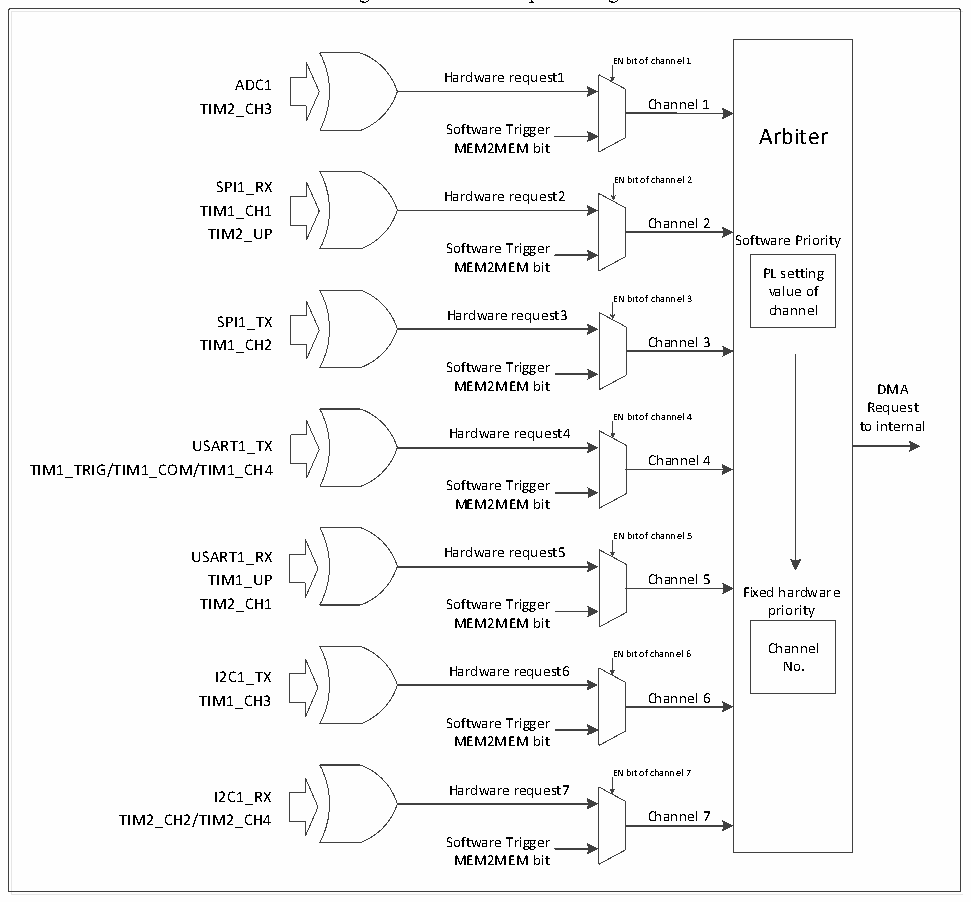

<!-- source-page: 65 -->

[← p.64](0064.md) · [index](../README.md) · [PDF p.65](https://ch32-riscv-ug.github.io/CH32V003/datasheet_en/CH32V003RM.PDF#page=65) · [p.66 →](0066.md)

<!-- header: CH32V003 Reference Manual https://wch-ic.com -->

Figure 8-1 DMA1 request image  
 <!-- rendered from the PDF; verify at https://ch32-riscv-ug.github.io/CH32V003/datasheet_en/CH32V003RM.PDF#page=65 -->

🖼 Text parsed from the figure above

Arbiter  Software Priority PL setting value of channel  Fixed hardware priority Channel No.  
EN bit of channel 1  
Hardware request1  
ADC1  
TIM2_CH3 Channel 1  
Software Trigger Arbiter  
MEM2MEM bit  
SPI1_RX EN bit of channel 2  
Hardware request2  
TIM1_CH1  
Channel 2  
TIM2_UP  
Software Trigger  
MEM2MEM bit PL setting  
EN bit of channel 3  
SPI1_TX Hardware request3 channel  
TIM1_CH2 Channel 3  
Software Trigger  
MEM2MEM bit DMA  
Request  
EN bit of channel 4  
to internal  
Hardware request4  
USART1_TX  
Channel 4  
TIM1_TRIG/TIM1_COM/TIM1_CH4  
Software Trigger  
MEM2MEM bit  
EN bit of channel 5  
USART1_RX Hardware request5  
TIM1_UP Channel 5  
TIM2_CH1 Software Trigger priority  
MEM2MEM bit  
EN bit of channel 6  
I2C1_TX Hardware request6 No.  
TIM1_CH3 Channel 6  
Software Trigger  
MEM2MEM bit  
EN bit of channel 7  
Hardware request7  
I2C1_RX  
TIM2_CH2/TIM2_CH4 Channel 7  
Software Trigger  
MEM2MEM bit  

<!-- p65-table-006 (table-8-2@1) -->
<table><caption>Table 8-2 DMA1 peripheral mapping table for each channel</caption><tr><th>Peripherals</th><th>Channel1</th><th>Channel 2</th><th>Channel 3</th><th>Channel 4</th><th>Channel 5</th><th>Channel 6</th><th>Channel 7</th></tr><tr><td>ADC1</td><td>ADC1</td><td></td><td></td><td></td><td></td><td></td><td></td></tr><tr><td>SPI1</td><td></td><td>SPI1_RX</td><td>SPI1_TX</td><td></td><td></td><td></td><td></td></tr><tr><td>USART1</td><td></td><td></td><td></td><td>USART1_TX</td><td>USART1_RX</td><td></td><td></td></tr><tr><td>I2C1</td><td></td><td></td><td></td><td></td><td></td><td>I2C1_TX</td><td>I2C1_RX</td></tr><tr><td>TIM1</td><td></td><td>TIM1_CH1</td><td>TIM1_CH2</td><td style="text-align:left">TIM1_CH4TIM1_TRIGTIM1_COM</td><td>TIM1_UP</td><td>TIM1_CH3</td><td></td></tr><tr><td>TIM2</td><td>TIM2_CH3</td><td>TIM2_UP</td><td></td><td></td><td>TIM2_CH1</td><td></td><td style="text-align:left">TIM2_CH2TIM2_CH4</td></tr></table>

## 8.3 Register Description

<!-- p65-table-007 (table-8-3@1) pages 65-66 -->
<table><caption>Table 8-3 DMA-related registers list</caption><tr><th>Name</th><th>Access address</th><th>Description</th><th>Reset value</th></tr><tr><td>R32_DMA_INTFR</td><td>0x40020000</td><td>DMA interrupt status register</td><td>0x00000000</td></tr><tr><td>R32_DMA_INTFCR</td><td>0x40020004</td><td>DMA interrupt flag clear register</td><td>0x00000000</td></tr><tr><td>R32_DMA_CFGR1</td><td>0x40020008</td><td>DMA channel 1 configuration register</td><td>0x00000000</td></tr><tr><td>R32_DMA_CNTR1</td><td>0x4002000C</td><td>DMA channel 1 number of data register</td><td>0x00000000</td></tr><tr><td>R32_DMA_PADDR1</td><td>0x40020010</td><td style="text-align:left">DMA channel 1 peripheral address register</td><td>0x00000000</td></tr><tr><td>R32_DMA_MADDR1</td><td>0x40020014</td><td>DMA channel 1 memory address register</td><td>0x00000000</td></tr><tr><td>R32_DMA_CFGR2</td><td>0x4002001C</td><td>DMA channel 2 configuration register</td><td>0x00000000</td></tr><tr><td>R32_DMA_CNTR2</td><td>0x40020020</td><td>DMA channel 2 number of data register</td><td>0x00000000</td></tr><tr><td>R32_DMA_PADDR2</td><td>0x40020024</td><td style="text-align:left">DMA channel 2 peripheral address register</td><td>0x00000000</td></tr><tr><td>R32_DMA_MADDR2</td><td>0x40020028</td><td>DMA channel 2 memory address register</td><td>0x00000000</td></tr><tr><td>R32_DMA_CFGR3</td><td>0x40020030</td><td>DMA channel 3 configuration register</td><td>0x00000000</td></tr><tr><td>R32_DMA_CNTR3</td><td>0x40020034</td><td>DMA channel 3 number of data register</td><td>0x00000000</td></tr><tr><td>R32_DMA_PADDR3</td><td>0x40020038</td><td style="text-align:left">DMA channel 3 peripheral address register</td><td>0x00000000</td></tr><tr><td>R32_DMA_MADDR3</td><td>0x4002003C</td><td>DMA channel 3 memory address register</td><td>0x00000000</td></tr><tr><td>R32_DMA_CFGR4</td><td>0x40020044</td><td>DMA channel 4 configuration register</td><td>0x00000000</td></tr><tr><td>R32_DMA_CNTR4</td><td>0x40020048</td><td>DMA channel 4 number of data register</td><td>0x00000000</td></tr><tr><td>R32_DMA_PADDR4</td><td>0x4002004C</td><td style="text-align:left">DMA channel 4 peripheral address register</td><td>0x00000000</td></tr><tr><td>R32_DMA_MADDR4</td><td>0x40020050</td><td>DMA channel 4 memory address register</td><td>0x00000000</td></tr><tr><td>R32_DMA_CFGR5</td><td>0x40020058</td><td>DMA channel 5 configuration register</td><td>0x00000000</td></tr><tr><td>R32_DMA_CNTR5</td><td>0x4002005C</td><td>DMA channel 5 number of data register</td><td>0x00000000</td></tr><tr><td>R32_DMA_PADDR5</td><td>0x40020060</td><td style="text-align:left">DMA channel 5 peripheral address register</td><td>0x00000000</td></tr><tr><td>R32_DMA_MADDR5</td><td>0x40020064</td><td>DMA channel 5 memory address register</td><td>0x00000000</td></tr><tr><td>R32_DMA_CFGR6</td><td>0x4002006C</td><td>DMA channel 6 configuration register</td><td>0x00000000</td></tr><tr><td>R32_DMA_CNTR6</td><td>0x40020070</td><td>DMA channel 6 number of data register</td><td>0x00000000</td></tr><tr><td>R32_DMA_PADDR6</td><td>0x40020074</td><td style="text-align:left">DMA channel 6 peripheral address register</td><td>0x00000000</td></tr><tr><td>R32_DMA_MADDR6</td><td>0x40020078</td><td>DMA channel 6 memory address register</td><td>0x00000000</td></tr><tr><td>R32_DMA_CFGR7</td><td>0x40020080</td><td>DMA channel 7 configuration register</td><td>0x00000000</td></tr><tr><td>R32_DMA_CNTR7</td><td>0x40020084</td><td>DMA channel 7 number of data register</td><td>0x00000000</td></tr><tr><td>R32_DMA_PADDR7</td><td>0x40020088</td><td style="text-align:left">DMA channel 7 peripheral address register</td><td>0x00000000</td></tr><tr><td>R32_DMA_MADDR7</td><td>0x4002008C</td><td>DMA channel 7 memory address register</td><td>0x00000000</td></tr></table>

<!-- image: p65-draw-image-00001 bbox=[507.6, 794.64, 527.04, 805.2] -->
<!-- footer: V1.9 66 -->
