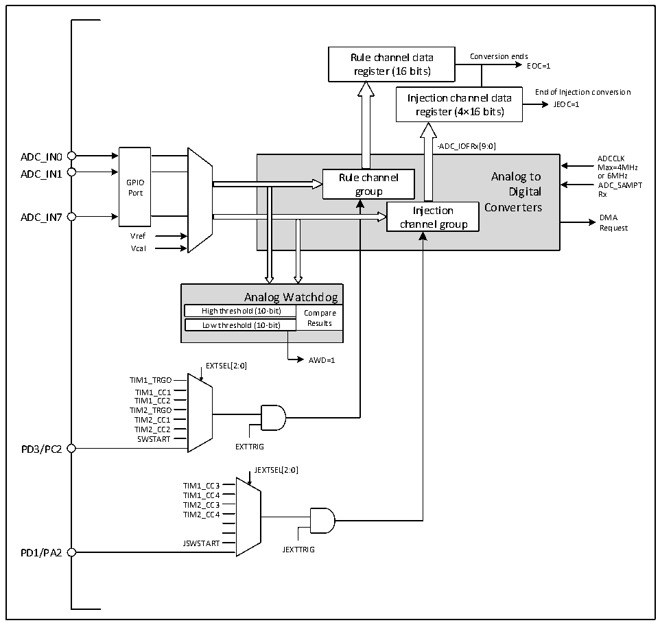

<!-- source-page: 71 -->

[← p.70](0070.md) · [index](../README.md) · [PDF p.71](https://ch32-riscv-ug.github.io/CH32V003/datasheet_en/CH32V003RM.PDF#page=71) · [p.72 →](0072.md)

<!-- header: CH32V003 Reference Manual https://wch-ic.com -->

## 9.2 Functional Description

### 9.2.1 Module Structure

Figure 9-1 ADC module block diagram  
 <!-- rendered from the PDF; verify at https://ch32-riscv-ug.github.io/CH32V003/datasheet_en/CH32V003RM.PDF#page=71 -->

🖼 Text parsed from the figure above

Rule channel data Conversion ends  
register (16 bits) EOC=1  
Injection channel data End of Injection conversion  
JEOC=1  
register (4×16 bits)  
-ADC_IOFRx[9:0]  
GPIOPort  
Rule channel Analog to group Digital Injection Converters channel group  
Max=4MHz  
ADC_IN7 DMA  
Request  
Vref  
Vcal  
Analog Watchdog  High threshoAldn (1a0l-obigt) Wa  atchdog Compare Results  Low threshold (10-bit)  
AWD=1  
EXTSEL[2:0]  
TIM1_TRGO  
TIM1_CC1  
TIM1_CC2  
TIM2_TRGO  
TIM2_CC1  
TIM2_CC2  
SWSTART  
PD3/PC2 EXTTRIG  
JEXTSEL[2:0]  
TIM1_CC3  
TIM1_CC4  
TIM2_CC3  
TIM2_CC4  
JSWSTART  
PD1/PA2 JEXTTRIG  

### 9.2.2 ADC Configuration

<strong>1) Module power-up</strong>  
An ADON bit of 1 in the ADC_CTLR2 register indicates that the ADC module is powered up. When the ADC  
module enters the power-up state (ADON=1) from the power-down mode (ADON=0), a delay period tSTAB is  
required for the module stabilization time. After that, the ADON bit is written to 1 again and is used as the  
start signal for software to start the ADC conversion. By clearing the ADON bit to 0, the current conversion  
can be terminated and the ADC module placed in power-down mode, a state in which the ADC consumes  
almost no power.  
<strong>2) Sampling clock</strong>  
The register operation of the module is based on the HBCLK (HB bus) clock, and the clock reference of its  
conversion unit, ADCCLK, is configured by the ADCPRE field of the RCC_CFGR0 register to divide the  
frequency. Refer to datasheet CH32V003DS0 for detailed information.  
<!-- image: p71-draw-image-00001 bbox=[507.6, 794.64, 527.04, 805.2] -->
<!-- footer: V1.9 72 -->
