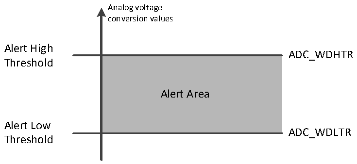

<!-- source-page: 76 -->

[← p.75](0075.md) · [index](../README.md) · [PDF p.76](https://ch32-riscv-ug.github.io/CH32V003/datasheet_en/CH32V003RM.PDF#page=76) · [p.77 →](0077.md)

<!-- header: CH32V003 Reference Manual https://wch-ic.com -->
<em>3. You cannot set intermittent mode for both rule groups and injection groups, and intermittent mode</em>  
<em>can only be used for a group of conversions.</em>  
<strong>4) Continuous conversion</strong>  
In the continuous conversion mode, another conversion is started as soon as the previous ADC conversion is  
completed. The conversion will not stop on the last channel of the selection group, but will continue conversion  
from the first channel of the selection group again. The startup events in this mode include external trigger  
events and the ADON bit is set to 1. After setting the startup, the CONT bit needs to be set to 1.  
If a regular channel is converted, the conversion data is stored in the ADC_RDATAR register, the conversion  
end flag EOC is set, and if EOCIE is set, an interrupt is generated.  
If an injection channel is converted, the conversion data is stored in the ADC_IDATARx register, the injection  
conversion end flag JEOC is set, and if JEOCIE is set, an interrupt is generated.  

### 9.2.5 Analog Watchdog

The AWD analog watchdog status bit is set if the analog voltage being converted by the ADC is below the low  
threshold or above the high threshold. The threshold settings are located in the lowest 10 valid bits of the  
ADC_WDHTR and ADC_WDLTR registers. The AWDIE bit of the ADC_CTLR1 register is set to allow the  
corresponding interrupt to be generated.  

Figure 9-4 Analog watchdog threshold area  
 <!-- rendered from the PDF; verify at https://ch32-riscv-ug.github.io/CH32V003/datasheet_en/CH32V003RM.PDF#page=76 -->

🖼 Text parsed from the figure above

Analog voltage  
conversion values  
Alert High  
ADC_WDHTR  
<!-- image: p76-draw-image-00002 inside the figure -->
Threshold  
Alert Area  
Alert Low  
ADC_WDLTR  
Threshold  

Configure the AWDSGL, AWDEN, JAWDEN and AWDCH[4:0] bits of the ADC_CTLR1 register to select  
the channel for analog watchdog alerting, as related in the following table.  

<!-- p76-table-001 (table-9-6@1) -->
<table><caption>Table 9-6 Analog Watchdog channel selection</caption><tr><th rowspan="2" style="text-align:left">Analog watchdog alert channel</th><th colspan="4">ADC_CTLR1 register control bit</th></tr><tr><td>AWDSGL</td><td>AWDEN</td><td>JAWDEN</td><td>AWDCH[4:0]</td></tr><tr><td>No vigilance</td><td>Ignore</td><td>0</td><td>0</td><td>Ignore</td></tr><tr><td>All injection channels</td><td>0</td><td>0</td><td>1</td><td>Ignore</td></tr><tr><td>All rule channels</td><td>0</td><td>1</td><td>0</td><td>Ignore</td></tr><tr><td style="text-align:left">All injection and rule channels</td><td>0</td><td>1</td><td>1</td><td>Ignore</td></tr><tr><td>Single injection channel</td><td>1</td><td>0</td><td>1</td><td style="text-align:left">Determine the channel number</td></tr><tr><td>Single rule channel</td><td>1</td><td>1</td><td>0</td><td style="text-align:left">Determine the channel number</td></tr><tr><td style="text-align:left">Single injection and rule channel</td><td>1</td><td>1</td><td>1</td><td style="text-align:left">Determine the channel number</td></tr></table>

<!-- image: p76-draw-image-00001 bbox=[507.6, 794.64, 527.04, 805.2] -->
<!-- footer: V1.9 77 -->
