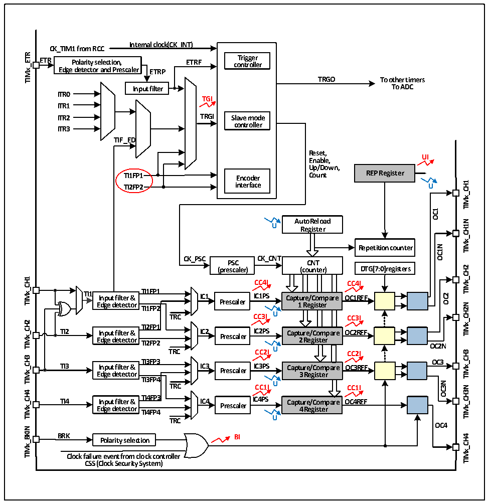

<!-- source-page: 87 -->

[← p.86](0086.md) · [index](../README.md) · [PDF p.87](https://ch32-riscv-ug.github.io/CH32V003/datasheet_en/CH32V003RM.PDF#page=87) · [p.88 →](0088.md)

<!-- header: CH32V003 Reference Manual https://wch-ic.com -->

Figure 10-1 Block diagram of advanced-control timer structure  
 <!-- rendered from the PDF; verify at https://ch32-riscv-ug.github.io/CH32V003/datasheet_en/CH32V003RM.PDF#page=87 -->

🖼 Text parsed from the figure above

<strong>Internal clock(CK_INT)</strong>  
<strong>CK_TIM1 from RCC</strong>  
<strong>TIMx_ETR</strong>  
<strong>ETR Polarity selection, ETRF co T n ri t g r g o e ll r e r</strong>  
Polarity selection, Edge detector and Prescaler  r  
<strong>TRGO To other timers</strong>  
<strong>Input filter To ADC</strong>  
<strong>ITR0</strong>  
<strong>TGI</strong>  
<strong>ITR1</strong>  
<strong>ITR2 TRGI Slave mode</strong>  
<strong>controller</strong>  
<strong>ITR3</strong>  
<strong>TIF_ED</strong>  
<strong>Reset,</strong>  
<strong>UI</strong>  
<strong>Enable,</strong>  
<strong>Up/Down,</strong>  
<strong>TI1FP1 Encoder Count REP Register</strong>  
<strong>TIMx_CH1</strong>  
<strong>TI2FP2 interface U</strong>  
<strong>OC1</strong>  
<strong>AutoReload</strong>  
<strong>TIMx_CH1N</strong>  
<strong>U</strong>  
<strong>Register</strong>  
<strong>OC1N</strong>  
<strong>Repetition counter</strong>  
<strong>CK_PSC CK_CNT</strong>  
<strong>PSC CNT</strong>  
<strong>TIMx_CH2</strong>  
<strong>(prescaler) (counter) DTG[7:0]registers</strong>  
<strong>TIMx_CH1</strong>  
<strong>CC4I CC4I</strong>  
<strong>TI1 Input filter &amp; TTII11FFPP11 IC1 IICC11PPSS Capture/Compare OC1REF</strong>  
<strong>OC2</strong>  
<strong>Edge detector Prescaler 1 Register</strong>  
<strong>TIMx_CH2N</strong>  
<strong>TI1FP2</strong>  
<strong>TRC CC3I U CC3I</strong>  
<strong>TIMx_CH2</strong>  
<strong>TI2FP1</strong>  
<strong>TI2 Input filter &amp; IC2 IC2PS Capture/Compare OC2REF</strong>  
<strong>Prescaler</strong>  
<strong>Edge detector TI2FP2 2 Register TRC CC2I U CC2I</strong>  
<strong>OC2N</strong>  
<strong>TIMx_CH3</strong>  
<strong>TIMx_CH3</strong>  
<strong>TI3FP3</strong>  
<strong>OC3</strong>  
<strong>TI3 Input filter &amp; IC3 Prescaler IC3PS Capture/Compare OC3REF</strong>  
<strong>Edge detector 3 Register</strong>  
<strong>TI3FP4</strong>  
<strong>OC3N</strong>  
<strong>TRC CC1I U CC1I</strong>  
<strong>TIMx_CH3N</strong>  
<strong>TIMx_CH4</strong>  
<strong>TI4 Input filter &amp; TI4FP3 IC4 IC4PS Capture/Compare OC4REF</strong>  
<strong>Edge detector Prescaler 4 Register</strong>  
<strong>TI4FP4</strong>  
<strong>TRC U</strong>  
<strong>OC4</strong>  
<strong>TIMx_BKIN</strong>  
<strong>BRK BI</strong>  
<strong>TIMx_CH4</strong>  
<strong>Polarity selection</strong>  
<strong>Clock failure event from clock controller</strong>  
<strong>CSS (Clock Security System)</strong>  

<!-- image: p87-draw-image-00001 bbox=[507.6, 794.64, 527.04, 805.2] -->
<!-- footer: V1.9 88 -->
