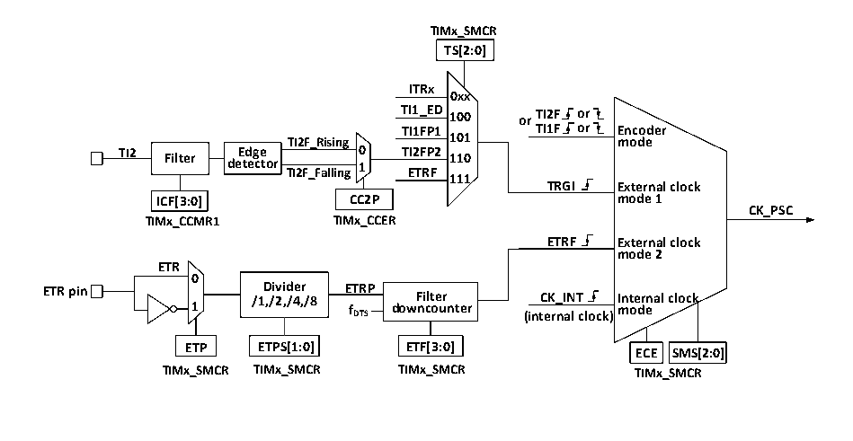

<!-- source-page: 88 -->

[← p.87](0087.md) · [index](../README.md) · [PDF p.88](https://ch32-riscv-ug.github.io/CH32V003/datasheet_en/CH32V003RM.PDF#page=88) · [p.89 →](0089.md)

<!-- header: CH32V003 Reference Manual https://wch-ic.com -->

### 10.2.2 Clock Input

Figure 10-2 Block diagram of CK_PSC source for advanced-control timer  
 <!-- rendered from the PDF; verify at https://ch32-riscv-ug.github.io/CH32V003/datasheet_en/CH32V003RM.PDF#page=88 -->

🖼 Text parsed from the figure above

<strong>TIMx_SMCR</strong>  
<strong>TS[2:0]</strong>  
<strong>ITRx</strong>  
<strong>0xx</strong>  
<strong>TI1_ED 100 or TI2F or</strong>  
<strong>TI1FP1 TI1F or Encoder</strong>  
<strong>TI2F_Rising 101 mode</strong>  
<strong>TI2 Filter de E t d e g c e tor TI2F_Falling 0 1 T E I2 T F R P F 2 110</strong>  
<strong>111</strong>  
<strong>TRGI External clock</strong>  
<strong>ICF[3:0] CC2P mode 1</strong>  
<strong>CK_PSC</strong>  
<strong>TIMx_CCMR1 TIMx_CCER</strong>  
<strong>ETRF External clock</strong>  
<strong>mode 2</strong>  
<strong>ETR</strong>  
<strong>0</strong>  
<strong>ETR pin /1 D ,/ i 2 vi , d /4 e , r /8 ETRP Filter CK_INT Internal clock</strong>  
<strong>1 fDTS downcounter</strong>  
<strong>mode</strong>  
<strong>(internal clock)</strong>  
<strong>ETP ETPS[1:0] ETF[3:0] ECE SMS[2:0]</strong>  
<strong>TIMx_SMCR TIMx_SMCR TIMx_SMCR TIMx_SMCR</strong>  

The advanced-control timer CK_PSC has many clock sources and can be divided into 4 categories.  
1) The advanced-control timer CK_PSC has many clock sources and can be divided into 4 categories.  
2) Internal HB clock input route: CK_INT.  
3) Route from the comparison capture channel pin (TIMx_CHx): TIMx_CHx → TIx → TIxFPx, this route  
is also used in encoder mode.  
4) Inputs from other internal timers: ITRx.  
The actual operation can be divided into 4 categories by determining the choice of input pulse for the SMS of  
the CK_PSC source.  
1) Selection of the internal clock source (CK_INT).  
2) External clock source mode 1.  
3) External clock source mode 2.  
4) Encoder mode.  
All 4 clock source sources mentioned above can be selected by these 4 operations.  

#### 10.2.2.1 Internal clock source (CK_INT)

If the SMS field is held at 000b to start the advanced-control timer, then it is the internal clock source (CK_INT)  
that is selected as the clock. At this point CK_INT is CK_PSC.  

#### 10.2.2.2 External Clock Source Mode 1

When the SMS domain is set to 111b, external clock source mode 1 is enabled. When external clock source 1  
is enabled, TRGI is selected as the source of CK_PSC. it is worth noting that the source of TRGI also needs  
to be selected by configuring the TS domain. the TS domain can select the following types of pulses as clock  
sources.  
1) Internal trigger (ITRx, x is 0,1,2,3).  
2) The signal after compare/capture channel 1 through the edge detector (TI1F_ED).  
3) The signal TI1FP1, TI2FP2 of the compare/capture channel.  
4) The signal ETRF from the external clock pin input.  

#### 10.2.2.3 External Clock Source Mode 2

Use external trigger mode 2 to count on every rising or falling edge of the external clock pin input. When the  
<!-- image: p88-draw-image-00001 bbox=[507.6, 794.64, 527.04, 805.2] -->
<!-- footer: V1.9 89 -->
