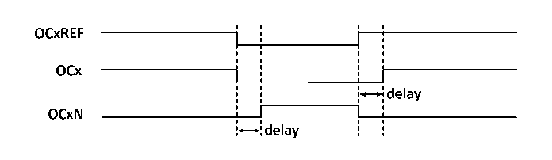

<!-- source-page: 93 -->

[← p.92](0092.md) · [index](../README.md) · [PDF p.93](https://ch32-riscv-ug.github.io/CH32V003/datasheet_en/CH32V003RM.PDF#page=93) · [p.94 →](0094.md)

<!-- header: CH32V003 Reference Manual https://wch-ic.com -->
count modes, and OCxREF makes rising and falling jumps when the values of the core counter and the  
compare capture register match. However, the comparison flags are set at different times in the three central  
alignment modes. When using the central alignment modes, it is best to generate a software update flag (set  
the UG bit) before starting the core counter.  

### 10.3.6 Complementary Outputs and Dead-time Insertion

The compare capture channel generally has two output pins (compare capture channel 4 has only one output  
pin) and can output two complementary signals (OCx and OCxN). OCx and OCxN can be independently set  
for polarity via the CCxP and CCxNP bits, independently set for output enable via CCxE and CCxNE, and  
independently set for output enable via the MOE, OIS, OISN, OSSI, and OSSR bits for dead-time and other  
controls. Enabling the OCx and OCxN outputs simultaneously will insert a dead-time, and each channel has a  
10-bit dead-time generator. OCx and OCxN are generated by the OCxREF association. If both OCx and OCxN  
are high active, then OCx is the same as OCxREF except that the rising edge of OCx is equivalent to OCxREF  
with a delay, and OCxN is the opposite of OCxREF in that its rising edge will have a delay relative to the  
falling edge of the reference signal. If the delay is greater than the effective output width, the corresponding  
pulse will not be generated.  
The relationship between OCx and OCxN and OCxREF is illustrated in Figure 10-4, which shows the dead-  
time.  

Figure 10-4 Complementary outputs and dead-time  
 <!-- rendered from the PDF; verify at https://ch32-riscv-ug.github.io/CH32V003/datasheet_en/CH32V003RM.PDF#page=93 -->

🖼 Text parsed from the figure above

<!-- image: p93-draw-image-00002 inside the figure -->
<!-- image: p93-draw-image-00003 inside the figure -->
<!-- image: p93-draw-image-00006 inside the figure -->
<!-- image: p93-draw-image-00004 inside the figure -->
<!-- image: p93-draw-image-00005 inside the figure -->

### 10.3.7 Brake Signal

When the brake signal is generated, the output enable signal and invalid level are modified according to the  
MOE, OIS, OISN, OSSI, and OSSR bits. However, OCx and OCxN will not be at the active level at any time.  
The source of the brake event can come from the brake input pin or it can be a clock failure event which is  
generated by the CSS (Clock Safety System).  
After system reset, the brake function is disabled by default (MOE bit is low), and setting the BKE bit enables  
the brake function. The polarity of the input brake signal can be set by setting BKP, and the BKE and BKP  
signals can be written at the same time, and there is a delay of one HB clock before the actual writing, so you  
need to wait for one HB cycle to read the written value correctly.  
At the presence of the selected level on the brake pin the system will generate the following actions.  
1) The MOE bit is cleared asynchronously, setting the output to an invalid, idle or reset state, depending on  
the setting of the SOOI bit.  
2) After the MOE has been cleared, each output channel outputs a level determined by OISx.  
3) When using complementary outputs: the outputs are placed in a null state, depending on the polarity.  
4) If the BIE is set, an interrupt is generated when the BIF is set; if the BDE bit is set, a DMA request is  
generated.  
5) If the AOE is set, the MOE bit is automatically set at the next update event UEV.  

### 10.3.8 Single Pulse Mode

Single pulse mode can be used to allow the microcontroller to respond to a specific event by causing it to  
generate a pulse after a delay, with the delay and width of the pulse programmable. Placing the OPM bit allows  
the core counter to stop when the next update event UEV is generated (counter flips to 0).  
<!-- image: p93-draw-image-00001 bbox=[507.6, 794.64, 527.04, 805.2] -->
<!-- footer: V1.9 94 -->
