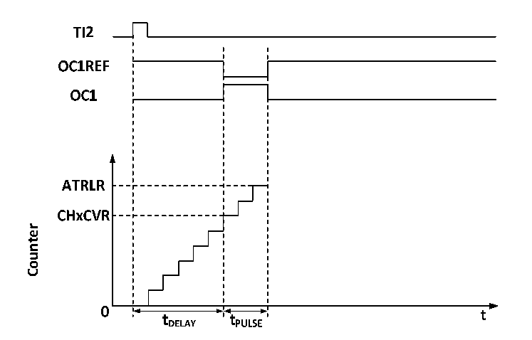

<!-- source-page: 94 -->

[← p.93](0093.md) · [index](../README.md) · [PDF p.94](https://ch32-riscv-ug.github.io/CH32V003/datasheet_en/CH32V003RM.PDF#page=94) · [p.95 →](0095.md)

<!-- header: CH32V003 Reference Manual https://wch-ic.com -->
As shown in Figure 10-5, a positive pulse of length Tpulse needs to be generated on OC1 after a delay Tdelay  
at the beginning of a rising edge detected on the TI2 input pin.  

Figure 10-5 Generation of single pulse  
 <!-- rendered from the PDF; verify at https://ch32-riscv-ug.github.io/CH32V003/datasheet_en/CH32V003RM.PDF#page=94 -->

🖼 Text parsed from the figure above

<!-- image: p94-draw-image-00003 inside the figure -->
<!-- image: p94-draw-image-00002 inside the figure -->
<!-- image: p94-draw-image-00004 inside the figure -->
<!-- image: p94-draw-image-00005 inside the figure -->
<!-- image: p94-draw-image-00006 inside the figure -->
<!-- image: p94-draw-image-00007 inside the figure -->
<!-- image: p94-draw-image-00008 inside the figure -->
<!-- image: p94-draw-image-00015 inside the figure -->
<!-- image: p94-draw-image-00016 inside the figure -->
<strong>Counter</strong>  
<!-- image: p94-draw-image-00009 inside the figure -->
<!-- image: p94-draw-image-00014 inside the figure -->
<!-- image: p94-draw-image-00010 inside the figure -->
<!-- image: p94-draw-image-00012 inside the figure -->
<!-- image: p94-draw-image-00013 inside the figure -->
<!-- image: p94-draw-image-00011 inside the figure -->

1) Set TI2 to trigger. Setting the CC2S field to 01b to map TI2FP2 to TI2; setting the CC2P bit to 0b to set  
TI2FP2 as rising edge detection; setting the TS field to 110b to set TI2FP2 as trigger source; setting the  
SMS field to 110b to set TI2FP2 to be used to start the counter.  
2) Tdelay is determined by the value of the Compare Capture Register, and Tpulse is determined by the  
value of the Auto Reload Value Register and the Compare Capture Register.  

### 10.3.9 Encoder Mode

The encoder mode is a typical application of the timer and can be used to access the biphasic output of the  
encoder. The counting direction of the core counter is synchronized with the direction of the encoder&#x27;s rotation  
axis, and each pulse output from the encoder will cause the core counter to add or subtract one. To use the  
encoder, set the SMS field to 001b (count only on TI2 edge), 010b (count only on TI1 edge) or 011b (count on  
both TI1 and TI2 edges), connect the encoder to the input of comparison capture channels 1 and 2, and set a  
value for the reload value register, which can be set to a larger value. When in encoder mode, the internal  
compare capture register, prescaler, repeat count register, etc. of the timer are working normally. The following  
table shows the relationship between the counting direction and the encoder signal.  

> ⚠ Table extraction recorded 3 issue(s) (overlapping merged cells); verify against [the PDF, p.94](https://ch32-riscv-ug.github.io/CH32V003/datasheet_en/CH32V003RM.PDF#page=94).

<!-- p94-table-002 (table-10-1@1) -->
<table><caption>Table 10-1 Relationship between counting direction and encoder signal of timer encoder mode</caption><tr><th rowspan="4">Counting effective edges</th><th rowspan="4" colspan="2" style="text-align:left">The level of relative signals</th><th colspan="2">TI1FP1 signal edge</th><th colspan="2">TI2FP2 signal</th></tr><tr><td>of</td><td rowspan="3" style="text-align:left">Rising edge</td><td rowspan="3" style="text-align:left">Falling edge</td><td rowspan="3" style="text-align:left">Rising edge</td><td rowspan="3" style="text-align:left">Falling edge</td></tr><tr><td>relative</td></tr><tr><td>signals</td></tr><tr><td rowspan="2">Counting at TI1 edge only</td><td colspan="2">high</td><td style="text-align:left">Downward counting</td><td style="text-align:left">Upward counting</td><td rowspan="2" colspan="2">No count</td></tr><tr><td colspan="2">low</td><td style="text-align:left">Upward counting</td><td style="text-align:left">Downward counting</td></tr><tr><td rowspan="2">Counting at TI2 edge only</td><td colspan="2">high</td><td rowspan="2" colspan="2">No count</td><td style="text-align:left">Upward counting</td><td style="text-align:left">Downward counting</td></tr><tr><td colspan="2">low</td><td style="text-align:left">Downward counting</td><td style="text-align:left">Upward counting</td></tr><tr><td rowspan="2" style="text-align:left">Double edge counting at TI1 and TI2</td><td colspan="2">high</td><td style="text-align:left">Downward counting</td><td style="text-align:left">Upward counting</td><td style="text-align:left">Upward counting</td><td style="text-align:left">Downward counting</td></tr><tr><td colspan="2">low</td><td style="text-align:left">Upward counting</td><td style="text-align:left">Downward counting</td><td style="text-align:left">Downward counting</td><td style="text-align:left">Upward counting</td></tr></table>

<!-- image: p94-draw-image-00001 bbox=[507.6, 794.64, 527.04, 805.2] -->
<!-- footer: V1.9 95 -->
