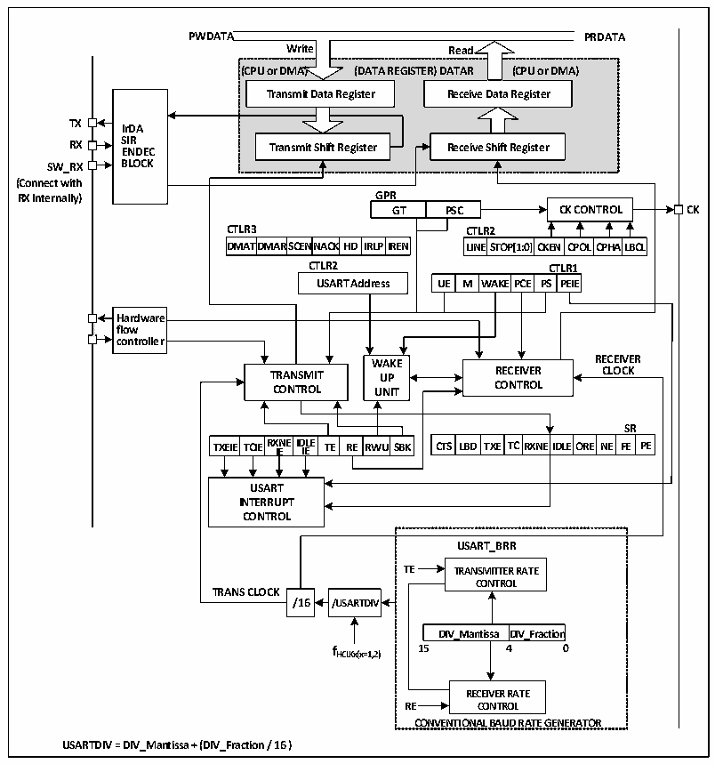

<!-- source-page: 135 -->

[← p.134](0134.md) · [index](../README.md) · [PDF p.135](https://ch32-riscv-ug.github.io/CH32V003/datasheet_en/CH32V003RM.PDF#page=135) · [p.136 →](0136.md)

<!-- header: CH32V003 Reference Manual https://wch-ic.com -->

# Chapter 12 Universal Synchronous Asynchronous Receiver Transmitter (USART)

The module contains one Universal Synchronous Asynchronous Transceiver USART1.  

## 12.1 Main Features

● Full-duplex or half-duplex synchronous or asynchronous communication  
● NRZ data format  
● Fractional baud rate generator, up to 3Mbps  
● Programmable data length  
● Configurable stop bits  
● Support LIN, IrDA encoders, smart cards  
● DMA support  
● Multiple interrupt sources  

## 12.2 Overview

Figure 12-1 Block diagram of a general-purpose synchronous/asynchronous transceiver  
 <!-- rendered from the PDF; verify at https://ch32-riscv-ug.github.io/CH32V003/datasheet_en/CH32V003RM.PDF#page=135 -->

🖼 Text parsed from the figure above

<strong>PWDATA PRDATA</strong>  
<strong>Write Read</strong>  
<strong>(CPU or DMA) (DATA REGISTER) DATAR (CPU or DMA)</strong>  
<strong>Transmit Data Register Receive Data Register</strong>  
<!-- image: p135-draw-image-00004 inside the figure -->
<strong>TX IrDA</strong>  
<strong>RX S E I N R DEC Transmit Shift Register Receive Shift Register</strong>  
<strong>SW_RX BLOCK</strong>  
<strong>(Connect with</strong>  
<strong>RX Internally) GPR</strong>  
<strong>GT PSC CK CONTROL CK</strong>  
<strong>CTLR3 CTLR2</strong>  
DMAT  TDMAR  SCENNA  ACKHD  IRLP  
CLITNLER2STO  OP[1:0]  CKEN  CPOL  CPHA  ALBCL  
<strong>DMATDMARSCENNACKHD IRLPIREN LINESTOP[1:0]CKEN CPOLCPHALBCL</strong>  
<strong>CTLR2 CTLR1</strong>  
WAKE  EPCE  PSCT  TPLREI1E  
Hardware flow controller  
<!-- image: p135-draw-image-00002 inside the figure -->
<!-- image: p135-draw-image-00003 inside the figure -->
<strong>WWAAKKEE RECEIVER</strong>  
<strong>TRANSMIT UUPP RECEIVER CLOCK</strong>  
<strong>CONTROL UUNNIITT CONTROL</strong>  
TXEIE  TCIE  RXNEIDLE IE IE  TE RE  RWU  
<strong>SR</strong>  
CTS LBD  TXE  TC  RXNEID  DLEORE  NE  SRFE  RPE  
<strong>USART</strong>  
<strong>INTERRUPT</strong>  
<strong>CONTROL</strong>  
<strong>USART_BRR</strong>  
<strong>TE TRANSMITTER RATE</strong>  
<strong>CONTROL</strong>  
<strong>TRANS CLOCK</strong>  
<strong>/16 /USARTDIV</strong>  
DIV_Mantissa  DIV_Fractio  
<strong>fHCLKx(x=1,2) 15 4 0</strong>  
<strong>RECEIVER RATE</strong>  
<strong>RE CONTROL</strong>  
<strong>CONVENTIONAL BAUD RATE GENERATOR</strong>  
<strong>USARTDIV = DIV_Mantissa + (DIV_Fraction / 16 )</strong>  

When TE (transmit enable bit) is set, the data in the transmit shift register is output on the TX pin and the clock  
<!-- image: p135-draw-image-00001 bbox=[507.6, 794.64, 527.04, 805.2] -->
<!-- footer: V1.9 136 -->
