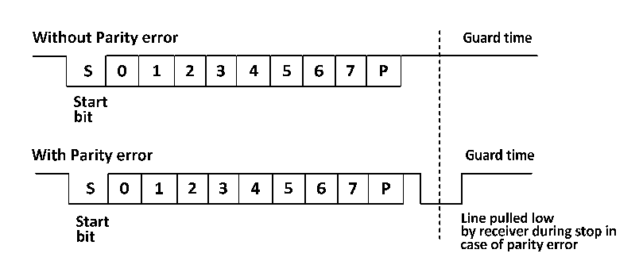

<!-- source-page: 138 -->

[← p.137](0137.md) · [index](../README.md) · [PDF p.138](https://ch32-riscv-ug.github.io/CH32V003/datasheet_en/CH32V003RM.PDF#page=138) · [p.139 →](0139.md)

<!-- header: CH32V003 Reference Manual https://wch-ic.com -->
(R16_USARTx_CTLR3), but it is also necessary to turn off LIN mode, half duplex mode and IR mode, i.e. to  
ensure that the LINEN, HDSEL and IREN bits are in reset, but CLKEN can be turned on to output the clock,  
these bits are in control registers 2 and 3 (R16_USARTx_CTLR2 and R16_USARTx_CTLR3).  
To support smart card mode, USART should be set to 8 bits of data plus 1 bit of parity, and its stop bit is  
recommended to be configured to 1.5 bits for both transmit and receive. Smart card mode is a 1-wire half-  
duplex protocol that uses the TX line for data communication and should be configured as an open-drain output  
plus a pull. When the receiver receives a frame of data and detects a parity error, it sends a NACK signal, i.e.,  
it actively pulls the TX down by one cycle during the stop bit, and the sender detects the NACK signal, which  
generates a frame error whereby the application can retransmit. Figure 17-4 shows the waveforms on the TX  
pin in the correct case and in the case of a parity error. the TC flag (transmit complete flag) of the USART can  
delay the GT (protection time) generation by one clock, and the receiver will not recognize the NACK signal  
it sets as the start bit.  

Figure 12-4 (Un)Occurrence of parity error diagram  
 <!-- rendered from the PDF; verify at https://ch32-riscv-ug.github.io/CH32V003/datasheet_en/CH32V003RM.PDF#page=138 -->

🖼 Text parsed from the figure above

<!-- image: p138-draw-image-00012 inside the figure -->
<!-- image: p138-draw-image-00015 inside the figure -->
<!-- image: p138-draw-image-00002 inside the figure -->
<!-- image: p138-draw-image-00003 inside the figure -->
<!-- image: p138-draw-image-00005 inside the figure -->
<!-- image: p138-draw-image-00006 inside the figure -->
<!-- image: p138-draw-image-00009 inside the figure -->
<!-- image: p138-draw-image-00004 inside the figure -->
<!-- image: p138-draw-image-00007 inside the figure -->
<!-- image: p138-draw-image-00008 inside the figure -->
<!-- image: p138-draw-image-00010 inside the figure -->
<!-- image: p138-draw-image-00011 inside the figure -->
<!-- image: p138-draw-image-00013 inside the figure -->
<!-- image: p138-draw-image-00014 inside the figure -->
<!-- image: p138-draw-image-00026 inside the figure -->
<!-- image: p138-draw-image-00029 inside the figure -->
<!-- image: p138-draw-image-00017 inside the figure -->
<!-- image: p138-draw-image-00019 inside the figure -->
<!-- image: p138-draw-image-00020 inside the figure -->
<!-- image: p138-draw-image-00023 inside the figure -->
<!-- image: p138-draw-image-00016 inside the figure -->
<!-- image: p138-draw-image-00018 inside the figure -->
<!-- image: p138-draw-image-00021 inside the figure -->
<!-- image: p138-draw-image-00022 inside the figure -->
<!-- image: p138-draw-image-00024 inside the figure -->
<!-- image: p138-draw-image-00025 inside the figure -->
<!-- image: p138-draw-image-00030 inside the figure -->
<!-- image: p138-draw-image-00027 inside the figure -->
<!-- image: p138-draw-image-00031 inside the figure -->
<!-- image: p138-draw-image-00028 inside the figure -->
<!-- image: p138-draw-image-00032 inside the figure -->

In smart card mode, the waveform output from the CK pin when enabled has nothing to do with communication;  
it simply clocks the smart card with the value of the AHB clock followed by a five-bit settable clock division  
(twice the value of the PSC, up to 62 divisions).  

## 12.7 IrDA

The USART module supports control of IrDA infrared transceivers for physical layer communication. The  
LINEN, STOP, CLKEN, SCEN and HDSEL bits must be cleared to use IrDA. NRZ (non-return to zero) coding  
is used between the USART module and the SIR physical layer (infrared transceiver) and is supported up to  
115200 bps rates.  
IrDA is a half-duplex protocol, if UASRT is sending data to SIR physical layer, then IrDA decoder will ignore  
the newly sent IR signal, if USART is receiving data from SIR, then SIR will not accept the signal from USART.  
the level logic of USART to SIR and SIRto USART is different. In SIR receive logic, the high level is 1 and  
the low level is 0, but in SIR send logic, the high level is 0 and the low level is 1.  

## 12.8 DMA

The USART module supports DMA function, which can be used to achieve fast and continuous sending and  
receiving. When DMA is enabled, the DMA writes data from the set memory space to the transmit buffer when  
TXE is set. When using DMA to receive, each time RXNE is set, DMA transfers the data in the receive buffer  
to a specific memory space.  

## 12.9 Interrupts

The USART module supports a variety of interrupt sources, including transmit data register empty (TXE),  
<!-- image: p138-draw-image-00001 bbox=[507.6, 794.64, 527.04, 805.2] -->
<!-- footer: V1.9 139 -->
