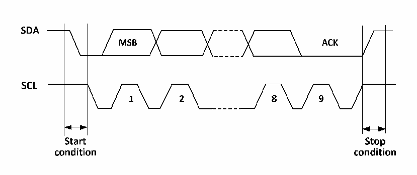

<!-- source-page: 146 -->

[← p.145](0145.md) · [index](../README.md) · [PDF p.146](https://ch32-riscv-ug.github.io/CH32V003/datasheet_en/CH32V003RM.PDF#page=146) · [p.147 →](0147.md)

<!-- header: CH32V003 Reference Manual https://wch-ic.com -->

# Chapter 13 Inter-integrated Circuit (I2C) interface

The Internal Integrated Circuit Bus (I2C) is widely used for communication between microcontrollers and  
sensors and other off-chip modules, it supports multi-master and multi-slave modes, and can communicate at  
100kHz (standard) and 400kHz (fast) using only two lines (SDA and SCL). Timing and DMA, with CRC  
checksum function.  

## 13.1 Main Features

● Support master and slave modes  
● Support 7-bit or 10-bit addresses  
● Slave devices support dual 7-bit addresses  
● Support two speed modes: 100kHz and 400kHz  
● Multiple status modes, multiple error flags  
● Support extended clock function  
● 2 interrupt vectors  
● DMA support  
● Support PEC  
● SMBus compatible  

## 13.2 Overview

I2C is a half-duplex bus that can only operate in one of the following four modes at the same time: master  
device transmit mode, master device receive mode, slave device transmit mode and slave device receive mode.  
the I2C module works in slave mode by default and automatically switches to master mode when a start  
condition is generated and to slave mode when arbitration is lost or a stop signal is generated. the I2C module  
supports multi-master functionality. When working in master mode, the I2C module actively emits data and  
addresses. Both data and address are transmitted in 8-bit units, with the high bit before and the low bit after.  
After the start event is a one-byte (in 7-bit address mode) or two-byte (in 10-bit address mode) address, and  
for every 8-bit data or address sent by the host, the slave needs to reply with an answer ACK, which pulls the  
SDA bus low, as shown in Figure 13-1.  

Figure 13-1 I2C Timing Diagram  
 <!-- rendered from the PDF; verify at https://ch32-riscv-ug.github.io/CH32V003/datasheet_en/CH32V003RM.PDF#page=146 -->

🖼 Text parsed from the figure above

<!-- image: p146-draw-image-00002 inside the figure -->
<!-- image: p146-draw-image-00004 inside the figure -->
<!-- image: p146-draw-image-00005 inside the figure -->
<!-- image: p146-draw-image-00003 inside the figure -->
<!-- image: p146-draw-image-00007 inside the figure -->
<!-- image: p146-draw-image-00008 inside the figure -->
<!-- image: p146-draw-image-00009 inside the figure -->
<!-- image: p146-draw-image-00006 inside the figure -->
<!-- image: p146-draw-image-00010 inside the figure -->
<!-- image: p146-draw-image-00012 inside the figure -->
<!-- image: p146-draw-image-00011 inside the figure -->
<!-- image: p146-draw-image-00013 inside the figure -->

In order to work properly the I2C must be fed with the correct clock, which is a minimum of 2MHz in standard  
mode and 4MHz in fast mode.  
<!-- image: p146-draw-image-00001 bbox=[507.6, 794.64, 527.04, 805.2] -->
<!-- footer: V1.9 147 -->
