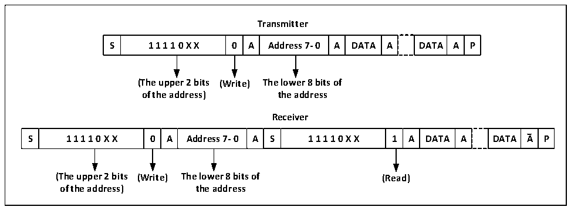
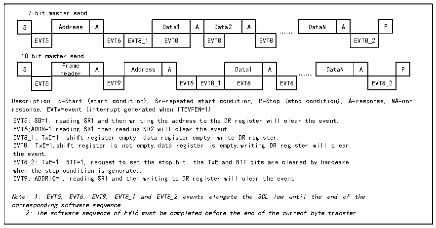

<!-- source-page: 148 -->

[← p.147](0147.md) · [index](../README.md) · [PDF p.148](https://ch32-riscv-ug.github.io/CH32V003/datasheet_en/CH32V003RM.PDF#page=148) · [p.149 →](0149.md)

<!-- header: CH32V003 Reference Manual https://wch-ic.com -->
of status register will be set, if ITEVTEN bit has been set, then interrupt will be generated, at this time,  
R16_I2Cx_STAR1 register should be read and then R16_I2Cx_STAR2 register should be read once to clear  
ADDR bit;  
In 7-bit address mode, the first byte sent is the address byte, the first 7 bits represent the address of the target  
slave device, the 8th bit determines the direction of the subsequent message, 0 means the master device writes  
data to the slave device, 1 means the master device reads information to the slave device.  
In 10-bit address mode, as shown in Figure 13-3, in the send address phase, the first byte is 11110xx0, xx is  
the highest 2 bits of the 10-bit address, and the second byte is the lower 8 bits of the 10-bit address. If  
subsequently enter the master device transmit mode, continue to send data; if subsequently ready to enter the  
master device receive mode, you need to re-send a start condition, follow to send a byte as 11110xx1, and then  
enter the master device receive mode.  

Figure 13-3 Schematic diagram of master sending and receiving data at 10-bit address  
 <!-- rendered from the PDF; verify at https://ch32-riscv-ug.github.io/CH32V003/datasheet_en/CH32V003RM.PDF#page=148 -->

🖼 Text parsed from the figure above

<strong>Transmitter</strong>  
S  1 1 1 1 0 X X  0  A  Address 7- 0  A  DATA  A  DATA  A  P  
<strong>(The upper 2 bits (Write) The lower 8 bits of</strong>  
<strong>of the address) the address</strong>  
<strong>Receiver</strong>  
S  1 1 1 1 0 X X  0  A  Address 7- 0  A  S  1 1 1 1 0 X X  1  A  DATA  A  DATA  A  P  
<strong>(The upper 2 bits (Write) The lower 8 bits of (Read)</strong>  
<strong>of the address) the address</strong>  

Master transmit mode:  
The master device&#x27;s internal shift register sends data from the data register to the SDA line. When the master  
device receives an ACK, TxE in status register 1 (R16_I2Cx_STAR1) is set, and an interrupt is also generated  
if ITEVTEN and ITBUFEN are set. Writing data to the data register will clear the TxE bit.  
If the TxE bit is set and no new data was written to the data register before the last data was sent, then the BTF  
bit will be set and SCL will remain low until it is cleared, and writing data to the data register after reading  
R16_I2Cx_STAR1 will clear the BTF bit.  

Figure 13-4 Master transmitter transmission sequence diagram  
 <!-- rendered from the PDF; verify at https://ch32-riscv-ug.github.io/CH32V003/datasheet_en/CH32V003RM.PDF#page=148 -->

🖼 Text parsed from the figure above

7-bit master send  
S  Address  A  Data1  A  Data2  A  EVT5  EVT6  EVT8_1  EVT8  EVT8  EVT8  
DataN  A  P  EVT8_2  
……  
10-bit master send  
S  Frame header  A  Address  A  Data1  A  EVT5  EVT9  EVT6  EVT8_1  EVT8  … EVT8  
DataN  A  P  EVT8_2  
Description: S=Start (start condition), Sr=repeated start condition, P=Stop (stop condition), A=response, NA=non-  
response, EVTx=event (interrupt generated when ITEVFEN=1)  
EVT5: SB=1, reading SR1 and then writing the address to the DR register will clear the event.  
EVT6;ADDR=1,reading SR1 then reading SR2 will clear the event.  
EVT8_1: TxE=1, shift register empty, data register empty, write DR register.  
EVT8: TxE=1,shift register is not empty,data register is empty,writing DR register will clear  
the event.  
EVT8_2: TxE=1, BTF=1, request to set the stop bit. the TxE and BTF bits are cleared by hardware  
when the stop condition is generated.  
EVT9: ADDR10=1, reading SR1 and then writing to DR register will clear the event.  
Note: 1: EVT5, EVT6, EVT9, EVT8_1 and EVT8_2 events elongate the SCL low until the end of the  
corresponding software sequence.  
2: The software sequence of EVT8 must be completed before the end of the current byte transfer.  

Master receive mode:  
<!-- image: p148-draw-image-00001 bbox=[507.6, 794.64, 527.04, 805.2] -->
<!-- footer: V1.9 149 -->
