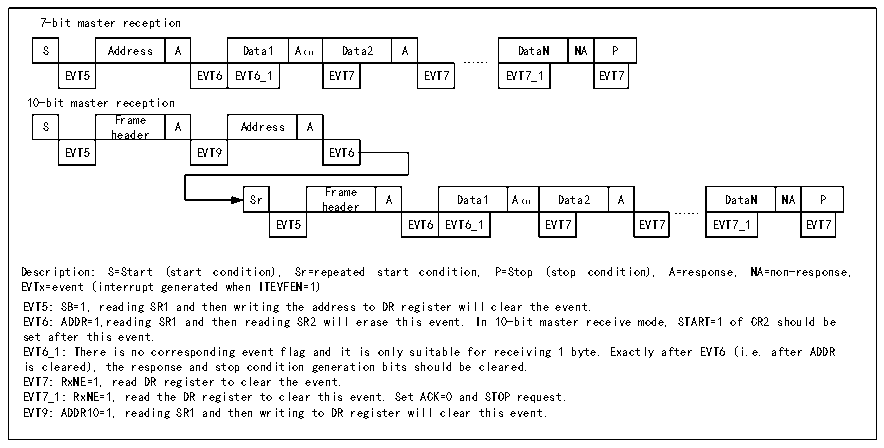

<!-- source-page: 149 -->

[← p.148](0148.md) · [index](../README.md) · [PDF p.149](https://ch32-riscv-ug.github.io/CH32V003/datasheet_en/CH32V003RM.PDF#page=149) · [p.150 →](0150.md)

<!-- header: CH32V003 Reference Manual https://wch-ic.com -->
The I2C module will receive data from the SDA line and write it into the data register via a shift register. After  
each byte, if the ACK bit is set, then the I2C module will send an answer low, and the RxNE bit will be set,  
and an interrupt will be generated if ITEVTEN and ITBUFEN are set. If RxNE is set and the original data is  
not read before the new data is received, the BTF bit will be set and SCL will remain low until the BTF is  
cleared, and reading R16_I2Cx_STAR1 and then reading the data register will clear the BTF bit.  

Figure 13-5 Receiver transmission sequence diagram  
 <!-- rendered from the PDF; verify at https://ch32-riscv-ug.github.io/CH32V003/datasheet_en/CH32V003RM.PDF#page=149 -->

🖼 Text parsed from the figure above

7-bit master reception  
S  Address  A  Data1  A（1）  Data2  A  EVT5  EVT6  EVT6_1  EVT7  EVT7  
DataN  NA  P  EVT7_1  EVT7  
……  
10-bit master reception  
S  Frame header  A  Address  A  EVT5  EVT9  EVT6  
Sr  Frame header  A  Data1  A（1）  Data2  A  EVT5  EVT6  EVT6_1  EVT7  EVT7  
DataN  NA  P  EVT7_1  EVT7  
……  
Description: S=Start (start condition), Sr=repeated start condition, P=Stop (stop condition), A=response, NA=non-response,  
EVTx=event (interrupt generated when ITEVFEN=1)  
EVT5: SB=1, reading SR1 and then writing the address to DR register will clear the event.  
EVT6: ADDR=1,reading SR1 and then reading SR2 will erase this event. In 10-bit master receive mode, START=1 of CR2 should be  
set after this event.  
EVT6_1: There is no corresponding event flag and it is only suitable for receiving 1 byte. Exactly after EVT6 (i.e. after ADDR  
is cleared), the response and stop condition generation bits should be cleared.  
EVT7: RxNE=1, read DR register to clear the event.  
EVT7_1: RxNE=1, read the DR register to clear this event. Set ACK=0 and STOP request.  
EVT9: ADDR10=1, reading SR1 and then writing to DR register will clear this event.  

When the master device ends sending data, it will actively send an end event, i.e. set the STOP bit, and the I2C  
will switch to slave mode. In receive mode, the master device needs to NAK at the answer position of the last  
data bit, and after receiving NACK, the slave device releases control of the SCL and SDA lines; the master  
device can then send a stop/restart condition. Note that the I2C module will automatically switch to slave mode  
after the stop condition is generated.  

## 13.4 Slave Mode

When in slave mode, the I2C module recognizes its own address and the broadcast call address. The software  
can control whether the recognition of the broadcast call address is enabled or disabled. Once a start event is  
detected, the I2C module compares the SDA data through the shift register with its own address (number of  
bits depends on ENDUAL and ADDMODE) or the broadcast address (when ENGC is set), if there is a  
mismatch it will be ignored until a new start event is generated. If it matches the header sequence, an ACK  
signal is generated and the address of the second byte is waited for; if the address of the second byte also  
matches or the full segment address matches in the case of a 7- bit address, then:  
first an ACK answer is generated;  
the ADDR bit is set, and if the ITEVTEN bit is already set, then a corresponding interrupt is also generated;  
if the dual address mode is used (ENDUAL bit is set), the DUALF bit also needs to be read to determine which  
address the host is evoking.  
The slave mode is receive mode by default. In case the last bit of the received header sequence is 1, or the last  
bit of the 7-bit address is 1 (depending on whether the header sequence is received for the first time or a normal  
7-bit address), the I2C module will go to transmitter mode and the TRA bit will indicate whether it is currently  
receiver or transmitter mode.  
Slave transmit mode:  
After clearing the ADDR bit, the I2C module sends bytes from the data register to the SDA line via a shift  
register. After an answer ACK is received, the TxE bit is set and an interrupt is generated if ITEVTEN and  
ITBUFEN are set. If TxE is set but no new data is written to the data register before the end of the next data  
send, the BTF bit will be set. SCL will remain low until the BTF is cleared. Reading status register 1  
<!-- image: p149-draw-image-00001 bbox=[507.6, 794.64, 527.04, 805.2] -->
<!-- footer: V1.9 150 -->
