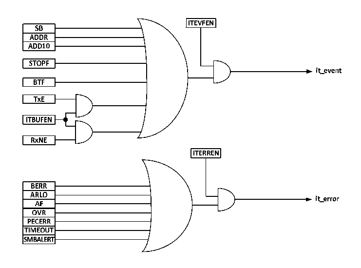

<!-- source-page: 152 -->

[← p.151](0151.md) · [index](../README.md) · [PDF p.152](https://ch32-riscv-ug.github.io/CH32V003/datasheet_en/CH32V003RM.PDF#page=152) · [p.153 →](0153.md)

<!-- header: CH32V003 Reference Manual https://wch-ic.com -->
1) Master-slave communication mode, where the host provides the clock and supports multiple masters and  
slaves.  
2) 2-wire communication architecture, with an optional warning line for SMBus.  
3) Both support 7-bit address format.  
There are also differences between SMBus and I2C.  
1) I2C supports speeds up to 400kHz, while SMBus supports up to 100kHz, and SMBus has a minimum  
speed limit of 10kHz.  
2) A timeout will be reported when the SMBus clock is low for more than 35mS, but there is no such limit  
for I2C.  
3) SMBus has a fixed logic level, while I2C does not, depending on VDD.  
4) SMBus has a bus protocol, while I2C does not.  
SMBus also includes device identification, address resolution protocols, unique device identifiers, SMBus  
reminders and various bus protocols as described in the SMBus specification version 2.0. When using SMBus,  
only the SMBus bit of the control register needs to be set, and the SMBTYPE bit and ENAARP bit need to be  
configured as needed.  

## 13.8 Interruptions

Each I2C module has two interrupt vectors, event interrupts and error interrupts. Both interrupts support the  
interrupt sources in Figure 13-4.  

Figure 13-4 I2C Interrupt Request  
 <!-- rendered from the PDF; verify at https://ch32-riscv-ug.github.io/CH32V003/datasheet_en/CH32V003RM.PDF#page=152 -->

🖼 Text parsed from the figure above

<!-- image: p152-draw-image-00018 inside the figure -->
<!-- image: p152-draw-image-00002 inside the figure -->
<!-- image: p152-draw-image-00003 inside the figure -->
<!-- image: p152-draw-image-00005 inside the figure -->
<!-- image: p152-draw-image-00004 inside the figure -->
<!-- image: p152-draw-image-00006 inside the figure -->
<!-- image: p152-draw-image-00020 inside the figure -->
<!-- image: p152-draw-image-00022 inside the figure -->
<!-- image: p152-draw-image-00021 inside the figure -->
<!-- image: p152-draw-image-00007 inside the figure -->
<!-- image: p152-draw-image-00008 inside the figure -->
<!-- image: p152-draw-image-00009 inside the figure -->
<!-- image: p152-draw-image-00010 inside the figure -->
<!-- image: p152-draw-image-00019 inside the figure -->
<!-- image: p152-draw-image-00011 inside the figure -->
<!-- image: p152-draw-image-00012 inside the figure -->
<!-- image: p152-draw-image-00023 inside the figure -->
<!-- image: p152-draw-image-00025 inside the figure -->
<!-- image: p152-draw-image-00013 inside the figure -->
<!-- image: p152-draw-image-00024 inside the figure -->
<!-- image: p152-draw-image-00014 inside the figure -->
<!-- image: p152-draw-image-00015 inside the figure -->
<!-- image: p152-draw-image-00016 inside the figure -->
<!-- image: p152-draw-image-00017 inside the figure -->

## 13.9 DMA

DMA can be used to send and receive bulk data. The ITBUFEN bit of the control register cannot be set when  
using DMA.  
● Transmission using DMA  
DMA mode can be activated by setting the DMAEN bit of the CTLR2 register. As long as the TxE bit is set,  
data will be loaded by DMA from the set memory into the data register of the I2C. The following settings are  
required to allocate channels for I2C.  
1) Set the I2Cx_DATAR register address to the DMA_PADDRx register and the memory address in the  
DMA_MADDRx register so that after each TxE event, data will be sent from memory to the  
<!-- image: p152-draw-image-00001 bbox=[507.6, 794.64, 527.04, 805.2] -->
<!-- footer: V1.9 153 -->
