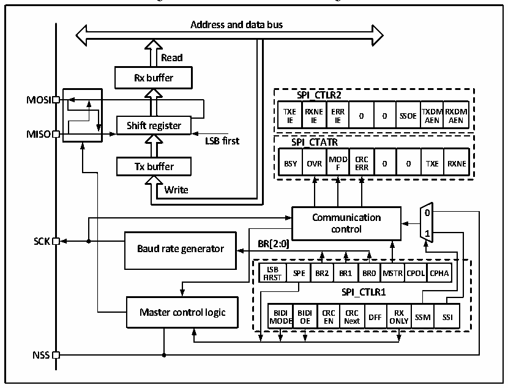

<!-- source-page: 160 -->

[← p.159](0159.md) · [index](../README.md) · [PDF p.160](https://ch32-riscv-ug.github.io/CH32V003/datasheet_en/CH32V003RM.PDF#page=160) · [p.161 →](0161.md)

<!-- header: CH32V003 Reference Manual https://wch-ic.com -->

# Chapter 14 Serial Peripheral Interface (SPI)

SPI supports data interaction in a 3-wire synchronous serial mode, plus a chip selector line to support hardware  
switching between Master and Slave modes, and supports communication on a single data line.  

## 14.1 Main Features

● Support full-duplex synchronous serial mode  
● Support single-line half-duplex mode  
● Support Master mode and Slave mode, multi-slave mode  
● Support 8-bit or 16-bit data structures  
● Maximum clock frequency supports up to half of FHCLK  
● Data order supports MSB or LSB first  
● Support hardware or software control of NSS pins  
● Hardware CRC checksum support for sending and receiving  
● Transceiver buffers support DMA transfers  
● Support modification of clock phase and polarity  

## 14.2 Function Description

### 14.2.1 Overview

Figure 14-1 SPI structure block diagram  
 <!-- rendered from the PDF; verify at https://ch32-riscv-ug.github.io/CH32V003/datasheet_en/CH32V003RM.PDF#page=160 -->

🖼 Text parsed from the figure above

<strong>Address and data bus</strong>  
<strong>Read</strong>  
<strong>Rx buffer</strong>  
<strong>SPI_CTLR2</strong>  
<strong>MOSI</strong>  
<strong>TXE RXNE ERR TXDMRXDM</strong>  
<strong>0 0 SSOE</strong>  
<strong>IE IE IE AEN AEN</strong>  
<strong>Shift register</strong>  
<strong>MISO</strong>  
<strong>LSB first SPI_CTATR</strong>  
<strong>MOD CRC</strong>  
<strong>Tx buffer BSY OVR F ERR 0 0 TXE RXNE</strong>  
<strong>Write</strong>  
<!-- image: p160-draw-image-00002 inside the figure -->
<!-- image: p160-draw-image-00003 inside the figure -->
<strong>0</strong>  
<strong>Communication</strong>  
<strong>control</strong>  
<strong>1</strong>  
<strong>SCK BR[2:0]</strong>  
<strong>Baud rate generator</strong>  
BR[2:0]  LSBFIRST  SPE  BR2  BR1  BR0  MSTR  RCPOL  CPHA  
<strong>SPI_CTLR1</strong>  
BIDIMODE  BIDIOE  CRCEN  CRCNext  DFF  RXON  SSMLY  SSI  
<strong>NSS</strong>  

As can be seen from Figure 14-1, the four main SPI-related pins are MISO, M0SI, SCK and NSS. The MISO  
pin is the data input pin when the SPI module is operating in Master mode and the data output pin when it is  
operating in Slave mode. the MOSI pin is the data output pin when it is operating in Master mode and the data  
input pin when it is operating in Slave mode. the SCK is the clock pin, the clock signal is always output by the  
host and the slave receives the clock signal and synchronizes the data sending and receiving. the NSS pin is  
the chip select pin with the following usage.  
1) NSS controlled by software: When SSM is set and the internal NSS signal is output high or low as  
<!-- image: p160-draw-image-00001 bbox=[507.6, 794.64, 527.04, 805.2] -->
<!-- footer: V1.9 161 -->
