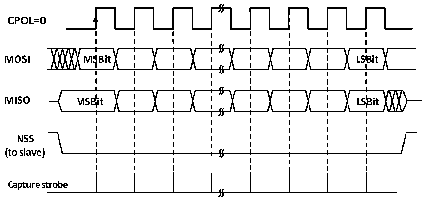
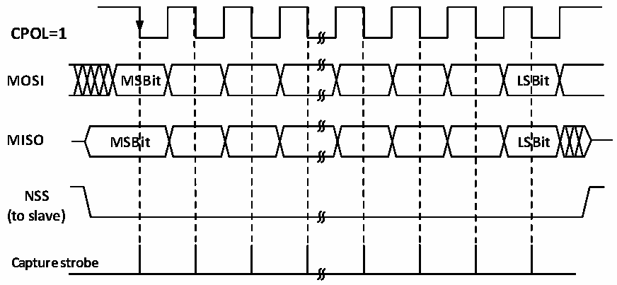

<!-- source-page: 162 -->

[← p.161](0161.md) · [index](../README.md) · [PDF p.162](https://ch32-riscv-ug.github.io/CH32V003/datasheet_en/CH32V003RM.PDF#page=162) · [p.163 →](0163.md)

<!-- header: CH32V003 Reference Manual https://wch-ic.com -->

Figure 14-2 SPI host mode read/write mode 0  
 <!-- rendered from the PDF; verify at https://ch32-riscv-ug.github.io/CH32V003/datasheet_en/CH32V003RM.PDF#page=162 -->

# MODE 0

# CPHA=0

🖼 Text parsed from the figure above

<strong>CPOL=0</strong>  
<strong>MOSI MSBit LSBit</strong>  
<strong>MISO MSBit LSBit</strong>  
<strong>NSS</strong>  
<strong>(to slave)</strong>  
<strong>Capture strobe</strong>  

Figure 14-3 SPI host mode read/write mode 1  
 <!-- rendered from the PDF; verify at https://ch32-riscv-ug.github.io/CH32V003/datasheet_en/CH32V003RM.PDF#page=162 -->

# MODE 1

# CPHA=0

🖼 Text parsed from the figure above

<strong>CPOL=1</strong>  
<strong>MOSI MSBit LSBit</strong>  
<strong>MISO MSBit LSBit</strong>  
<strong>NSS</strong>  
<strong>(to slave)</strong>  
<strong>Capture strobe</strong>  

<!-- image: p162-draw-image-00001 bbox=[507.6, 794.64, 527.04, 805.2] -->
<!-- footer: V1.9 163 -->
