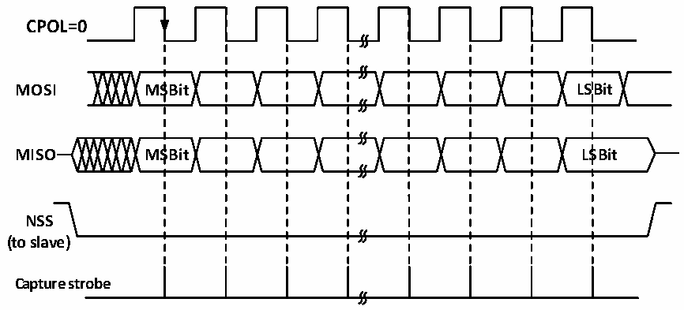
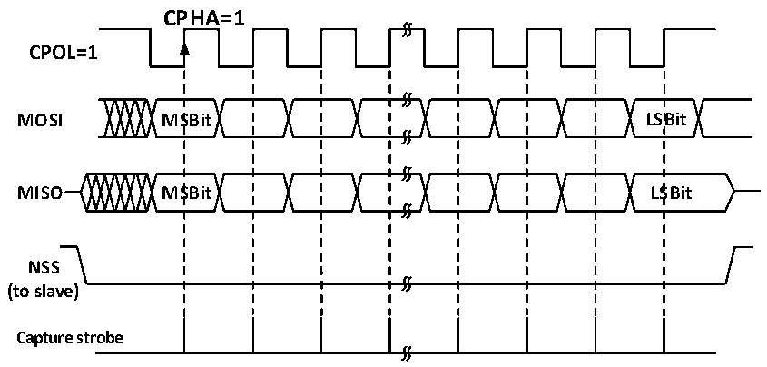

<!-- source-page: 163 -->

[← p.162](0162.md) · [index](../README.md) · [PDF p.163](https://ch32-riscv-ug.github.io/CH32V003/datasheet_en/CH32V003RM.PDF#page=163) · [p.164 →](0164.md)

<!-- header: CH32V003 Reference Manual https://wch-ic.com -->

Figure 14-4 SPI host mode read/write mode 2  
 <!-- rendered from the PDF; verify at https://ch32-riscv-ug.github.io/CH32V003/datasheet_en/CH32V003RM.PDF#page=163 -->

<strong>MODE 2</strong>  
<strong>CPHA=1</strong>  

🖼 Text parsed from the figure above

<strong>CPOL=0</strong>  
<strong>MOSI MSBit LSBit</strong>  
<strong>MISO MSBit LSBit</strong>  
<strong>NSS</strong>  
<strong>(to slave)</strong>  
<strong>Capture strobe</strong>  

Figure 14-5 SPI host mode read/write mode 3  
 <!-- rendered from the PDF; verify at https://ch32-riscv-ug.github.io/CH32V003/datasheet_en/CH32V003RM.PDF#page=163 -->

<strong>MODE 3</strong>  

🖼 Text parsed from the figure above

<strong>CPHA=1</strong>  
<strong>CPOL=1</strong>  
<strong>MOSI MSBit LSBit</strong>  
<strong>MISO MSBit LSBit</strong>  
<strong>NSS</strong>  
<strong>(to slave)</strong>  
<strong>Capture strobe</strong>  

### 14.2.3 Slave Mode

When the SPI module is operating in slave mode, SCK is used to receive the clock from the host and its own  
baud rate setting is invalid. To configure into slave mode, proceed as follows.  
Configure the DEF bit to set the data bit length.  
Configure the CPHA to match the host&#x27;s operating mode;  
Determine the SPI operating mode based on the transmit/receive configuration and CPOL;  
If transmission is required in slave mode, set CPOL and configure it to Mode 2 or Mode 3; the host may modify  
the configuration as needed;  
If only reception is required in slave mode, simply match the host&#x27;s CPOL mode;  
Configure LSBFIRST to match the host data frame format;  
The NSS pin needs to be held low in hardware management mode, if NSS is set to software management (SSM  
set), then keep SSI unset.  
Clear the MSTR bit and set the SPE bit to enable SPI mode. In transmitting, when the first slave receive sample  
edge appears in SCK, the slave starts to transmit. The process of sending is to move the data in the transmit  
<!-- image: p163-draw-image-00001 bbox=[507.6, 794.64, 527.04, 805.2] -->
<!-- footer: V1.9 164 -->
