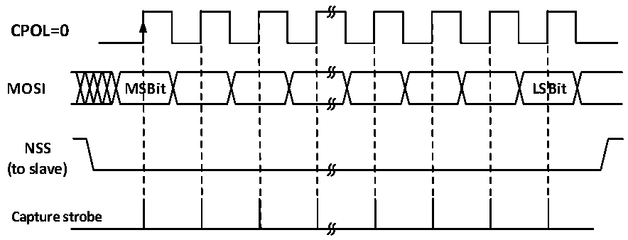
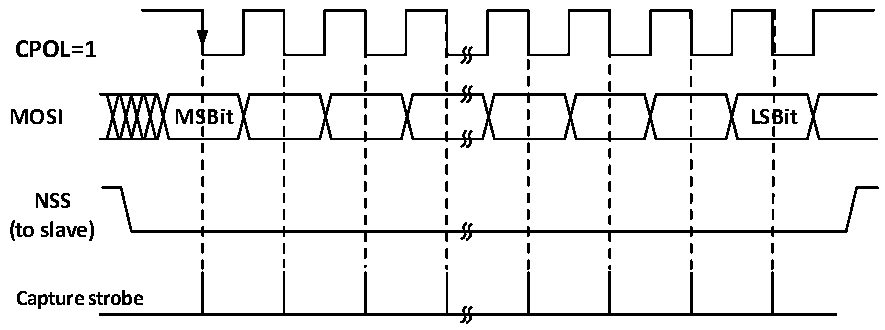

<!-- source-page: 164 -->

[← p.163](0163.md) · [index](../README.md) · [PDF p.164](https://ch32-riscv-ug.github.io/CH32V003/datasheet_en/CH32V003RM.PDF#page=164) · [p.165 →](0165.md)

<!-- header: CH32V003 Reference Manual https://wch-ic.com -->
buffer t the transmit shift register. When the data in the transmit buffer is moved to the shift register, the TXE  
flag will be set, and if the TXEIE bit was set before, then an interrupt will be generated.  
During reception, after the last clock sample edge, the RXNE bit is set, the bytes received by the shift register  
are transferred to the receive buffer, and the read operation of the read data register can obtain the data in the  
receive buffer. If RXNEIE is set before RXNE is set, then an interrupt is generated.  

Figure 14-6 SPI slave mode read mode 0  
 <!-- rendered from the PDF; verify at https://ch32-riscv-ug.github.io/CH32V003/datasheet_en/CH32V003RM.PDF#page=164 -->

# MODE 0

# CPHA=0

🖼 Text parsed from the figure above

<strong>CPOL=0</strong>  
<strong>MOSI MSBit LSBit</strong>  
<strong>NSS</strong>  
<strong>(to slave)</strong>  
<strong>Capture strobe</strong>  

Figure 14-7 SPI slave mode read mode 1  
 <!-- rendered from the PDF; verify at https://ch32-riscv-ug.github.io/CH32V003/datasheet_en/CH32V003RM.PDF#page=164 -->

# MODE 1

# CPHA=0

🖼 Text parsed from the figure above

<strong>CPOL=1</strong>  
<strong>MOSI MSBit LSBit</strong>  
<strong>NSS</strong>  
<strong>(to slave)</strong>  
<strong>Capture strobe</strong>  

<!-- image: p164-draw-image-00001 bbox=[507.6, 794.64, 527.04, 805.2] -->
<!-- footer: V1.9 165 -->
