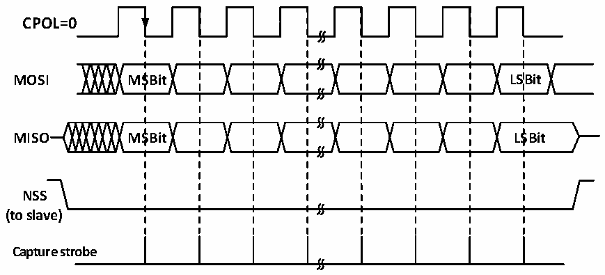
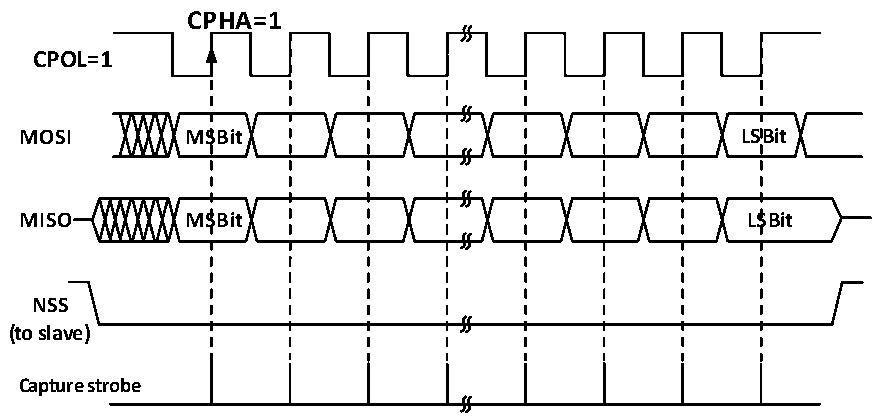

<!-- source-page: 165 -->

[← p.164](0164.md) · [index](../README.md) · [PDF p.165](https://ch32-riscv-ug.github.io/CH32V003/datasheet_en/CH32V003RM.PDF#page=165) · [p.166 →](0166.md)

<!-- header: CH32V003 Reference Manual https://wch-ic.com -->

Figure 14-8 SPI slave mode read mode 2  
 <!-- rendered from the PDF; verify at https://ch32-riscv-ug.github.io/CH32V003/datasheet_en/CH32V003RM.PDF#page=165 -->

# MODE 2

# CPHA=1

🖼 Text parsed from the figure above

<strong>CPOL=0</strong>  
<strong>MOSI MSBit LSBit</strong>  
<strong>MISO MSBit LSBit</strong>  
<strong>NSS</strong>  
<strong>(to slave)</strong>  
<strong>Capture strobe</strong>  

Figure 14-9 SPI slave mode read mode 3  
 <!-- rendered from the PDF; verify at https://ch32-riscv-ug.github.io/CH32V003/datasheet_en/CH32V003RM.PDF#page=165 -->

# MODE 3

🖼 Text parsed from the figure above

CPHA=1  
<strong>CPOL=1</strong>  
<strong>MOSI MSBit LSBit</strong>  
<strong>MISO MSBit LSBit</strong>  
<strong>NSS</strong>  
<strong>(to slave)</strong>  
<strong>Capture strobe</strong>  

### 14.2.4 Simplex Mode

The SPI interface can operate in half-duplex mode, where the master device uses the MOSI pin and the slave  
device uses the MISO pin for communication. When using half-duplex communication, you need to set  
BIDIMODE and use BIDIOE to control the transmission direction.  
Setting the RXONLY bit in normal full-duplex mode sets the SPI module to receive-only simplex mode,  
releasing a data pin after RXONLY is set. The SPI can also be set to transmit only mode by ignoring the  
received data.  

### 14.2.5 CRC

The SPI module uses CRC checksum to ensure the reliability of full-duplex communication, and separate CRC  
calculators are used for data sending and receiving. the polynomial for CRC calculation is determined by the  
polynomial register, and different calculations are used for 8-bit data width and 16-bit data width, respectively.  
Setting the CRCEN bit will enable CRC checksum and at the same time will reset the CRC calculator. After  
the last data byte is sent, setting the CRCNEXT bit will send the TXCRCR calculator calculation after the  
<!-- image: p165-draw-image-00001 bbox=[507.6, 794.64, 527.04, 805.2] -->
<!-- footer: V1.9 166 -->
