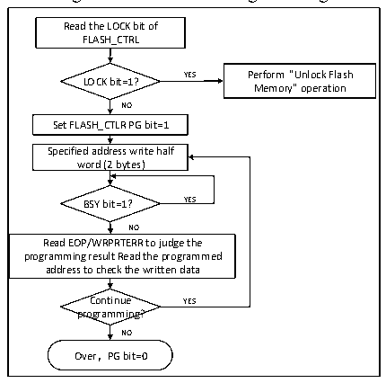

<!-- source-page: 179 -->

[← p.178](0178.md) · [index](../README.md) · [PDF p.179](https://ch32-riscv-ug.github.io/CH32V003/datasheet_en/CH32V003RM.PDF#page=179) · [p.180 →](0180.md)

<!-- header: CH32V003 Reference Manual https://wch-ic.com -->

### 16.4.3 Main Memory Standard Programming

Standard programming can be written 2 bytes at a time. When the PG bit of FLASH_CTLR register is &#x27;1&#x27;, each  
half-word (2 bytes) written to the flash address will initiate programming once, and writing any non-half-word  
data will cause the FPEC to generate a bus error. During programming, the BSY bit is &#x27;1&#x27;, and at the end of  
programming, the BSY bit is &#x27;0&#x27; and the EOP bit is &#x27;1&#x27;.  
<em>Note: When the BSY bit is &#x27;1&#x27;, it will prohibit to perform write operation to any register.</em>  

Figure 16-1 FLASH Programming  
 <!-- rendered from the PDF; verify at https://ch32-riscv-ug.github.io/CH32V003/datasheet_en/CH32V003RM.PDF#page=179 -->

🖼 Text parsed from the figure above

Read the LOCK bit of  
FLASH_CTRL  
LOCK bit=1? YES Perform &quot;Unlock Flash  
Memory&quot; operation  
NO  
Set FLASH_CTLR PG bit=1  
Specified address write half  
word (2 bytes)  
BSY bit=1？ YES  
NO  
Read EOP/WRPRTERR to judge the  
programming result Read the programmed  
address to check the written data  
Continue YES  
programming?  
NO  
Over，PG bit=0  

1) Check the FLASH_CTLR register LOCK, if it is 1, you need to execute the &quot;Unlock Flash&quot; operation.  
2) Set the PG bit of FLASH_CTLR register to &#x27;1&#x27; to enable the standard programming mode.  
3) Write the half word to be programmed to the specified flash address (even address).  
4) Wait for the BSY bit to become &#x27;0&#x27; or the EOP bit of FLASH_STATR register to be &#x27;1&#x27; to indicate the end  
of programming, and clear the EOP bit to 0.  
5) Query the FLASH_STATR register to see if there is an error or read the programmed address data  
checksum.  
6) Continue programming you can repeat steps 3-5 and end programming to clear the PG bit to 0.  

### 16.4.4 Main Memory Standard Erase

Flash memory can be erased by standard page (1K bytes) or by whole chip.  
<!-- image: p179-draw-image-00001 bbox=[507.6, 794.64, 527.04, 805.2] -->
<!-- footer: V1.9 180 -->
