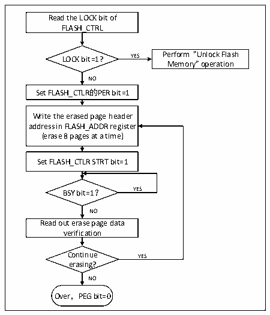
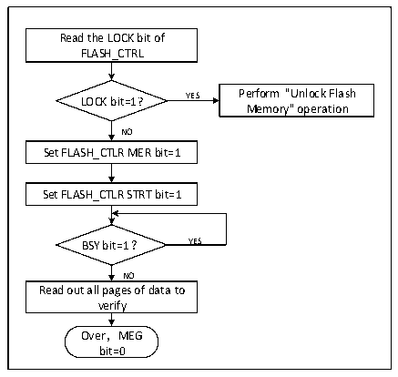

<!-- source-page: 180 -->

[← p.179](0179.md) · [index](../README.md) · [PDF p.180](https://ch32-riscv-ug.github.io/CH32V003/datasheet_en/CH32V003RM.PDF#page=180) · [p.181 →](0181.md)

<!-- header: CH32V003 Reference Manual https://wch-ic.com -->

Figure 16-2 FLASH Page Erase  
 <!-- rendered from the PDF; verify at https://ch32-riscv-ug.github.io/CH32V003/datasheet_en/CH32V003RM.PDF#page=180 -->

🖼 Text parsed from the figure above

Read the LOCK bit of  
FLASH_CTRL  
LOCK bit=1? YES Perform &quot;Unlock Flash  
Memory&quot; operation  
NO  
Set FLASH_CTLR的PER bit=1  
Write the erased page header  
address in FLASH_ADDR register  
(erase 8 pages at a time)  
Set FLASH_CTLR STRT bit=1  
BSY bit=1？ YES  
NO  
Read out erase page data  
verification  
Continue YES  
erasing?  
NO  
Over，PEG bit=0  

1) Check the LOCK bit of FLASH_CTLR register, if it is 1, you need to execute the &quot;Unlock Flash&quot;  
operation.  
2) Set the PER bit of FLASH_CTLR register to &#x27;1&#x27; to enable the standard page erase mode.  
3) Write the page header address of the selected erase to FLASH_ADDR register.  
4) Set the STRT bit of FLASH_CTLR register to &#x27;1&#x27; to initiate an erase action.  
5) Wait for the BSY bit to become &#x27;0&#x27; or the EOP bit of FLASH_STATR register to be &#x27;1&#x27; to indicate the end  
of erase, and clear the EOP bit to 0.  
6) Read the data of the erased page for verification.  
7) Continue the standard page erase can repeat steps 3-5 and end the erase to clear the PEG bit to 0.  

Figure 16-3 FLASH whole chip erase  
 <!-- rendered from the PDF; verify at https://ch32-riscv-ug.github.io/CH32V003/datasheet_en/CH32V003RM.PDF#page=180 -->

🖼 Text parsed from the figure above

Read the LOCK bit of  
FLASH_CTRL  
LOCK bit=1? YES Perform &quot;Unlock Flash  
Memory&quot; operation  
NO  
Set FLASH_CTLR MER bit=1  
Set FLASH_CTLR STRT bit=1  
BSY bit=1？ YES  
NO  
Read out all pages of data to  
verify  
Over，MEG  
bit=0  

1) Check the LOCK bit of FLASH_CTLR register, if it is 1, you need to execute the &quot;Unlock Flash&quot;  
operation.  
2) Set the MER bit of FLASH_CTLR register to &#x27;1&#x27; to enable the whole chip erase mode.  
3) Set the STRT bit of FLASH_CTLR register to &#x27;1&#x27; to start the erase action.  
4) Wait for the BSY bit to become &#x27;0&#x27; or the EOP bit of FLASH_STATR register to be &#x27;1&#x27; to indicate the end  
of erase, and clear the EOP bit to 0.  
<!-- image: p180-draw-image-00001 bbox=[507.6, 794.64, 527.04, 805.2] -->
<!-- footer: V1.9 181 -->
