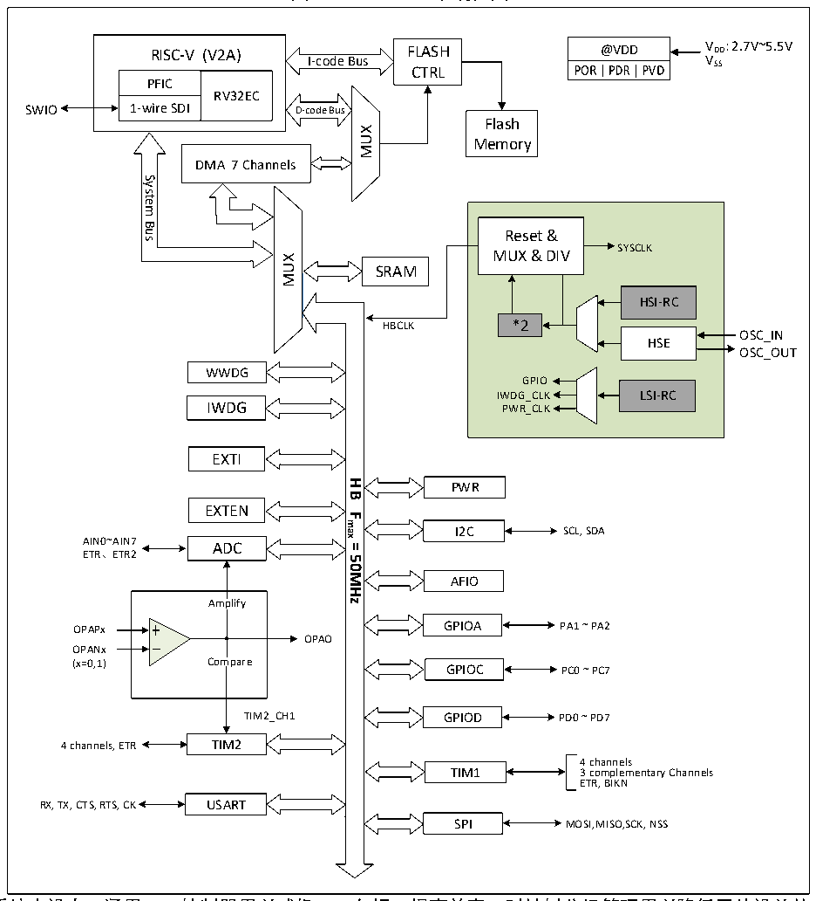

<!-- source-page: 2 -->

[← p.1](0001.md) · [index](../README.md) · [PDF p.2](https://ch32-riscv-ug.github.io/CH32V003/datasheet_zh/CH32V003RM.PDF#page=2) · [p.3 →](0003.md)

<!-- header: CH32V003应用手册 https://wch.cn -->

# 第 1 章 存储器和总线架构

## 1.1 总线架构

CH32V003 系列产品基于RISC-V 指令集设计，其架构中将内核、仲裁单元、DMA 模块、SRAM存  
储等部分通过多组总线实现交互。设计中集成通用DMA控制器以减轻CPU负担、提高访问效率，同  
时兼有数据保护机制，时钟自动切换保护等措施增加了系统稳定性。其系统框图见图1-1。  

图1-1 CH32V003系统框图  
 <!-- rendered from the PDF; verify at https://ch32-riscv-ug.github.io/CH32V003/datasheet_zh/CH32V003RM.PDF#page=2 -->

🖼 Text parsed from the figure above

RISC-V (V2A)  PFIC  RV32EC  1-wire SDI  
@VDD V DD : 2.7V~5.5V  
RISC-V (V2A) FLASH  
VSS  
I-code Bus  
CTRL  
SWIO  
Flash  
MUX  
Memory  
DMA 7 Channels  
System  
<!-- image: p2-draw-image-00002 inside the figure -->
Bus  
Reset &amp;  
SYSCLK  
MUX &amp; DIV  
MUX  
SRAM  
HSI-RC  
*2  
HBCLK  
OSC_IN  
HSE  
OSC_OUT  
WWDG  
GPIO  
IWDG_CLK LSI-RC  
IWDG PWR_CLK  
EXTI  
<strong>HB</strong>  
PWR  
EXTEN  
<strong>Fmax</strong>  
I2C  
SCL, SDA  
AIN0~AIN7 ADC  
<strong>=</strong>  
ETR、ETR2  
<strong>50MHz</strong>  
AFIO  
Amplify  
OPAPx GPIOA PA1 ~ PA2  
OPAO  
OPANx  
(x=0,1) Compare GPIOC PC0 ~ PC7  
TIM2_CH1 GPIOD PD0 ~ PD7  
4 channels, ETR TIM2  
4 channels  
TIM1 3 complementary Channels  
ETR, BIKN  
RX, TX, CTS, RTS, CK USART  
SPI MOSI,MISO,SCK, NSS  

系统中设有：通用DMA控制器用以减轻CPU负担、提高效率；时钟树分级管理用以降低了外设总的  
运行功耗，同时还兼有数据保护机制，时钟安全系统保护机制等措施来增加系统稳定性。  
● 指令总线(I-Code)将内核和FLASH指令接口相连，预取指在此总线上完成。  
● 数据总线(D-Code)将内核和FLASH数据接口相连，用于常量加载和调试。  
● 系统总线将内核和总线矩阵相连，用于协调内核、DMA、SRAM和外设的访问。  
● DMA总线负责DMA的HB主控接口与总线矩阵相连，该总线访问对象是FLASH数据、SRAM和外设。  
● 总线矩阵负责的是系统总线、数据总线、DMA总线、SRAM和HB桥之间的访问协调。  
<!-- image: p2-draw-image-00001 bbox=[507.84, 786.12, 527.28, 796.68] -->
<!-- footer: V1.9 1 -->
