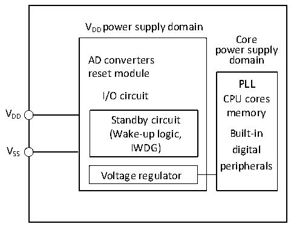
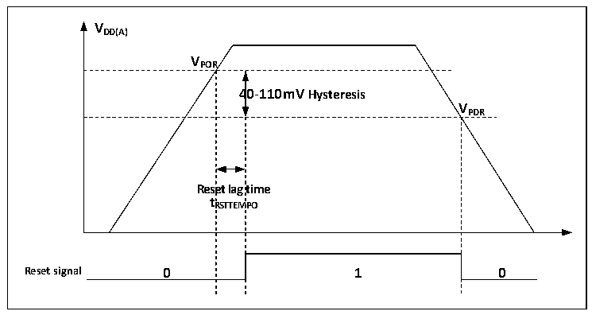

<!-- source-page: 5 -->

[← p.4](0004.md) · [index](../README.md) · [PDF p.5](https://ch32-riscv-ug.github.io/CH32V003/datasheet_zh/CH32V003RM.PDF#page=5) · [p.6 →](0006.md)

<!-- header: CH32V003应用手册 https://wch.cn -->

# 第 2 章 电源控制（PWR）

## 2.1 概述

系统工作电压VDD 范围为2.7～5.5V，内置电压调节器提供内核所需的工作电源。  

图2-1 电源结构框图  
 <!-- rendered from the PDF; verify at https://ch32-riscv-ug.github.io/CH32V003/datasheet_zh/CH32V003RM.PDF#page=5 -->

🖼 Text parsed from the figure above

VDD power supply domain  
Core  
power supply  
AD converters domain  
reset module  
PLL  
I/O circuit CPU cores  
V memory  
DD Standby circuit  
(Wake-up logic, Built-in  
VSS IWDG) digital  
peripherals  
Voltage regulator  

## 2.2 电源管理

### 2.2.1 上电复位和掉电复位

系统内部集成了上电复位POR和掉电复位PDR电路，当芯片供电电压VDD 低于对应门限电压时，  
系统被相关电路复位，无需外置额外的复位电路。上电门限电压VPOR 和掉电门限电压VPDR 的参数请参  
考对应的数据手册。  

图2-2 POR和PDR的工作示意图  
 <!-- rendered from the PDF; verify at https://ch32-riscv-ug.github.io/CH32V003/datasheet_zh/CH32V003RM.PDF#page=5 -->

🖼 Text parsed from the figure above

<strong>VDD(A)</strong>  
<strong>VPOR</strong>  
4  40-110mV Hysteresis  Rese t R  et lag RSTTEM  time MPO  V  
<strong>VPDR</strong>  
<strong>tRSTTEMPO</strong>  
<strong>Reset signal 0 1 0</strong>  

### 2.2.2 可编程电压监测器

可编程电压监测器 PVD，主要被用于监控系统主电源的变化，与电源控制寄存器 PWR_CTLR 的  
PLS[2:0]所设置的门槛电压相比较，配合外部中断寄存器（EXTI）设置，可产生相关中断，以便及  
时通知系统进行数据保存等掉电前操作。  
具体配置如下：  
1） 设置PWR_CTLR寄存器的PLS[2:0]域，选择要监控电压阈值。  
2） 可选的中断处理。PVD功能内部连接EXTI模块的第8线的上升/下降边沿触发设置，开启此中断  
（配置EXTI），当VDD 下降到PVD阈值以下或上升到PVD阈值之上时就会产生PVD中断。  
<!-- image: p5-draw-image-00001 bbox=[507.84, 786.12, 527.28, 796.68] -->
<!-- footer: V1.9 3 -->
