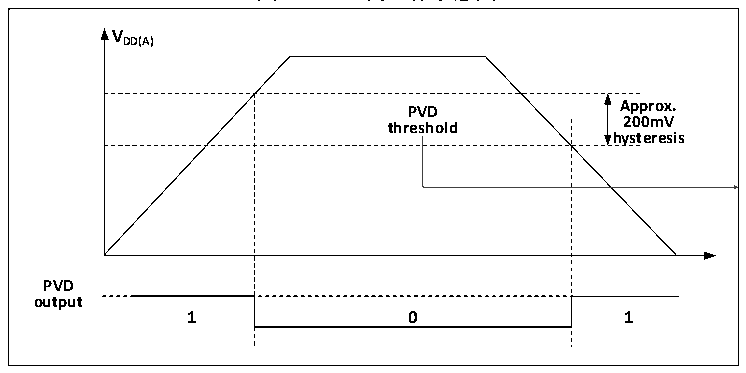

<!-- source-page: 6 -->

[← p.5](0005.md) · [index](../README.md) · [PDF p.6](https://ch32-riscv-ug.github.io/CH32V003/datasheet_zh/CH32V003RM.PDF#page=6) · [p.7 →](0007.md)

<!-- header: CH32V003应用手册 https://wch.cn -->
3） 设置PWR_CTLR寄存器的PVDE位来开启PVD功能。  
4） 读取PWR_CSR状态寄存器的PVD0位可获取当前系统主电源与PLS[2:0]设置阈值关系，执行相应  
软处理。当VDD电压高于PLS[2:0]设置阈值，PVD0位置0；当VDD电压低于PLS[2:0]设置阈值，  
PVD0位置1。  

图2-3 PVD的工作示意图  
 <!-- rendered from the PDF; verify at https://ch32-riscv-ug.github.io/CH32V003/datasheet_zh/CH32V003RM.PDF#page=6 -->

🖼 Text parsed from the figure above

<strong>VDD(A)</strong>  
PVD threshold  0  
<strong>hysteresis</strong>  
<strong>PVD</strong>  
<strong>output</strong>  

## 2.3 低功耗模式

在系统复位后，微控制器处于正常工作状态（运行模式），此时可以通过降低系统主频或者关  
闭不用外设时钟或者降低工作外设时钟来节省系统功耗。如果系统不需要工作，可设置系统进入低  
功耗模式，并通过特定事件让系统跳出此状态。  
微控制器目前提供了2种低功耗模式，从处理器、外设、电压调节器等的工作差异上分为：  
● 睡眠模式：内核停止运行，所有外设（包含内核私有外设）仍在运行。  
● 待机模式：停止所有时钟，唤醒后，时钟切换到HSI。  

<!-- p6-table-002 (table-2-1@1) -->
<table><caption>表2-1 低功耗模式一览</caption><tr><th>模式</th><th>进入</th><th>唤醒源</th><th>对时钟的影响</th><th>电压调节器</th></tr><tr><td rowspan="2">睡眠</td><td>WFI</td><td>任意中断唤醒</td><td rowspan="2" style="text-align:left">内核时钟关闭，其他时钟无影响</td><td rowspan="2">正常</td></tr><tr><td>WFE</td><td>唤醒事件唤醒</td></tr><tr><td>待机</td><td style="text-align:left">SLEEPDEEP置1PDDS置1WFI或WFE</td><td style="text-align:left">任意外部中断或事件、AWU 事件、NRST引脚复位、IWDG复位。 注：任意事件也可以唤醒系统， 但唤醒后系统不复位。</td><td style="text-align:left">关闭HSE、HSI、 ， PLL和外设时钟</td><td>低功耗模式</td></tr></table>

注：SLEEPDEEP位属于内核私有外设控制位， CH32V003产品参考PFIC_SCTLR寄存器。  

### 2.3.1 低功耗配置选项

● WFI和WFE方式  
WFI：微控制器被具有中断控制器响应的中断源唤醒，系统唤醒后，将最先执行中断服务函数（微  
控制器复位除外）。  
WFE：唤醒事件触发微控制器将退出低功耗模式。唤醒事件包括：  
1） 配置一个外部或内部的EXTI线为事件模式，此时无需配置中断控制器；  
2） 或者配置某个中断源，等效为WFI唤醒，系统优先执行中断服务函数；  
3） 或者配置SEVONPEND位，开启外设中断使能，但不开启中断控制器中的中断使能，系统唤醒后  
需要清除中断挂起位。  
● SLEEPONEXIT  
启用：执行WFI或WFE指令后，微控制器确保所有待处理的中断服务退出后进入低功耗模式。  
不启用：执行WFI或WFE指令后，微控制器立即进入低功耗模式。  
<!-- image: p6-draw-image-00001 bbox=[507.84, 786.12, 527.28, 796.68] -->
<!-- footer: V1.9 4 -->
