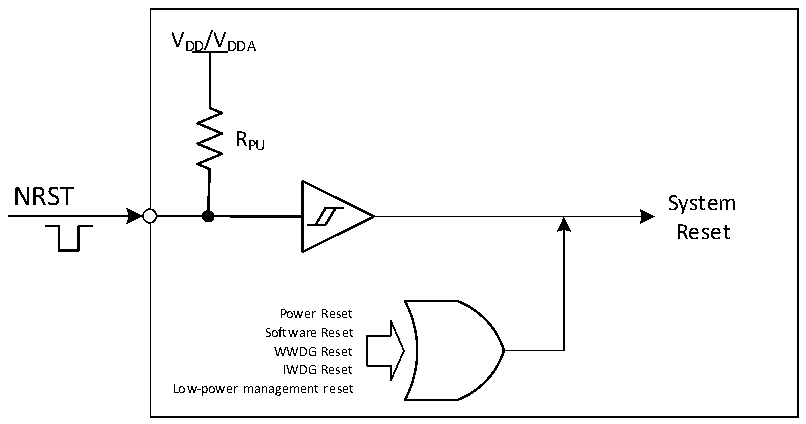

<!-- source-page: 12 -->

[← p.11](0011.md) · [index](../README.md) · [PDF p.12](https://ch32-riscv-ug.github.io/CH32V003/datasheet_zh/CH32V003RM.PDF#page=12) · [p.13 →](0013.md)

<!-- header: CH32V003应用手册 https://wch.cn -->

图3-1 系统复位结构  
 <!-- rendered from the PDF; verify at https://ch32-riscv-ug.github.io/CH32V003/datasheet_zh/CH32V003RM.PDF#page=12 -->

🖼 Text parsed from the figure above

VDD/VDDA  
RPU  
NRST  
System  
Reset  
Power Reset  
Software Reset  
WWDG Reset  
IWDG Reset  
Low-power management reset  

<!-- image: p12-draw-image-00001 bbox=[507.84, 786.12, 527.28, 796.68] -->
<!-- footer: V1.9 10 -->
