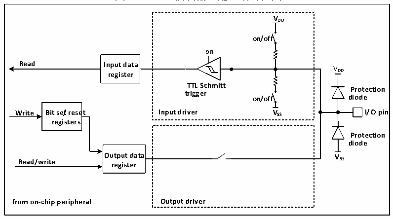

<!-- source-page: 52 -->

[← p.51](0051.md) · [index](../README.md) · [PDF p.52](https://ch32-riscv-ug.github.io/CH32V003/datasheet_zh/CH32V003RM.PDF#page=52) · [p.53 →](0053.md)

<!-- header: CH32V003应用手册 https://wch.cn -->

### 7.2.3 外部中断

所有的GPIO口都可以被配置外部中断输入通道，但一个外部中断输入通道最多只能映射到一个  
GPIO引脚上，且外部中断通道的序号必须和GPIO端口的位号一致，比如PA1（或PC1、PD1等）只  
能映射到EXTI1上，且EXTI1只能接受PA1、PC1或PD1等其中之一的映射，两方都是一对一的关系。  

### 7.2.4 复用功能

使用复用功能必须要注意：  
● 使用输入方向的复用功能，端口必须配置成复用输入模式，上下拉设置可根据实际需要来设置  
● 使用输出方向的复用功能，端口必须配置成复用输出模式，推挽或开漏可根据实际情况设置  
● 对于双向的复用功能，端口必须配置成复用输出模式，这时驱动器被配置成浮空输入模式  
同一个IO口可能有多个外设复用到此管脚，因此为了使各个外设都有最大的发挥空间，外设的  
复用引脚除了默认复用引脚，还可以进行重映射，重映射到其他的引脚，避开被占用的引脚。  

### 7.2.5 锁定机制

锁定机制可以锁定IO口的配置。经过特定的一个写序列后，选定的IO引脚配置将被锁定，在  
下一个复位前无法更改。  

### 7.2.6 输入配置

图7-2 GPIO模块输入配置结构框图  
 <!-- rendered from the PDF; verify at https://ch32-riscv-ug.github.io/CH32V003/datasheet_zh/CH32V003RM.PDF#page=52 -->

🖼 Text parsed from the figure above

<strong>VDD</strong>  
<strong>on/off</strong>  
<strong>on</strong>  
<strong>Read Input data</strong>  
VDD  
<strong>register</strong>  
<strong>TTL Schmitt</strong>  
<strong>Protection</strong>  
<strong>trigger</strong>  
<strong>on/off diode</strong>  
<strong>Write Bit se/treset Input driver VSS I/O pin</strong>  
<strong>registers</strong>  
<strong>Protection</strong>  
<strong>diode</strong>  
<strong>Output data VSS</strong>  
<strong>Read/write</strong>  
<strong>register</strong>  
<strong>from on-chip peripheral Output driver</strong>  

当IO口配置成输入模式时，输出驱动断开，输入上下拉可选，不连接复用功能和模拟输入。在  
每个IO口上的数据在每个HB时钟被采样到输入数据寄存器，读取输入数据寄存器对应位即获取了  
对应引脚的电平状态。  
<!-- image: p52-draw-image-00001 bbox=[507.84, 786.12, 527.28, 796.68] -->
<!-- footer: V1.9 50 -->
