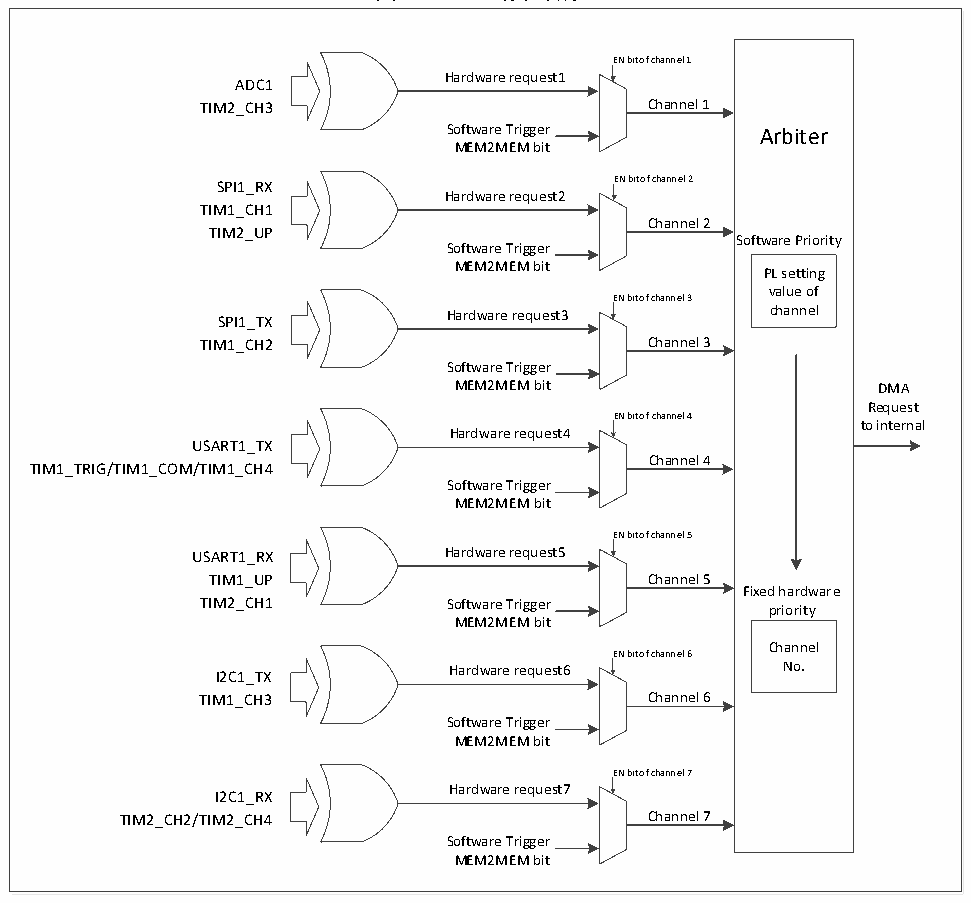

<!-- source-page: 67 -->

[← p.66](0066.md) · [index](../README.md) · [PDF p.67](https://ch32-riscv-ug.github.io/CH32V003/datasheet_zh/CH32V003RM.PDF#page=67) · [p.68 →](0068.md)

<!-- header: CH32V003应用手册 https://wch.cn -->

### 8.2.3 DMA请求映射

DMA 控制器提供 7 个通道，每个通道对应多个外设请求，通过设置相应外设寄存器中对应 DMA  
控制位，可以独立的开启或关闭各个外设的DMA功能，具体对应关系如下。  

图8-1 DMA1请求映像  
 <!-- rendered from the PDF; verify at https://ch32-riscv-ug.github.io/CH32V003/datasheet_zh/CH32V003RM.PDF#page=67 -->

🖼 Text parsed from the figure above

<!-- image: p67-draw-image-00016 inside the figure -->
EN bit of channel 1  
<!-- image: p67-draw-image-00002 inside the figure -->
Hardware request1  
<!-- image: p67-draw-image-00009 inside the figure -->
ADC1  
TIM2_CH3 Channel 1  
Software Trigger Arbiter  
MEM2MEM bit  
SPI1_RX EN bit of channel 2  
<!-- image: p67-draw-image-00003 inside the figure -->
Hardware request2  
<!-- image: p67-draw-image-00010 inside the figure -->
TIM1_CH1  
Channel 2  
TIM2_UP  
Software Priority  
Software Trigger  
MEM2MEM bit PL setting  
value of  
EN bit of channel 3  
<!-- image: p67-draw-image-00004 inside the figure -->
SPI1_TX Hardware request3 channel  
<!-- image: p67-draw-image-00011 inside the figure -->
TIM1_CH2 Channel 3  
Software Trigger  
MEM2MEM bit DMA  
Request  
EN bit of channel 4  
to internal  
<!-- image: p67-draw-image-00005 inside the figure -->
Hardware request4  
<!-- image: p67-draw-image-00012 inside the figure -->
USART1_TX  
Channel 4  
TIM1_TRIG/TIM1_COM/TIM1_CH4  
Software Trigger  
MEM2MEM bit  
EN bit of channel 5  
<!-- image: p67-draw-image-00006 inside the figure -->
USART1_RX Hardware request5  
<!-- image: p67-draw-image-00013 inside the figure -->
TIM1_UP Channel 5  
Fixed hardware  
TIM2_CH1 Software Trigger priority  
MEM2MEM bit  
Channel  
EN bit of channel 6  
<!-- image: p67-draw-image-00007 inside the figure -->
I2C1_TX Hardware request6 No.  
<!-- image: p67-draw-image-00014 inside the figure -->
TIM1_CH3 Channel 6  
Software Trigger  
MEM2MEM bit  
EN bit of channel 7  
<!-- image: p67-draw-image-00008 inside the figure -->
Hardware request7  
<!-- image: p67-draw-image-00015 inside the figure -->
I2C1_RX  
TIM2_CH2/TIM2_CH4 Channel 7  
Software Trigger  
MEM2MEM bit  

<!-- p67-table-001 (table-8-2@1) -->
<table><caption>表8-2 DMA1各通道外设映射表</caption><tr><th>外设</th><th>通道1</th><th>通道2</th><th>通道3</th><th>通道4</th><th>通道5</th><th>通道6</th><th>通道7</th></tr><tr><td>ADC1</td><td>ADC1</td><td></td><td></td><td></td><td></td><td></td><td></td></tr><tr><td>SPI1</td><td></td><td>SPI1_RX</td><td>SPI1_TX</td><td></td><td></td><td></td><td></td></tr><tr><td>USART1</td><td></td><td></td><td></td><td>USART1_TX</td><td>USART1_RX</td><td></td><td></td></tr><tr><td>I2C1</td><td></td><td></td><td></td><td></td><td></td><td>I2C1_TX</td><td>I2C1_RX</td></tr><tr><td>TIM1</td><td></td><td>TIM1_CH1</td><td>TIM1_CH2</td><td style="text-align:left">TIM1_CH4TIM1_TRIGTIM1_COM</td><td>TIM1_UP</td><td>TIM1_CH3</td><td></td></tr><tr><td>TIM2</td><td>TIM2_CH3</td><td>TIM2_UP</td><td></td><td></td><td>TIM2_CH1</td><td></td><td style="text-align:left">TIM2_CH2TIM2_CH4</td></tr></table>

<!-- image: p67-draw-image-00001 bbox=[507.84, 786.12, 527.28, 796.68] -->
<!-- footer: V1.9 65 -->
