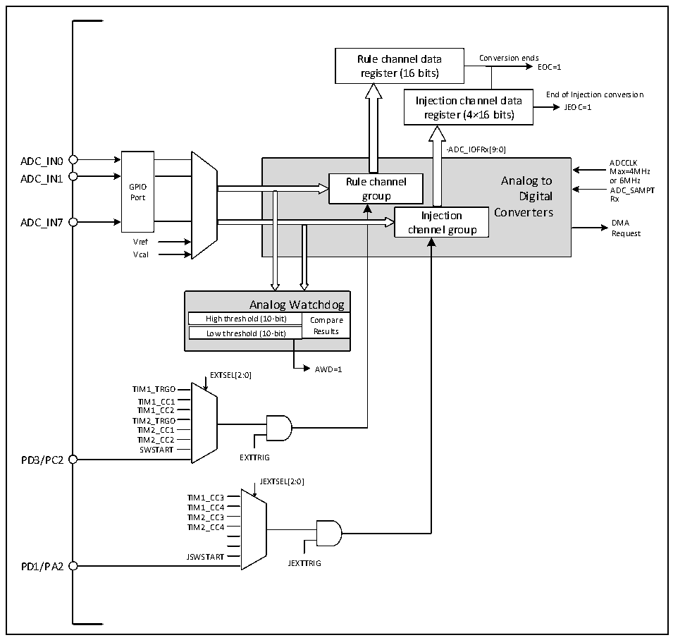

<!-- source-page: 74 -->

[← p.73](0073.md) · [index](../README.md) · [PDF p.74](https://ch32-riscv-ug.github.io/CH32V003/datasheet_zh/CH32V003RM.PDF#page=74) · [p.75 →](0075.md)

<!-- header: CH32V003应用手册 https://wch.cn -->

## 9.2 功能描述

### 9.2.1 模块结构

图9-1 ADC模块框图  
 <!-- rendered from the PDF; verify at https://ch32-riscv-ug.github.io/CH32V003/datasheet_zh/CH32V003RM.PDF#page=74 -->

🖼 Text parsed from the figure above

Rule channel data Conversion ends  
register (16 bits) EOC=1  
Injection channel data End of Injection conversion  
JEOC=1  
register (4×16 bits)  
-ADC_IOFRx[9:0]  
GPIOPort  
Rule channel Analog to group Digital Injection Converters channel group  
Max=4MHz  
ADC_IN7 DMA  
Request  
Vref  
Vcal  
Analog Watchdog  High threshoAldn (1a0l-obigt) Wa  atchdog Compare Results  Low threshold (10-bit)  
AWD=1  
EXTSEL[2:0]  
TIM1_TRGO  
TIM1_CC1  
TIM1_CC2  
TIM2_TRGO  
TIM2_CC1  
TIM2_CC2  
SWSTART  
PD3/PC2 EXTTRIG  
JEXTSEL[2:0]  
TIM1_CC3  
TIM1_CC4  
TIM2_CC3  
TIM2_CC4  
JSWSTART  
PD1/PA2 JEXTTRIG  

### 9.2.2 ADC配置

1）模块上电  
ADC_CTLR2寄存器的ADON位为1表示ADC模块上电。当ADC模块从断电模式（ADON=0）下进入  
上电状态（ADON=1）后，需要延迟一段时间tSTAB 用于模块稳定时间。之后再次写入ADON位为1，用  
于作为软件启动ADC转换的启动信号。通过清除ADON位为0，可以终止当前转换并将ADC模块置于  
断电模式，这个状态下，ADC几乎不耗电。  
2）采样时钟  
模块的寄存器操作基于HBCLK（HB总线）时钟，其转换单元的时钟基准ADCCLK，由RCC_CFGR0  
寄存器的ADCPRE域配置分频，详细信息参考数据手册CH32V003DS0。  
3）通道配置  
ADC模块提供了10个通道采样源，包括8个外部通道和2个内部通道。它们可以配置到两种转  
换组中：规则组和注入组。以实现任意多个通道上以任意顺序进行一系列转换构成的组转换。  
<!-- image: p74-draw-image-00001 bbox=[507.84, 786.12, 527.28, 796.68] -->
<!-- footer: V1.9 72 -->
