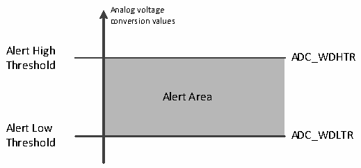

<!-- source-page: 79 -->

[← p.78](0078.md) · [index](../README.md) · [PDF p.79](https://ch32-riscv-ug.github.io/CH32V003/datasheet_zh/CH32V003RM.PDF#page=79) · [p.80 →](0080.md)

<!-- header: CH32V003应用手册 https://wch.cn -->

图9-2 模拟看门狗阈值区  
 <!-- rendered from the PDF; verify at https://ch32-riscv-ug.github.io/CH32V003/datasheet_zh/CH32V003RM.PDF#page=79 -->

🖼 Text parsed from the figure above

Analog voltage  
conversion values  
Alert High  
ADC_WDHTR  
<!-- image: p79-draw-image-00002 inside the figure -->
Threshold  
Alert Area  
Alert Low  
ADC_WDLTR  
Threshold  

配置ADC_CTLR1寄存器的AWDSGL、AWDEN、JAWDEN及AWDCH[4:0]位选择模拟看门狗警戒的通道，  
具体关系见下表：  

<!-- p79-table-001 (table-9-6@1) -->
<table><caption>表9-6 模拟看门狗通道选择</caption><tr><th rowspan="2">模拟看门狗警戒通道</th><th colspan="4">ADC_CTLR1寄存器控制位</th></tr><tr><td>AWDSGL</td><td>AWDEN</td><td>JAWDEN</td><td>AWDCH[4:0]</td></tr><tr><td>不警戒</td><td>忽略</td><td>0</td><td>0</td><td>忽略</td></tr><tr><td>所有注入通道</td><td>0</td><td>0</td><td>1</td><td>忽略</td></tr><tr><td>所有规则通道</td><td>0</td><td>1</td><td>0</td><td>忽略</td></tr><tr><td>所有注入和规则通道</td><td>0</td><td>1</td><td>1</td><td>忽略</td></tr><tr><td>单一注入通道</td><td>1</td><td>0</td><td>1</td><td>决定通道编号</td></tr><tr><td>单一规则通道</td><td>1</td><td>1</td><td>0</td><td>决定通道编号</td></tr><tr><td>单一注入和规则通道</td><td>1</td><td>1</td><td>1</td><td>决定通道编号</td></tr></table>

## 9.3 寄存器描述

<!-- p79-table-002 (table-9-7@1) pages 79-80 -->
<table><caption>表9-7 ADC相关寄存器列表</caption><tr><th>名称</th><th>访问地址</th><th>描述</th><th>复位值</th></tr><tr><td>R32_ADC_STATR</td><td>0x40012400</td><td>ADC状态寄存器</td><td>0x00000000</td></tr><tr><td>R32_ADC_CTLR1</td><td>0x40012404</td><td>ADC控制寄存器1</td><td>0x02000000</td></tr><tr><td>R32_ADC_CTLR2</td><td>0x40012408</td><td>ADC控制寄存器2</td><td>0x00000000</td></tr><tr><td>R32_ADC_SAMPTR1</td><td>0x4001240C</td><td>ADC采样时间配置寄存器1</td><td>0x00000000</td></tr><tr><td>R32_ADC_SAMPTR2</td><td>0x40012410</td><td>ADC采样时间配置寄存器2</td><td>0x00000000</td></tr><tr><td>R32_ADC_IOFR1</td><td>0x40012414</td><td>ADC注入通道数据偏移寄存器1</td><td>0x00000000</td></tr><tr><td>R32_ADC_IOFR2</td><td>0x40012418</td><td>ADC注入通道数据偏移寄存器2</td><td>0x00000000</td></tr><tr><td>R32_ADC_IOFR3</td><td>0x4001241C</td><td>ADC注入通道数据偏移寄存器3</td><td>0x00000000</td></tr><tr><td>R32_ADC_IOFR4</td><td>0x40012420</td><td>ADC注入通道数据偏移寄存器4</td><td>0x00000000</td></tr><tr><td>R32_ADC_WDHTR</td><td>0x40012424</td><td>ADC看门狗高阈值寄存器</td><td>0x000003FF</td></tr><tr><td>R32_ADC_WDLTR</td><td>0x40012428</td><td>ADC看门狗低阈值寄存器</td><td>0x00000000</td></tr><tr><td>R32_ADC_RSQR1</td><td>0x4001242C</td><td>ADC规则通道序列寄存器1</td><td>0x00000000</td></tr><tr><td>R32_ADC_RSQR2</td><td>0x40012430</td><td>ADC规则通道序列寄存器2</td><td>0x00000000</td></tr><tr><td>R32_ADC_RSQR3</td><td>0x40012434</td><td>ADC规则通道序列寄存器3</td><td>0x00000000</td></tr><tr><td>R32_ADC_ISQR</td><td>0x40012438</td><td>ADC注入通道序列寄存器</td><td>0x00000000</td></tr><tr><td>R32_ADC_IDATAR1</td><td>0x4001243C</td><td>ADC注入数据寄存器1</td><td>0x00000000</td></tr><tr><td>R32_ADC_IDATAR2</td><td>0x40012440</td><td>ADC注入数据寄存器2</td><td>0x00000000</td></tr><tr><td>R32_ADC_IDATAR3</td><td>0x40012444</td><td>ADC注入数据寄存器3</td><td>0x00000000</td></tr><tr><td>R32_ADC_IDATAR4</td><td>0x40012448</td><td>ADC注入数据寄存器4</td><td>0x00000000</td></tr><tr><td>R32_ADC_RDATAR</td><td>0x4001244C</td><td>ADC规则数据寄存器</td><td>0x00000000</td></tr><tr><td>R32_ADC_DLYR</td><td>0x40012450</td><td>ADC延迟寄存器</td><td>0x00000000</td></tr></table>

<!-- image: p79-draw-image-00001 bbox=[507.84, 786.12, 527.28, 796.68] -->
<!-- footer: V1.9 77 -->
