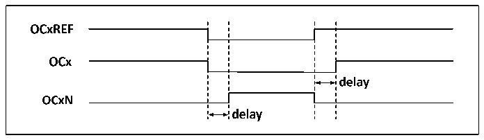
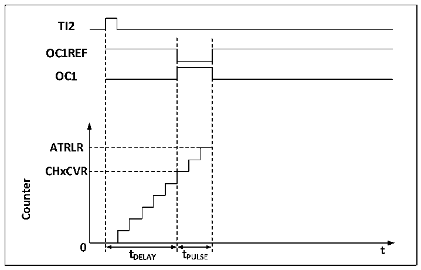

<!-- source-page: 96 -->

[← p.95](0095.md) · [index](../README.md) · [PDF p.96](https://ch32-riscv-ug.github.io/CH32V003/datasheet_zh/CH32V003RM.PDF#page=96) · [p.97 →](0097.md)

<!-- header: CH32V003应用手册 https://wch.cn -->
是OCx的上升沿相当于OCxREF有一个延迟，OCxN与OCxREF相反，它的上升沿相对参考信号的下降  
沿会有一个延迟，如果延迟大于有效输出宽度，则不会产生相应的脉冲。  
如图10-4展示了OCx和OCxN与OCxREF的关系，并展示出死区。  

图10-4 互补输出和死区  
 <!-- rendered from the PDF; verify at https://ch32-riscv-ug.github.io/CH32V003/datasheet_zh/CH32V003RM.PDF#page=96 -->

🖼 Text parsed from the figure above

<!-- image: p96-draw-image-00002 inside the figure -->
<!-- image: p96-draw-image-00003 inside the figure -->
<!-- image: p96-draw-image-00006 inside the figure -->
<!-- image: p96-draw-image-00004 inside the figure -->
<!-- image: p96-draw-image-00005 inside the figure -->

### 10.3.7 刹车信号

当产生刹车信号时，输出使能信号和无效电平都会根据MOE、OIS、OISN、OSSI和OSSR等位进  
行修改。但OCx和OCxN不会在任何时间都处在有效电平。刹车事件源可以来自于刹车输入引脚，也  
可以是一个时钟失败事件，而时钟失败事件由CSS（时钟安全系统）产生。  
在系统复位后，刹车功能被默认禁止（MOE 位为低），置 BKE 位可以使能刹车功能，输入的刹  
车信号的极性可以通过设置 BKP 设置，BKE 和 BKP信号可以被同时写入，在真正写入之前会有一个  
HB时钟的延迟，因此需要等一个HB周期才能正确读出写入值。  
在刹车引脚出现选定的电平系统将产生如下动作：  
1） MOE位被异步清零，根据SOOI位的设置将输出置为无效状态、空闲状态或复位状态；  
2） 在MOE被清零后，每一个输出通道输出由OISx确定的电平；  
3） 当使用互补输出时：输出被置于无效状态，具体取决于极性；  
4） 如果BIE被置位，当BIF置位，会产生一个中断；如果设置了BDE位，则会产生一个DMA请求；  
5） 如果AOE被置位，在下一个更新事件UEV时，MOE位被自动置位。  

### 10.3.8 单脉冲模式

单脉冲模式可以用于让微控制器响应一个特定的事件，使之在一个延迟之后产生一个脉冲，延  
迟和脉冲的宽度可编程。置OPM位可以使核心计数器在产生下一个更新事件UEV时（计数器翻转到  
0）停止。  
如图10-5，需要在TI2输入引脚上检测到一个上升沿开始，延迟Tdelay之后，在OC1上产生  
一个长度为Tpulse的正脉冲：  

图10-5 单脉冲的产生  
 <!-- rendered from the PDF; verify at https://ch32-riscv-ug.github.io/CH32V003/datasheet_zh/CH32V003RM.PDF#page=96 -->

🖼 Text parsed from the figure above

<!-- image: p96-draw-image-00008 inside the figure -->
<!-- image: p96-draw-image-00007 inside the figure -->
<!-- image: p96-draw-image-00009 inside the figure -->
<!-- image: p96-draw-image-00010 inside the figure -->
<!-- image: p96-draw-image-00011 inside the figure -->
<!-- image: p96-draw-image-00012 inside the figure -->
<!-- image: p96-draw-image-00013 inside the figure -->
<!-- image: p96-draw-image-00020 inside the figure -->
<!-- image: p96-draw-image-00021 inside the figure -->
<strong>Counter</strong>  
<!-- image: p96-draw-image-00014 inside the figure -->
<!-- image: p96-draw-image-00019 inside the figure -->
<!-- image: p96-draw-image-00015 inside the figure -->
<!-- image: p96-draw-image-00017 inside the figure -->
<!-- image: p96-draw-image-00018 inside the figure -->
<!-- image: p96-draw-image-00016 inside the figure -->

<!-- image: p96-draw-image-00001 bbox=[507.84, 786.12, 527.28, 796.68] -->
<!-- footer: V1.9 94 -->
