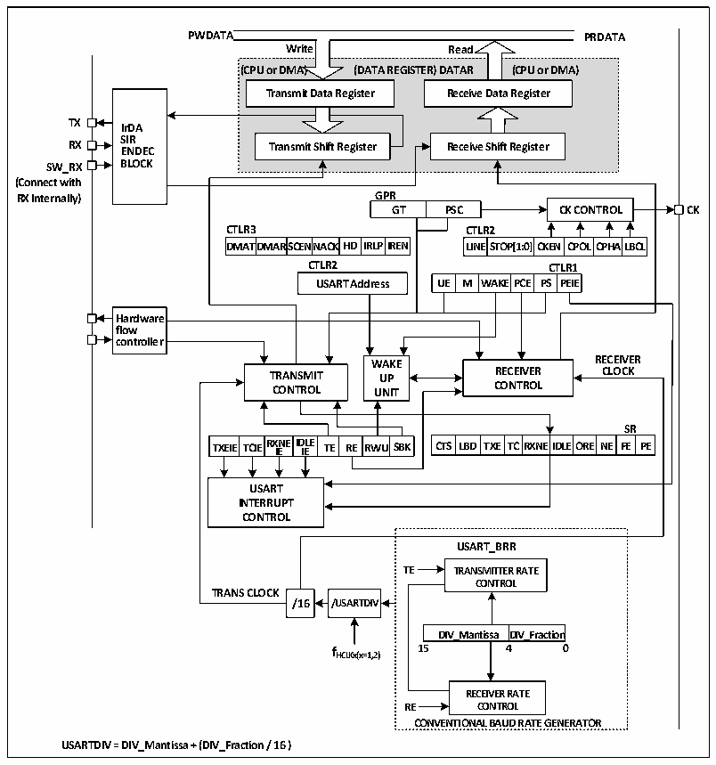

<!-- source-page: 139 -->

[← p.138](0138.md) · [index](../README.md) · [PDF p.139](https://ch32-riscv-ug.github.io/CH32V003/datasheet_zh/CH32V003RM.PDF#page=139) · [p.140 →](0140.md)

<!-- header: CH32V003应用手册 https://wch.cn -->

# 第 12 章 通用同步异步收发器（USART）

该模块包含1个通用同步异步收发器USART1。  

## 12.1 主要特征

● 全双工或半双工的同步或异步通信  
● NRZ数据格式  
● 分数波特率发生器，最高3Mbps  
● 可编程数据长度  
● 可配置的停止位  
● 支持LIN，IrDA编码器，智能卡  
● 支持DMA  
● 多种中断源  

## 12.2 概述

图12-1 通用同步/异步收发器的结构框图  
 <!-- rendered from the PDF; verify at https://ch32-riscv-ug.github.io/CH32V003/datasheet_zh/CH32V003RM.PDF#page=139 -->

🖼 Text parsed from the figure above

<strong>PWDATA PRDATA</strong>  
<!-- image: p139-draw-image-00005 inside the figure -->
<!-- image: p139-draw-image-00004 inside the figure -->
<strong>Write Read</strong>  
<strong>(CPU or DMA) (DATA REGISTER) DATAR (CPU or DMA)</strong>  
Transmit Data Register  
<strong>Transmit Data Register Receive Data Register</strong>  
<!-- image: p139-draw-image-00003 inside the figure -->
<!-- image: p139-draw-image-00006 inside the figure -->
<strong>TX IrDA</strong>  
<strong>RX S E I N R DEC Transmit Shift Register Receive Shift Register</strong>  
<strong>SW_RX BLOCK</strong>  
<strong>(Connect with</strong>  
<strong>RX Internally) GPR</strong>  
<strong>GT PSC CK CONTROL CK</strong>  
<strong>CTLR3 CTLR2</strong>  
DMAT  TDMAR  SCENNA  ACKHD  IRLPI  
CLITNLER2ST  TOP[1:0]  CKEN  CPOL  CPHA  ALBCL  
<strong>DMATDMARSCENNACKHD IRLPIREN LINESTOP[1:0]CKEN CPOLCPHALBCL</strong>  
<strong>CTLR2 CTLR1</strong>  
WA  AKEPCE  PSCT  TPLREI1E  
Hardware flow controller  
<!-- image: p139-draw-image-00002 inside the figure -->
<strong>WWAAKKEE RECEIVER</strong>  
<strong>TRANSMIT UUPP RECEIVER CLOCK</strong>  
<strong>CONTROL UUNNIITT CONTROL</strong>  
TXEIE  TCIE  RXNEIDIE  ID IE LE  TE RE  RWU  
<strong>SR</strong>  
CTS LBD  TXE  TC  RXNEID  DLEORE  NE  FSER  RPE  
<strong>USART</strong>  
<strong>INTERRUPT</strong>  
<strong>CONTROL</strong>  
<strong>USART_BRR</strong>  
<strong>TE TRANSMITTER RATE</strong>  
<strong>CONTROL</strong>  
<strong>TRANS CLOCK</strong>  
<strong>/16 /USARTDIV</strong>  
DIV_Mantissa  DIV_Fractio  
<strong>fHCLKx(x=1,2) 15 4 0</strong>  
<strong>RECEIVER RATE</strong>  
<strong>RE CONTROL</strong>  
<strong>CONVENTIONAL BAUD RATE GENERATOR</strong>  
<strong>USARTDIV = DIV_Mantissa + (DIV_Fraction / 16 )</strong>  

# 当TE（发送使能位）置位时，发送移位寄存器里的数据在TX引脚上输出，时钟在CK引脚上输

# 出。在发送时，最先移出的是最低有效位，每个数据帧都由一个低电平的起始位开始，然后发送器

<!-- image: p139-draw-image-00001 bbox=[507.84, 786.12, 527.28, 796.68] -->
<!-- footer: V1.9 137 -->
