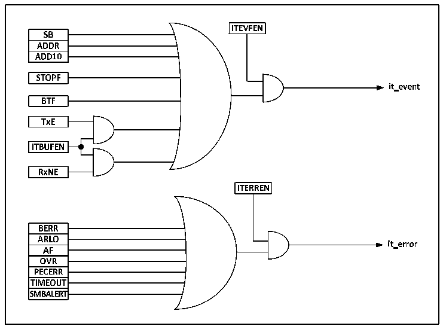

<!-- source-page: 156 -->

[← p.155](0155.md) · [index](../README.md) · [PDF p.156](https://ch32-riscv-ug.github.io/CH32V003/datasheet_zh/CH32V003RM.PDF#page=156) · [p.157 →](0157.md)

<!-- header: CH32V003应用手册 https://wch.cn -->
3） 都支持7位地址格式。  
同时SMBus和I2C也存在区别：  
1） I2C支持的速度最高400kHz，而SMBus支持的最高是100kHz，且SMBus有最小10kHz的速度限  
制；  
2） SMBus的时钟为低超过35mS时，会报超时，但I2C无此限制；  
3） SMBus有固定的逻辑电平，而I2C没有，取决于VDD；  
4） SMBus有总线协议，而I2C没有。  
SMBus还包括设备识别、地址解析协议、唯一的设备标识符、SMBus提醒和各种总线协议，具体  
请参考SMBus规范2.0版本。当使用SMBus时，只需要置控制寄存器的SMBus位，按需配置SMBTYPE  
位和ENAARP位。  

## 13.8 中断

每个I2C模块都有两种中断向量，分别是事件中断和错误中断。两种中断支持图13-4的中断源。  

图13-8 I2C中断请求  
 <!-- rendered from the PDF; verify at https://ch32-riscv-ug.github.io/CH32V003/datasheet_zh/CH32V003RM.PDF#page=156 -->

🖼 Text parsed from the figure above

<!-- image: p156-draw-image-00018 inside the figure -->
<!-- image: p156-draw-image-00002 inside the figure -->
<!-- image: p156-draw-image-00003 inside the figure -->
<!-- image: p156-draw-image-00005 inside the figure -->
<!-- image: p156-draw-image-00004 inside the figure -->
<!-- image: p156-draw-image-00006 inside the figure -->
<!-- image: p156-draw-image-00020 inside the figure -->
<!-- image: p156-draw-image-00022 inside the figure -->
<!-- image: p156-draw-image-00021 inside the figure -->
<!-- image: p156-draw-image-00007 inside the figure -->
<!-- image: p156-draw-image-00008 inside the figure -->
<!-- image: p156-draw-image-00009 inside the figure -->
<!-- image: p156-draw-image-00010 inside the figure -->
<!-- image: p156-draw-image-00019 inside the figure -->
<!-- image: p156-draw-image-00011 inside the figure -->
<!-- image: p156-draw-image-00012 inside the figure -->
<!-- image: p156-draw-image-00023 inside the figure -->
<!-- image: p156-draw-image-00025 inside the figure -->
<!-- image: p156-draw-image-00013 inside the figure -->
<!-- image: p156-draw-image-00024 inside the figure -->
<!-- image: p156-draw-image-00014 inside the figure -->
<!-- image: p156-draw-image-00015 inside the figure -->
<!-- image: p156-draw-image-00016 inside the figure -->
<!-- image: p156-draw-image-00017 inside the figure -->

## 13.9 DMA

可以使用DMA来进行批量数据的收发。使用DMA时不能对控制寄存器的ITBUFEN位进行置位。  
● 利用DMA发送  
通过将CTLR2寄存器的DMAEN位置位可以激活DMA模式。只要TxE位被置位，数据将由DMA从  
设定的内存装载进I2C的数据寄存器。需要进行以下设定来为I2C分配通道。  
1） 向DMA_PADDRx寄存器设置I2Cx_DATAR寄存器地址，DMA_MADDRx寄存器中设置存储器地址，这  
样在每个TxE事件后，数据将从存储器送至I2Cx_DATAR寄存器。  
2） 在DMA_CNTRx寄存器中设置所需的传输字节数。在每个TxE事件后，此值将被递减。  
3） 利用DMA_CFGRx寄存器中的PL[0:1]位配置通道优先级。  
4） 设置DMA_CFGRx寄存器中的DIR位，并根据应用要求可以配置在整个传输完成一半或全部完成  
时发出中断请求。  
5） 通过设置DMA_CFGRx寄存器上的EN位激活通道。  
当DMA控制器中设置的数据传输字节数目已经完成时，DMA控制器给I2C接口发送一个传输结  
<!-- image: p156-draw-image-00001 bbox=[507.84, 786.12, 527.28, 796.68] -->
<!-- footer: V1.9 154 -->
