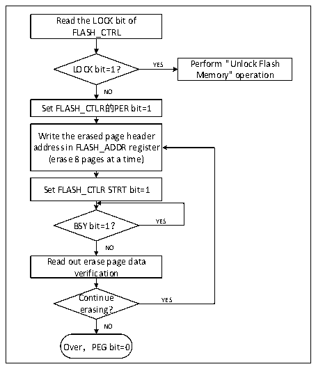
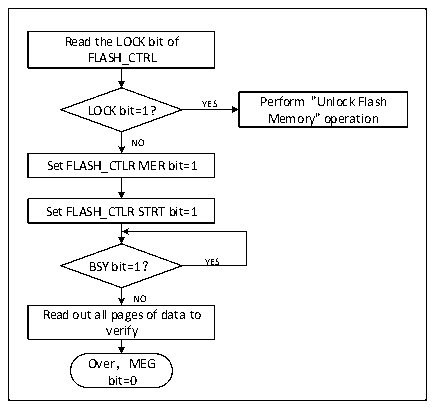

<!-- source-page: 186 -->

[← p.185](0185.md) · [index](../README.md) · [PDF p.186](https://ch32-riscv-ug.github.io/CH32V003/datasheet_zh/CH32V003RM.PDF#page=186) · [p.187 →](0187.md)

<!-- header: CH32V003应用手册 https://wch.cn -->

图16-2 FLASH页擦除  
 <!-- rendered from the PDF; verify at https://ch32-riscv-ug.github.io/CH32V003/datasheet_zh/CH32V003RM.PDF#page=186 -->

🖼 Text parsed from the figure above

Read the LOCK bit of  
FLASH_CTRL  
LOCK bit=1? YES Perform &quot;Unlock Flash  
Memory&quot; operation  
NO  
Set FLASH_CTLR的PER bit=1  
Write the erased page header  
address in FLASH_ADDR register  
(erase 8 pages at a time)  
Set FLASH_CTLR STRT bit=1  
BSY bit=1？ YES  
NO  
Read out erase page data  
verification  
Continue YES  
erasing?  
NO  
Over，PEG bit=0  

1）检查FLASH_CTLR寄存器LOCK位，如果为1，需要执行“解除闪存锁”操作。  
2）设置FLASH_CTLR寄存器的PER位为‘1’，开启标准页擦除模式。  
3）向FLASH_ADDR寄存器写入选择擦除的页首地址。  
4）设置FLASH_CTLR寄存器的STRT位为‘1’，启动一次擦除动作。  
5）等待BSY位变为‘0’或FLASH_STATR寄存器的EOP位为‘1’表示擦除结束，将EOP位清0。  
6）读擦除页的数据进行校验。  
7）继续标准页擦除可以重复3-5步骤，结束擦除将PEG位清0。  

图16-3 FLASH整片擦除  
 <!-- rendered from the PDF; verify at https://ch32-riscv-ug.github.io/CH32V003/datasheet_zh/CH32V003RM.PDF#page=186 -->

🖼 Text parsed from the figure above

Read the LOCK bit of  
FLASH_CTRL  
LOCK bit=1? YES Perform &quot;Unlock Flash  
Memory&quot; operation  
NO  
Set FLASH_CTLR MER bit=1  
Set FLASH_CTLR STRT bit=1  
BSY bit=1？ YES  
NO  
Read out all pages of data to  
verify  
Over，MEG  
bit=0  

1）检查FLASH_CTLR寄存器LOCK位，如果为1，需要执行“解除闪存锁”操作。  
2）设置FLASH_CTLR寄存器的MER位为‘1’，开启整片擦除模式。  
3）设置FLASH_CTLR寄存器的STRT位为‘1’，启动擦除动作。  
4）等待BSY位变为‘0’或FLASH_STATR寄存器的EOP位为‘1’表示擦除结束，将EOP位清0。  
5）读擦除页的数据进行校验。  
6）将MER位清0。  
<!-- image: p186-draw-image-00001 bbox=[507.84, 786.12, 527.28, 796.68] -->
<!-- footer: V1.9 184 -->
