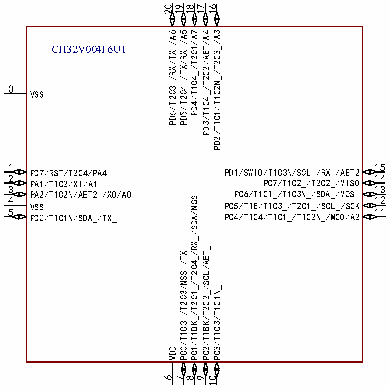

<!-- source-page: 13 -->

[← p.12](0012.md) · [index](../README.md) · [PDF p.13](https://ch32-riscv-ug.github.io/CH32V006/datasheet_en/CH32V004DS0.PDF#page=13) · [p.14 →](0014.md)

<!-- header: CH32V004 Datasheet https://wch-ic.com -->

# Chapter 2 Pinouts and Pin Definition

## 2.1 Pinouts

CH32V004F6P1  
1 20  
PD4/T1C4_/T2C1/A7 PD3/T1C4_/T2C2/AET/A4  
2 19  
PD5/T2C4_/TX/RX_/A5 PD2/T1C1/T1C2N_/T2C3_/A3  
3 18  
PD6/T2C3_/RX/TX_/A6 PD1/SWIO/T1C3N/SCL_/RX_/AET2  
4 17  
PD7/RST/T2C4/PA4 PC7/T1C2_/T2C2_/MISO  
5 16  
PA1/T1C2/XI/A1 PC6/T1C1_/T1C3N_/SDA_/MOSI  
6 15  
PA2/T1C2N/AET2_/XO/A0 PC5/T1E/T1C3_/T2C1_/SCL_/SCK  
7 14  
VSS PC4/T1C4/T1C1_/T1C2N_/MCO/A2  
8 13  
PD0/T1C1N/SDA_/TX_ PC3/T1C3/T1C1N_  
12  
9  
VDD PC2/T1BK/T2C2_/SCL/AET_  
10 11  
PC0/T1C3_/T2C3/NSS_/TX_ PC1/T1BK_/T2C1_/T2C4_/RX_/SDA/NSS  

 <!-- p13-cluster-01 uncaptioned graphics, rendered from the PDF; verify at https://ch32-riscv-ug.github.io/CH32V006/datasheet_en/CH32V004DS0.PDF#page=13 -->

🖼 Text parsed from the figure above

20  
19  
18  
17  
16  
PD6/T2C3_/RX/TX_/A6  
PD5/T2C4_/TX/RX_/A5  
PD4/T1C4_/T2C1/A7  
PD3/T1C4_/T2C2/AET/A4  
PD2/T1C1/T1C2N_/T2C3_/A3  
CH32V004F6U1  
0  
VSS  
1 15  
PD7/RST/T2C4/PA4 PD1/SWIO/T1C3N/SCL_/RX_/AET2  
2 14  
PA1/T1C2/XI/A1 PC7/T1C2_/T2C2_/MISO  
3 13  
PA2/T1C2N/AET2_/XO/A0 PC6/T1C1_/T1C3N_/SDA_/MOSI  
4 12  
PC1/T1BK_/T2C1_/T2C4_/RX_/SDA/NSS  
VSS PC5/T1E/T1C3_/T2C1_/SCL_/SCK  
5 11  
PD0/T1C1N/SDA_/TX_ PC4/T1C4/T1C1_/T1C2N_/MCO/A2  
PC0/T1C3_/T2C3/NSS_/TX_  
PC2/T1BK/T2C2_/SCL/AET_  
PC3/T1C3/T1C1N_  
VDD  
6  
7  
8  
9  
10  

<em>Note: The alternate functions in the pin diagram are abbreviated.</em>  
Example: A: ADC_ (A1: ADC_IN1, AET: ADC_RETR, AET2: ADC_IETR)  
<!-- image: p13-draw-image-00001 bbox=[518.88, 784.08, 538.32, 794.28] -->
<!-- footer: V1.9 11 -->
