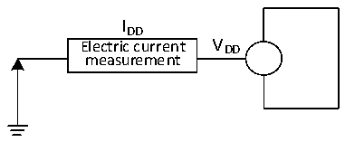

<!-- source-page: 22 -->

[← p.21](0021.md) · [index](../README.md) · [PDF p.22](https://ch32-riscv-ug.github.io/CH32V006/datasheet_en/CH32V004DS0.PDF#page=22) · [p.23 →](0023.md)

<!-- header: CH32V004 Datasheet https://wch-ic.com -->

> ⬆ **Table continued** — rendered in full at [page 21](0021.md). <!-- p22-table-001 -->

### 3.3.4 Supply Current Characteristics

Current consumption is a comprehensive index of a variety of parameters and factors. These parameters and  
factors include operating voltage, ambient temperature, I/O pin load, the software configuration of the product, the  
operating frequency, flip rate of the I/O pin, the location of the program in memory and the executed code, etc.  
The current consumption measurement method is as follows:  

Figure 3-2 Current consumption measurement  
 <!-- rendered from the PDF; verify at https://ch32-riscv-ug.github.io/CH32V006/datasheet_en/CH32V004DS0.PDF#page=22 -->

🖼 Text parsed from the figure above

IDD  
Electric current V DD  
measurement  

The microcontroller is in the following conditions:  
In the case of room temperature VDD= 3.3V or 5V, during the test: all I/O ports are configured with pull-down  
input, HSI = 24MHz (calibrated), and the bit LDO_MODE of register PWR_CTLR is 10. Enable or disable the  
power consumption of all peripheral clocks.  

<!-- p22-table-002 (table-3-6@1) -->
<table><caption>Table 3-6 Typical current consumption in Run mode, data processing code runs from the internal Flash</caption><tr><th rowspan="3">Symbol</th><th rowspan="3">Parameter</th><th colspan="3">Condition</th><th colspan="2">Typ.</th><th rowspan="3">Unit</th></tr><tr><td rowspan="2">HSI/HSE</td><td rowspan="2">HSI_LP</td><td rowspan="2" style="text-align:left">FHCLK</td><td rowspan="2" style="text-align:left">All peripherals enabled</td><td>All peripherals</td></tr><tr><td>disabled</td></tr><tr><td rowspan="11" style="text-align:left">I (1) DD</td><td rowspan="11" style="text-align:left">Supply current in Run mode</td><td rowspan="5" style="text-align:left">Runs on the high-speed external clock (HSE) (HSE_SI = 00, HSE_LP = 1)</td><td rowspan="5">X</td><td style="text-align:left">F = 48MHz HCLK</td><td>4.3</td><td>3.4</td><td rowspan="11">mA</td></tr><tr><td style="text-align:left">F = 24MHz HCLK</td><td>3.3</td><td>2.8</td></tr><tr><td style="text-align:left">F = 16MHz HCLK</td><td>2.8</td><td>2.5</td></tr><tr><td style="text-align:left">F = 8MHz HCLK</td><td>2.5</td><td>2.4</td></tr><tr><td style="text-align:left">F = 750kHz HCLK</td><td>1.7</td><td>1.7</td></tr><tr><td rowspan="6" style="text-align:left">Runs on the high-speed internal RC oscillator (HSI)</td><td rowspan="5">0</td><td style="text-align:left">F = 48MHz HCLK</td><td>3.6</td><td>2.7</td></tr><tr><td style="text-align:left">F = 24MHz HCLK</td><td>2.5</td><td>2.0</td></tr><tr><td style="text-align:left">F = 16MHz HCLK</td><td>2.1</td><td>1.7</td></tr><tr><td style="text-align:left">F = 8MHz HCLK</td><td>1.8</td><td>1.6</td></tr><tr><td style="text-align:left">F = 750kHz HCLK</td><td>0.9</td><td>0.9</td></tr><tr><td>1</td><td style="text-align:left">F = 40kHz HCLK</td><td>0.6</td><td>0.6</td></tr></table>

<em>Note: The above are measured parameters.</em>  

<!-- p22-table-003 (table-3-7@1) pages 22-23 -->
<table><caption>Table 3-7 Typical current consumption in Sleep mode, data processing code runs from internal Flash or SRAM</caption><tr><th rowspan="3">Symbol</th><th rowspan="3">Parameter</th><th colspan="3">Condition</th><th colspan="2">Typ.</th><th rowspan="3">Unit</th></tr><tr><td rowspan="2">HSI/HSE</td><td rowspan="2">HSI_LP</td><td rowspan="2" style="text-align:left">FHCLK</td><td rowspan="2" style="text-align:left">All peripherals enabled</td><td>All peripherals</td></tr><tr><td>disabled</td></tr><tr><td rowspan="11" style="text-align:left">I (1) DD</td><td rowspan="11" style="text-align:left">Supply current in Sleep mode (In this case, peripheral power supply and clock are maintained)</td><td rowspan="5" style="text-align:left">Runs on the high-speed external clock (HSE) (HSE_SI = 00, HSE_LP = 1)</td><td rowspan="5">X</td><td style="text-align:left">F = 48MHz HCLK</td><td>3.0</td><td>2.1</td><td rowspan="11">mA</td></tr><tr><td style="text-align:left">F = 24MHz HCLK</td><td>2.3</td><td>1.8</td></tr><tr><td style="text-align:left">F = 16MHz HCLK</td><td>2.1</td><td>1.8</td></tr><tr><td style="text-align:left">F = 8MHz HCLK</td><td>1.8</td><td>1.7</td></tr><tr><td style="text-align:left">F = 750kHz HCLK</td><td>1.6</td><td>1.6</td></tr><tr><td rowspan="6" style="text-align:left">Runs on the high-speed internal RC oscillator (HSI)</td><td rowspan="5">0</td><td style="text-align:left">F = 48MHz HCLK</td><td>2.2</td><td>1.3</td></tr><tr><td style="text-align:left">F = 24MHz HCLK</td><td>1.5</td><td>1.0</td></tr><tr><td style="text-align:left">F = 16MHz HCLK</td><td>1.3</td><td>1.0</td></tr><tr><td style="text-align:left">F = 8MHz HCLK</td><td>1.1</td><td>0.9</td></tr><tr><td style="text-align:left">F = 750kHz HCLK</td><td>0.9</td><td>0.9</td></tr><tr><td>1</td><td style="text-align:left">F = 40kHz HCLK</td><td>0.6</td><td>0.6</td></tr></table>

<!-- image: p22-draw-image-00001 bbox=[518.88, 784.08, 538.32, 794.28] -->
<!-- footer: V1.9 20 -->
