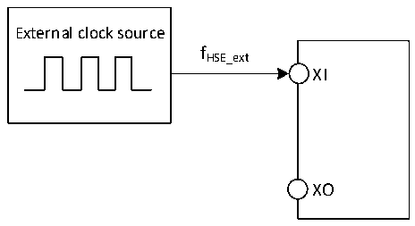
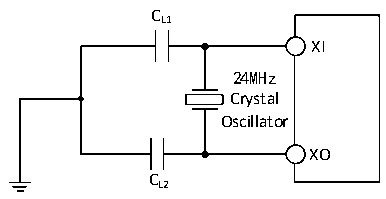

<!-- source-page: 24 -->

[← p.23](0023.md) · [index](../README.md) · [PDF p.24](https://ch32-riscv-ug.github.io/CH32V006/datasheet_en/CH32V004DS0.PDF#page=24) · [p.25 →](0025.md)

<!-- header: CH32V004 Datasheet https://wch-ic.com -->

Figure 3-3 External high-frequency clock source circuit  
 <!-- rendered from the PDF; verify at https://ch32-riscv-ug.github.io/CH32V006/datasheet_en/CH32V004DS0.PDF#page=24 -->

🖼 Text parsed from the figure above

External clock source  
fHSE_ext  
XI  
XO  

<!-- p24-table-001 (table-3-10@1) -->
<table><caption>Table 3-10 High-speed external clock generated from a crystal/ceramic resonator</caption><tr><th>Symbol</th><th>Parameter</th><th>Condition</th><th>Min.</th><th>Typ.</th><th>Max.</th><th>Unit</th></tr><tr><td style="text-align:left">FXI</td><td>Resonator frequency</td><td></td><td>3</td><td>24</td><td>32</td><td>MHz</td></tr><tr><td style="text-align:left">RF</td><td>Feedback resistor (no external)</td><td></td><td></td><td>250</td><td></td><td>kΩ</td></tr><tr><td style="text-align:left">CLOAD</td><td style="text-align:left">Recommended load capacitance and corresponding crystal series impedance RS</td><td style="text-align:left">R = 60Ω(1) S</td><td></td><td>20</td><td></td><td>pF</td></tr><tr><td rowspan="2" style="text-align:left">IHSE</td><td rowspan="2">HSE drive current</td><td>HSE_LP = 0, 20p load</td><td></td><td>1.6</td><td></td><td rowspan="2">mA</td></tr><tr><td>HSE_LP = 1, 20p load</td><td></td><td>0.8</td><td></td></tr><tr><td style="text-align:left">g m</td><td>Oscillator transconductance</td><td>Startup</td><td></td><td>21</td><td></td><td>mA/V</td></tr><tr><td style="text-align:left">t SU(HSE)</td><td>Startup time</td><td style="text-align:left">V is stable DD</td><td></td><td>1.5(2)</td><td></td><td>ms</td></tr></table>

<em>Note: 1. 25M crystal ESR is recommended not more than 80Ω, less than 25M can be appropriately relaxed.</em>  
<em>2. Startup time refers to the time difference between when HSEON is turned on and when HSERDY is set.</em>  
Circuit reference design and requirements:  
The load capacitance of the crystal is subject to the recommendation of the crystal manufacturer, generally CL1=  
CL2.  

Figure 3-4 Typical circuit of external 24M crystal  
 <!-- rendered from the PDF; verify at https://ch32-riscv-ug.github.io/CH32V006/datasheet_en/CH32V004DS0.PDF#page=24 -->

🖼 Text parsed from the figure above

CL1  
XI  
24MHz  
Crystal  
Oscillator  
XO  
CL2  

### 3.3.6 Internal Clock Source Characteristics

<!-- p24-table-002 (table-3-11@1) pages 24-25 -->
<table><caption>Table 3-11 Internal high-speed (HSI) RC oscillator characteristics</caption><tr><th>Symbol</th><th>Parameter</th><th>Condition</th><th>Min.</th><th>Typ.</th><th>Max.</th><th>Unit</th></tr><tr><td rowspan="2" style="text-align:left">FHSI</td><td rowspan="2">Frequency (after calibration)</td><td>HSI_LP = 0</td><td></td><td>24</td><td></td><td>MHz</td></tr><tr><td>HSI_LP = 1</td><td>30</td><td>42</td><td>58</td><td>KHz</td></tr><tr><td style="text-align:left">DuCy HSI</td><td>Duty Cycle</td><td></td><td>45</td><td>50</td><td>55</td><td>%</td></tr><tr><td style="text-align:left">ACCHSI</td><td>Accuracy of HSI oscillator (after</td><td>HSI_LP = 0,</td><td>-2.2</td><td></td><td>2.2</td><td>%</td></tr><tr><td></td><td>calibration)</td><td>TA = -10℃~70℃</td><td></td><td></td><td></td><td></td></tr><tr><td style="text-align:left">t (1) SU(HSI)</td><td style="text-align:left">HSI oscillator startup stabilization time</td><td></td><td></td><td>3</td><td>8</td><td>us</td></tr><tr><td rowspan="2" style="text-align:left">IDD(HSI)</td><td rowspan="2">HSI oscillator power consumption</td><td>HSI_LP = 0</td><td></td><td>200</td><td></td><td rowspan="2">uA</td></tr><tr><td>HSI_LP = 1</td><td></td><td>8.5</td><td></td></tr></table>

<!-- image: p24-draw-image-00001 bbox=[518.88, 784.08, 538.32, 794.28] -->
<!-- footer: V1.9 22 -->
