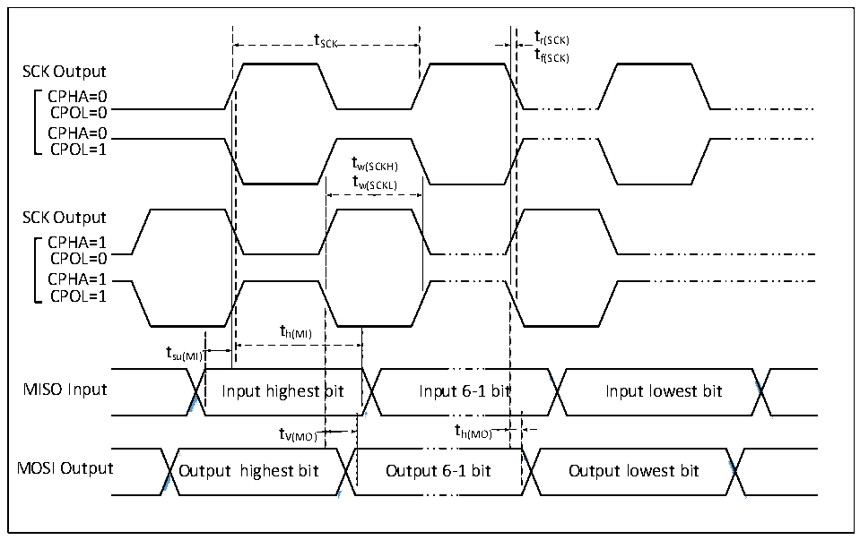
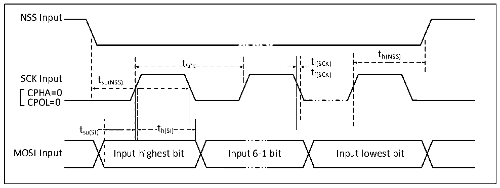

<!-- source-page: 29 -->

[← p.28](0028.md) · [index](../README.md) · [PDF p.29](https://ch32-riscv-ug.github.io/CH32V006/datasheet_en/CH32V004DS0.PDF#page=29) · [p.30 →](0030.md)

<!-- header: CH32V004 Datasheet https://wch-ic.com -->

### 3.3.13 SPI Interface Characteristics

Figure 3-7 SPI timing diagram in Master mode  
 <!-- rendered from the PDF; verify at https://ch32-riscv-ug.github.io/CH32V006/datasheet_en/CH32V004DS0.PDF#page=29 -->

🖼 Text parsed from the figure above

t SCK t r(SCK)  
tf(SCK)  
SCK Output  
CPHA=0  
CPOL=0  
CPHA=0  
CPOL=1  
tw(SCKH)  
tw(SCKL)  
SCK Output  
CPHA=1  
CPOL=0  
CPHA=1  
CPOL=1  
th(MI)  
tsu(MI)  
<!-- image: p29-draw-image-00002 inside the figure -->
<!-- image: p29-draw-image-00003 inside the figure -->
<!-- image: p29-draw-image-00004 inside the figure -->
<!-- image: p29-draw-image-00005 inside the figure -->
bit  t V(MO)  
)  
MISO Input Input highest bit Input 6-1 bit Input lowest bit  
t V(MO) t h(MO)  
<!-- image: p29-draw-image-00006 inside the figure -->
<!-- image: p29-draw-image-00007 inside the figure -->
<!-- image: p29-draw-image-00008 inside the figure -->
<!-- image: p29-draw-image-00009 inside the figure -->
MOSI Output Output highest bit Output 6-1 bit Output lowest bit  

Figure 3-8-1 SPI timing diagram in Slave mode (CPHA = 0, CPOL=0)  
 <!-- rendered from the PDF; verify at https://ch32-riscv-ug.github.io/CH32V006/datasheet_en/CH32V004DS0.PDF#page=29 -->

🖼 Text parsed from the figure above

NSS Input  
t  
t SCK t r(SCK) h(NSS)  
t  
SCK Input tsu(NSS) f(SCK)  
CPHA=0  
CPOL=0  
t h(SI)  th(SI)  
t su(SI) t h(SI)  
MOSI Input Input highest bit Input 6-1 bit Input lowest bit  

<!-- image: p29-draw-image-00001 bbox=[518.88, 784.08, 538.32, 794.28] -->
<!-- footer: V1.9 27 -->
