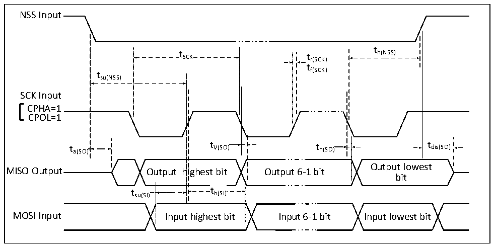

<!-- source-page: 31 -->

[← p.30](0030.md) · [index](../README.md) · [PDF p.31](https://ch32-riscv-ug.github.io/CH32V006/datasheet_en/CH32V004DS0.PDF#page=31) · [p.32 →](0032.md)

<!-- header: CH32V004 Datasheet https://wch-ic.com -->

Figure 3-9-2 SPI timing diagram in Slave mode (CPHA = 1, CPOL=1)  
 <!-- rendered from the PDF; verify at https://ch32-riscv-ug.github.io/CH32V006/datasheet_en/CH32V004DS0.PDF#page=31 -->

🖼 Text parsed from the figure above

NSS Input  
t  
t SCK t r(SCK) h(NSS)  
tf(SCK)  
tsu(NSS)  
SCK Input  
CPHA=1  
CPOL=1  
t a(SO) t V(SO) t h(SO) t dis(SO)  
Output lowest  
MISO Output Output highest bit Output 6-1 bit  
bit  
t su(SI)  
t h(SI)  th(SI)  
MOSI Input Input highest bit Input 6-1 bit Input lowest bit  

<!-- p31-table-003 (table-3-22@1) -->
<table><caption>Table 3-22 SPI interface characteristics</caption><tr><th>Symbol</th><th>Parameter</th><th colspan="2">Condition</th><th>Min.</th><th>Max.</th><th>Unit</th></tr><tr><td rowspan="2" style="text-align:left">f /t SCK SCK</td><td rowspan="2">SPI clock frequency</td><td colspan="2">Master mode</td><td></td><td>24</td><td>MHz</td></tr><tr><td colspan="2">Slave mode</td><td></td><td>24</td><td>MHz</td></tr><tr><td style="text-align:left">t /t r(SCK) f(SCK)</td><td>SPI clock rise and fall time</td><td colspan="2">Load capacitance: C = 30pF</td><td></td><td>10</td><td>ns</td></tr><tr><td style="text-align:left">t SU(NSS)</td><td>NSS setup time</td><td colspan="2">Slave mode</td><td style="text-align:left">2*t HCLK</td><td></td><td>ns</td></tr><tr><td style="text-align:left">t h(NSS)</td><td>NSS hold time</td><td colspan="2">Slave mode</td><td style="text-align:left">2*t HCLK</td><td></td><td>ns</td></tr><tr><td style="text-align:left">t /t w(SCKH) w(SCKL)</td><td>SCK high and low time</td><td colspan="2" style="text-align:left">Master mode, f = 24MHz, HCLK Prescaler factor = 4</td><td>70</td><td>97</td><td>ns</td></tr><tr><td rowspan="2" style="text-align:left">t SU(MI)</td><td rowspan="3">Data input setup time</td><td rowspan="2" style="text-align:left">Master mode</td><td>HSRXEN = 0</td><td>15</td><td></td><td rowspan="2">ns</td></tr><tr><td>HSRXEN =</td><td style="text-align:left">15-0.5*t SCK</td><td></td></tr><tr><td style="text-align:left">t SU(SI)</td><td colspan="2">Slave mode</td><td>4</td><td></td><td>ns</td></tr><tr><td rowspan="2" style="text-align:left">t h(MI)</td><td rowspan="3">Data input hold time</td><td rowspan="2" style="text-align:left">Master mode</td><td>HSRXEN = 0</td><td>-4</td><td></td><td rowspan="2">ns</td></tr><tr><td>HSRXEN = 1</td><td style="text-align:left">0.5*t -4SCK</td><td></td></tr><tr><td style="text-align:left">t h(SI)</td><td colspan="2">Slave mode</td><td>4</td><td></td><td>ns</td></tr><tr><td style="text-align:left">t a(SO)</td><td>Data output access time</td><td colspan="2" style="text-align:left">Slave mode, f = 20MHz HCLK</td><td>0</td><td style="text-align:left">1*t HCLK</td><td>ns</td></tr><tr><td style="text-align:left">t dis(SO)</td><td>Data output disable time</td><td colspan="2">Slave mode</td><td>0</td><td>10</td><td>ns</td></tr><tr><td style="text-align:left">t V(SO)</td><td rowspan="2">Data output valid time</td><td colspan="2">Slave mode (After enable edge)</td><td></td><td>15</td><td>ns</td></tr><tr><td style="text-align:left">t V(MO)</td><td colspan="2">Master mode (After enable edge)</td><td></td><td>5</td><td>ns</td></tr><tr><td style="text-align:left">t h(SO)</td><td rowspan="2">Data output hold time</td><td colspan="2">Slave mode (After enable edge)</td><td>6</td><td></td><td>ns</td></tr><tr><td style="text-align:left">t h(MO)</td><td colspan="2">Master mode (After enable edge)</td><td>0</td><td></td><td>ns</td></tr></table>

### 3.3.14 12-bit ADC Characteristics

<!-- p31-table-004 (table-3-23@1) pages 31-32 -->
<table><caption>Table 3-23 ADC characteristics</caption><tr><th>Symbol</th><th>Parameter</th><th>Condition</th><th>Min.</th><th>Typ.</th><th>Max.</th><th>Unit</th></tr><tr><td rowspan="2" style="text-align:left">VDD</td><td rowspan="2">Supply voltage</td><td style="text-align:left">f ≤ 1MHz S</td><td>2.7</td><td></td><td>5.5</td><td>V</td></tr><tr><td style="text-align:left">f &gt; 1MHz S</td><td>4.5</td><td></td><td>5.5</td><td>V</td></tr><tr><td rowspan="2" style="text-align:left">IDDA</td><td rowspan="2" style="text-align:left">ADC supply current (Without buffer)</td><td style="text-align:left">f = 3MHz S</td><td></td><td>1.34</td><td></td><td>mA</td></tr><tr><td style="text-align:left">f = 1MHz S</td><td></td><td>0.42</td><td></td><td>mA</td></tr><tr><td rowspan="2" style="text-align:left">IBUF</td><td rowspan="2">ADC buffer own current</td><td>ADC_LP =</td><td></td><td>0.68</td><td></td><td>mA</td></tr><tr><td>ADC_LP = 1</td><td></td><td>0.13</td><td></td><td>mA</td></tr><tr><td style="text-align:left">f ADC</td><td>ADC clock frequency</td><td></td><td></td><td>16</td><td>48</td><td>MHz</td></tr><tr><td style="text-align:left">f S</td><td>Sampling rate</td><td></td><td>0.06</td><td></td><td>3</td><td>MHz</td></tr><tr><td rowspan="3" style="text-align:left">f TRIG</td><td rowspan="3">External trigger frequency</td><td style="text-align:left">f = 16MHz ADC</td><td></td><td></td><td>900</td><td>KHz</td></tr><tr><td style="text-align:left">f = 48MHz ADC</td><td></td><td></td><td>2.7</td><td>MHz</td></tr><tr><td></td><td></td><td></td><td>18</td><td style="text-align:left">1/f ADC</td></tr><tr><td style="text-align:left">VAIN</td><td>Switching voltage range</td><td></td><td>0</td><td></td><td style="text-align:left">VDD</td><td>V</td></tr><tr><td style="text-align:left">RAIN</td><td>External input impedance</td><td></td><td></td><td></td><td>50</td><td>kΩ</td></tr><tr><td style="text-align:left">RADC</td><td>Sampling switch resistance</td><td></td><td></td><td>0.6</td><td>1.5</td><td>kΩ</td></tr><tr><td style="text-align:left">CADC</td><td style="text-align:left">Internal sample and hold capacitance</td><td></td><td></td><td>4</td><td></td><td>pF</td></tr><tr><td rowspan="2" style="text-align:left">t CAL</td><td rowspan="2">Calibration time</td><td style="text-align:left">f = 16MHz ADC</td><td></td><td></td><td>6.25</td><td>us</td></tr><tr><td></td><td></td><td></td><td>100</td><td style="text-align:left">1/f ADC</td></tr><tr><td rowspan="3" style="text-align:left">t Iat</td><td rowspan="3">Injection trigger conversion delay</td><td style="text-align:left">f = 16MHz ADC</td><td></td><td></td><td>0.125</td><td>us</td></tr><tr><td style="text-align:left">f = 48MHz ADC</td><td></td><td></td><td>0.042</td><td>us</td></tr><tr><td></td><td></td><td></td><td>2</td><td style="text-align:left">1/f ADC</td></tr><tr><td rowspan="3" style="text-align:left">t Iatr</td><td rowspan="3" style="text-align:left">Conventional trigger conversion delay</td><td style="text-align:left">f = 16MHz ADC</td><td></td><td></td><td>0.125</td><td>us</td></tr><tr><td style="text-align:left">f = 48MHz ADC</td><td></td><td></td><td>0.042</td><td>us</td></tr><tr><td></td><td></td><td></td><td>2</td><td style="text-align:left">1/f ADC</td></tr><tr><td rowspan="4" style="text-align:left">t s</td><td rowspan="4">Sampling time</td><td style="text-align:left">f = 16MHz ADC</td><td>0.218</td><td></td><td>14.97</td><td>us</td></tr><tr><td></td><td>3.5</td><td></td><td>239.5</td><td style="text-align:left">1/f ADC</td></tr><tr><td style="text-align:left">f = 48MHz ADC</td><td>0.073</td><td></td><td>0.739</td><td>us</td></tr><tr><td></td><td>3.5</td><td></td><td>35.5</td><td style="text-align:left">1/f ADC</td></tr><tr><td style="text-align:left">t STAB</td><td>Power-on time</td><td></td><td></td><td></td><td>1</td><td>us</td></tr><tr><td rowspan="4" style="text-align:left">t CONV</td><td rowspan="4" style="text-align:left">Total conversion time (including sampling time)</td><td style="text-align:left">f = 16MHz ADC</td><td>1</td><td></td><td>15.75</td><td>us</td></tr><tr><td></td><td>16</td><td></td><td>252</td><td style="text-align:left">1/f ADC</td></tr><tr><td style="text-align:left">f = 48MHz ADC</td><td>0.33</td><td></td><td>1</td><td>us</td></tr><tr><td></td><td>16</td><td></td><td>48</td><td style="text-align:left">1/f ADC</td></tr></table>

<!-- image: p31-draw-image-00001 bbox=[518.88, 784.08, 538.32, 794.28] -->
<!-- footer: V1.9 29 -->
